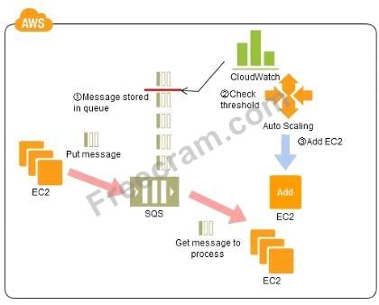
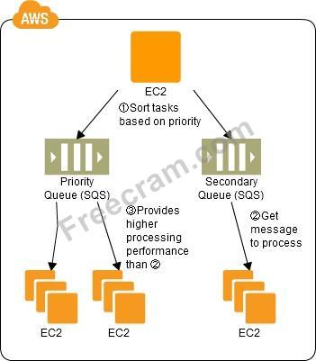

### Question 1:

If I write the below command, what does it do?

ec2-run ami-e3a5408a -n 20 -g appserver

- A. Start twenty instances as members of appserver group.
- B. Start 20 security groups
- C. Terminate twenty instances as members of appserver group.
- D. Creates 20 rules in the security group named appserver

<details><summary>Answer:</summary><p>
[A]

Explanation:

[Free Cram Question Link](https://www.freecram.com/question/Citrix.AWS-Architect.v2018-12-10.q237/if-i-write-the-below-command-what-does-it-do-ec2-run-ami-e3a5408a-n-20-g-appserver)

</p></details><hr>

### Question 2:

In Amazon ElastiCache, the failure of a single cache node can have an impact on the availability of your application and the load on your back-end database while ElastiCache provisions a replacement for the failed cache node and it get repopulated.

Which of the following is a solution to reduce this potential availability impact?

- A. Spread your memory and compute capacity over fewer number of cache nodes, each with smaller capacity.
- B. Spread your memory and compute capacity over a larger number of cache nodes, each with smaller capacity.
- C. Include fewer number of high capacity nodes.
- D. Include a larger number of cache nodes, each with high capacity.

<details><summary>Answer:</summary><p>
[B]

Explanation:

In Amazon ElastiCache, the number of cache nodes in the cluster is a key factor in the availability of your cluster running Memcached. The failure of a single cache node can have an impact on the availability of your application and the load on your back-end database while ElastiCache provisions a replacement for the failed cache node and it get repopulated.

You can reduce this potential availability impact by spreading your memory and compute capacity over a larger number of cache nodes, each with smaller capacity, rather than using a fewer number of high capacity nodes.

http://docs.aws.amazon.com/AmazonElastiCache/latest/UserGuide/CacheNode.Memcached.html

[Free Cram Question Link](https://www.freecram.com/question/Citrix.AWS-Architect.v2018-12-10.q237/in-amazon-elasticache-the-failure-of-a-single-cache-node-can-have-an-impact-on-the-availability-of-your)

</p></details><hr>

### Question 3:

A user has created a VPC with CIDR 20.0.0.0/16 using the wizard. The user has created a public subnet CIDR (20.0.0.0/24) and VPN only subnets CIDR (20.0.1.0/24) along with the VPN gateway (vgw-123456) to connect to the user's data centre. The user's data centre has CIDR 172.28.0.0/12. The user has also setup a NAT instance (i-123456) to allow traffic to the internet from the VPN subnet.

Which of the below mentioned options is not a valid entry for the main route table in this scenario?

- A. Destination: 20.0.0.0/16 and Target: local
- B. Destination: 0.0.0.0/0 and Target: i-123456
- C. Destination: 172.28.0.0/12 and Target: vgw-123456
- D. Destination: 20.0.1.0/24 and Target: i-123456

<details><summary>Answer:</summary><p>
[D]

Explanation:

The user can create subnets as per the requirement within a VPC. If the user wants to connect VPC from his own data centre, he can setup a public and VPN only subnet which uses hardware VPN access to connect with his data centre. When the user has configured this setup with Wizard, it will create a virtual private gateway to route all traffic of the VPN subnet. If the user has setup a NAT instance to route all the internet requests, then all requests to the internet should be routed to it. All requests to the organization's DC will be routed to the VPN gateway. Here are the valid entries for the main route table in this scenario:

Destination: 0.0.0.0/0 & Target: i-123456 (To route all internet traffic to the NAT Instance) Destination:

172.28.0.0/12 & Target: vgw-123456 (To route all the organization's data centre traffic to the VPN gateway) Destination: 20.0.0.0/16 & Target: local (To allow local routing in VPC)

http://docs.aws.amazon.com/AmazonVPC/latest/UserGuide/VPC_Scenario3.html

[Free Cram Question Link](https://www.freecram.com/question/Citrix.AWS-Architect.v2018-12-10.q237/a-user-has-created-a-vpc-with-cidr-20.0.0.0-16-using-the-wizard-the-user-has-created-a-public-subnet)

</p></details><hr>

### Question 4: x

You must architect the migration of a web application to AWS. The application consists of Linux web servers running a custom web server. You are required to save the logs generated from the application to a durable location.

What options could you select to migrate the application to AWS? (Choose 2)

- A. Create Dockerfile for the application. Create an AWS OpsWorks stack consisting of a custom layer. Create custom recipes to install Docker and to deploy your Docker container using the Dockerfile. Create customer recipes to install and configure the application to publish the logs to Amazon CloudWatch Logs.
- B. Use VM import/Export to import a virtual machine image of the server into AWS as an AMI. Create an Amazon Elastic Compute Cloud (EC2) instance from AMI, and install and configure the Amazon CloudWatch Logs agent. Create a new AMI from the instance. Create an AWS Elastic Beanstalk application using the AMI platform and the new AMI.
- C. Create an AWS Elastic Beanstalk application using the custom web server platform. Specify the web server executable and the application project and source files. Enable log file rotation to Amazon Simple Storage Service (S3).
- D. Create Dockerfile for the application. Create an AWS OpsWorks stack consisting of a Docker layer that uses the Dockerfile. Create custom recipes to install and configure Amazon Kineses to publish the logs into Amazon CloudWatch.
- E. Create a Dockerfile for the application. Create an AWS Elastic Beanstalk application using the Docker platform and the Dockerfile. Enable logging the Docker configuration to automatically publish the application logs. Enable log file rotation to Amazon S3.

<details><summary>Answer:</summary><p>
[C, E]

Explanation:

[Free Cram Question Link](https://www.freecram.com/question/Citrix.AWS-Architect.v2018-12-10.q237/you-must-architect-the-migration-of-a-web-application-to-aws-the-application-consists-of-linux-web-server)

</p></details><hr>

### Question 5:

A web-startup runs its very successful social news application on Amazon EC2 with an Elastic Load Balancer, an Auto-Scaling group of Java/Tomcat application-servers, and DynamoDB as data store. The main web-application best runs on m2 x large instances since it is highly memory- bound Each new deployment requires semi-automated creation and testing of a new AMI for the application servers which takes quite a while ana is therefore only done once per week.

Recently, a new chat feature has been implemented in nodejs and wails to be integrated in the architecture. First tests show that the new component is CPU bound Because the company has some experience with using Chef, they decided to streamline the deployment process and use AWS Ops Works as an application life cycle tool to simplify management of the application and reduce the deployment cycles.

What configuration in AWS Ops Works is necessary to integrate the new chat module in the most cost- efficient and flexible way?

- A. Create one AWS OpsWorks stack, create one AWS Ops Works layer, create one custom recipe
- B. Create two AWS OpsWorks stacks create two AWS Ops Works layers, create two custom recipe
- C. Create two AWS OpsWorks stacks create two AWS Ops Works layers, create one custom recipe
- D. Create one AWS OpsWorks stack create two AWS Ops Works layers, create one custom recipe

<details><summary>Answer:</summary><p>
[D]

Explanation:

[Free Cram Question Link](https://www.freecram.com/question/Citrix.AWS-Architect.v2018-12-10.q237/a-web-startup-runs-its-very-successful-social-news-application-on-amazon-ec2-with-an-elastic-load-balancer)

</p></details><hr>

### Question 6:

To scale out the AWS resources using manual AutoScaling, which of the below mentioned parameters should the user change?

- A. Current capacity
- B. Desired capacity
- C. Preferred capacity
- D. Maximum capacity

<details><summary>Answer:</summary><p>
[B]

Explanation:

The Manual Scaling as part of Auto Scaling allows the user to change the capacity of Auto Scaling group.

The user can add / remove EC2 instances on the fly. To execute manual scaling, the user should modify the desired capacity. AutoScaling will adjust instances as per the requirements.

http://docs.aws.amazon.com/AutoScaling/latest/DeveloperGuide/as-manual-scaling.html

[Free Cram Question Link](https://www.freecram.com/question/Citrix.AWS-Architect.v2018-12-10.q237/to-scale-out-the-aws-resources-using-manual-autoscaling-which-of-the-below-mentioned-parameters-should)

</p></details><hr>

### Question 7:

By default, Amazon Cognito maintains the last-written version of the data. You can override this behavior and resolve data conflicts programmatically.

In addition, push synchronization allows you to use Amazon Cognito to send a silent notification to all devices associated with an identity to notify them that new data is available.

- A. get
- B. post
- C. pull
- D. push

<details><summary>Answer:</summary><p>
[D]

Explanation:

http://aws.amazon.com/cognito/faqs/

[Free Cram Question Link](https://www.freecram.com/question/Citrix.AWS-Architect.v2018-12-10.q237/by-default-amazon-cognito-maintains-the-last-written-version-of-the-data-you-can-override-this-behavior)

</p></details><hr>

### Question 8:

An organization has hosted an application on the EC2 instances. There will be multiple users connecting to the instance for setup and configuration of application. The organization is planning to implement certain security best practices.

Which of the below mentioned pointers will not help the organization achieve better security arrangement?

- A. Allow only IAM users to connect with the EC2 instances with their own secret access key.
- B. Create a procedure to revoke the access rights of the individual user when they are not required to connect to EC2 instance anymore for the purpose of application configuration.
- C. Apply the latest patch of OS and always keep it updated.
- D. Disable the password based login for all the users. All the users should use their own keys to connect with the instance securely.

<details><summary>Answer:</summary><p>
[A]

Explanation:

Since AWS is a public cloud any application hosted on EC2 is prone to hacker attacks. It becomes extremely important for a user to setup a proper security mechanism on the EC2 instances. A few of the security measures are listed below:

Always keep the OS updated with the latest patch

Always create separate users with in OS if they need to connect with the EC2 instances, create their keys and disable their password Create a procedure using which the admin can revoke the access of the user when the business work on the EC2 instance is completed. Lock down unnecessary ports.

Audit any proprietary applications that the user may be running on the EC2 instance Provide temporary escalated privileges, such as sudo for users who need to perform occasional privileged tasks The IAM is useful when users are required to work with AWS resources and actions, such as launching an instance. It is not useful to connect (RDP / SSH) with an instance.

http://aws.amazon.com/articles/1233/

[Free Cram Question Link](https://www.freecram.com/question/Citrix.AWS-Architect.v2018-12-10.q237/an-organization-has-hosted-an-application-on-the-ec2-instances-there-will-be-multiple-users-connecting)

</p></details><hr>

### Question 9:



Refer to the architecture diagram above of a batch processing solution using Simple Queue Service (SQS) to set up a message queue between EC2 instances which are used as batch processors Cloud Watch monitors the number of Job requests (queued messages) and an Auto Scaling group adds or deletes batch servers automatically based on parameters set in Cloud Watch alarms.

You can use this architecture to implement which of the following features in a cost effective and efficient manner?

- A. Reduce the overall lime for executing jobs through parallel processing by allowing a busy EC2 instance that receives a message to pass it to the next instance in a daisy-chain setup.
- B. Implement fault tolerance against EC2 instance failure since messages would remain in SQS and worn can continue with recovery of EC2 instances implement fault tolerance against SQS failure by backing up messages to S3.
- C. Implement message passing between EC2 instances within a batch by exchanging messages through SQS.
- D. Coordinate number of EC2 instances with number of job requests automatically thus Improving cost effectiveness.
- E. Handle high priority jobs before lower priority jobs by assigning a priority metadata field to SQS messages.

<details><summary>Answer:</summary><p>
[D]

Explanation:

There are cases where a large number of batch jobs may need processing, and where the jobs may need to be re-prioritized.

For example, one such case is one where there are differences between different levels of services for unpaid users versus subscriber users (such as the time until publication) in services enabling, for example, presentation files to be uploaded for publication from a web browser. When the user uploads a presentation file, the conversion processes, for example, for publication are performed as batch processes on the system side, and the file is published after the conversion. Is it then necessary to be able to assign the level of priority to the batch processes for each type of subscriber?

Explanation of the Cloud Solution/Pattern

A queue is used in controlling batch jobs. The queue need only be provided with priority numbers. Job requests are controlled by the queue, and the job requests in the queue are processed by a batch server.

In Cloud computing, a highly reliable queue is provided as a service, which you can use to structure a highly reliable batch system with ease. You may prepare multiple queues depending on priority levels, with job requests put into the queues depending on their priority levels, to apply prioritization to batch processes. The performance (number) of batch servers corresponding to a queue must be in accordance with the priority level thereof.

Implementation

In AWS, the queue service is the Simple Queue Service (SQS). Multiple SQS queues may be prepared to prepare queues for individual priority levels (with a priority queue and a secondary queue). Moreover, you may also use the message Delayed Send function to delay process execution.

Use SQS to prepare multiple queues for the individual priority levels.

Place those processes to be executed immediately (job requests) in the high priority queue.

Prepare numbers of batch servers, for processing the job requests of the queues, depending on the priority levels.

Queues have a message "Delayed Send" function. You can use this to delay the time for starting a process.

Configuration



Benefits

You can increase or decrease the number of servers for processing jobs to change automatically the processing speeds of the priority queues and secondary queues.

You can handle performance and service requirements through merely increasing or decreasing the number of EC2 instances used in job processing.

Even if an EC2 were to fail, the messages (jobs) would remain in the queue service, enabling processing to be continued immediately upon recovery of the EC2 instance, producing a system that is robust to failure.

Cautions

Depending on the balance between the number of EC2 instances for performing the processes and the number of messages that are queued, there may be cases where processing in the secondary queue may be completed first, so you need to monitor the processing speeds in the primary queue and the secondary queue.

[Free Cram Question Link](https://www.freecram.com/question/Citrix.AWS-Architect.v2018-12-10.q237/exhibit-refer-to-the-architecture-diagram-above-of-a-batch-processing-solution-using-simple-queue-servic)

</p></details><hr>

### Question 10:

An organization has 4 people in the IT operations team who are responsible to manage the AWS infrastructure. The organization wants to setup that each user will have access to launch and manage an instance in a zone which the other user cannot modify.

Which of the below mentioned options is the best solution to set this up?

- A. Create four AWS accounts and give each user access to a separate account.
- B. Create an IAM user and allow them permission to launch an instance of a different sizes only.
- C. Create four IAM users and four VPCs and allow each IAM user to have access to separate VPCs.
- D. Create a VPC with four subnets and allow access to each subnet for the individual IAM user.

<details><summary>Answer:</summary><p>
[D]

Explanation:

A Virtual Private Cloud (VPC) is a virtual network dedicated to the user's AWS account. The user can create subnets as per the requirement within a VPC. The VPC also work with IAM and the organization can create IAM users who have access to various VPC services. The organization can setup access for the IAM user who can modify the security groups of the VPC. The sample policy is given below:

```json
{
  "Version": "2012-10-17",
  "Statement": [
    {
      "Effect": "Allow",
      "Action": "ec2:RunInstances",
      "Resource": [
        "arn:aws:ec2:region::image/ami-*",
        "arn:aws:ec2:region:account:subnet/subnet-1a2b3c4d",
        "arn:aws:ec2:region:account:network-interface/*",
        "arn:aws:ec2:region:account:volume/*",
        "arn:aws:ec2:region:account:key-pair/*",
        "arn:aws:ec2:region:account:security-group/sg-123abc123"
      ]
    }
  ]
}
```

With this policy the user can create four subnets in separate zones and provide IAM user access to each subnet.

http://docs.aws.amazon.com/AmazonVPC/latest/UserGuide/VPC_IAM.html

[Free Cram Question Link](https://www.freecram.com/question/Citrix.AWS-Architect.v2018-12-10.q237/an-organization-has-4-people-in-the-it-operations-team-who-are-responsible-to-manage-the-aws-infrastructur)

</p></details><hr>

### Question 11:

Within the IAM service a GROUP is regarded as a:

- A. A collection of AWS accounts
- B. It's the group of EC2 machines that gain the permissions specified in the GROUP.
- C. There's no GROUP in IAM, but only USERS and RESOURCES.
- D. A collection of users.

<details><summary>Answer:</summary><p>
[D]

Explanation:

Use groups to assign permissions to IAM users

Instead of defining permissions for individual IAM users, it's usually more convenient to create groups that relate to job functions (administrators, developers, accounting, etc.), define the relevant permissions for each group, and then assign IAM users to those groups. All the users in an IAM group inherit the permissions assigned to the group. That way, you can make changes for everyone in a group in just one place. As people move around in your company, you can simply change what IAM group their IAM user belongs to. http://docs.aws.amazon.com/IAM/latest/UserGuide/best-practices.html#use-groups-for- permissions

[Free Cram Question Link](https://www.freecram.com/question/Citrix.AWS-Architect.v2018-12-10.q237/within-the-iam-service-a-group-is-regarded-as-a)

</p></details><hr>

### Question 12:

You are migrating a legacy client-server application to AWS. The application responds to a specific DNS domain (e.g. www.example.com) and has a 2-tier architecture, with multiple application servers and a database server. Remote clients use TCP to connect to the application servers. The application servers need to know the IP address of the clients in order to function properly and are currently taking that information from the TCP socket. A Multi-AZ RDS MySQL instance will be used for the database.

During the migration you can change the application code, but you have to file a change request.

How would you implement the architecture on AWS in order to maximize scalability and high availability?

- A. File a change request to implement Proxy Protocol support in the application. Use an ELB with a TCP Listener and Proxy Protocol enabled to distribute load on two application servers in different Azs.
- B. File a change request to implement Alias Resource support in the application. Use Route 53 Alias Resource Record to distribute load on two application servers in different Azs.
- C. File a change request to implement Cross-Zone support in the application. Use an ELB with a TCP Listener and Cross-Zone Load Balancing enabled, two application servers in different AZs.
- D. File a change request to implement Latency Based Routing support in the application. Use Route 53 with Latency Based Routing enabled to distribute load on two application servers in different Azs.

<details><summary>Answer:</summary><p>
[A]

Explanation:

[Free Cram Question Link](https://www.freecram.com/question/Citrix.AWS-Architect.v2018-12-10.q237/you-are-migrating-a-legacy-client-server-application-to-aws-the-application-responds-to-a-specific-dns)

</p></details><hr>

### Question 13:

Your website is serving on-demand training videos to your workforce. Videos are uploaded monthly in high resolution MP4 format. Your workforce is distributed globally often on the move and using company- provided tablets that require the HTTP Live Streaming (HLS) protocol to watch a video. Your company has no video transcoding expertise and it required you may need to pay for a consultant.

How do you implement the most cost-efficient architecture without compromising high availability and quality of video delivery?

- A. A video transcoding pipeline running on EC2 using SQS to distribute tasks and Auto Scaling to adjust the number of nodes depending on the length of the queue. S3 to host videos with Lifecycle Management to archive all files to Glacier after a few days. CloudFront to serve HLS transcoded videos from Glacier.
- B. A video transcoding pipeline running on EC2 using SQS to distribute tasks and Auto Scaling to adjust the number of nodes depending on the length of the queue. EBS volumes to host videos and EBS snapshots to incrementally backup original files after a few days. CloudFront to serve HLS transcoded videos from EC2.
- C. Elastic Transcoder to transcode original high-resolution MP4 videos to HLS. S3 to host videos with Lifecycle Management to archive original files to Glacier after a few days. CloudFront to serve HLS transcoded videos from S3.
- D. Elastic Transcoder to transcode original high-resolution MP4 videos to HLS. EBS volumes to host videos and EBS snapshots to incrementally backup original files after a few days. CloudFront to serve HLS transcoded videos from EC2.

<details><summary>Answer:</summary><p>
[C]

Explanation:

[Free Cram Question Link](https://www.freecram.com/question/Citrix.AWS-Architect.v2018-12-10.q237/your-website-is-serving-on-demand-training-videos-to-your-workforce-videos-are-uploaded-monthly-in-high)

</p></details><hr>

### Question 14: x

Identify a true statement about the statement ID (Sid) in IAM.

- A. You cannot expose the Sid in the IAM API.
- B. You cannot use a Sid value as a sub-ID for a policy document's ID for services provided by SQS and SNS.
- C. You can expose the Sid in the IAM API.
- D. You cannot assign a Sid value to each statement in a statement array.

<details><summary>Answer:</summary><p>
[A]

Explanation:

The Sid (statement ID) is an optional identifier that you provide for the policy statement. You can assign a Sid a value to each statement in a statement array. In IAM, the Sid is not exposed in the IAM API. You can't retrieve a particular statement based on this ID.

http://docs.aws.amazon.com/IAM/latest/UserGuide/reference_policies_elements.html#Sid

[Free Cram Question Link](https://www.freecram.com/question/Citrix.AWS-Architect.v2018-12-10.q237/identify-a-true-statement-about-the-statement-id-sid-in-iam)

</p></details><hr>

### Question 15:

You are developing a new mobile application and are considering storing user preferences in AWS.2w This would provide a more uniform cross-device experience to users using multiple mobile devices to access the application. The preference data for each user is estimated to be 50KB in size Additionally 5 million customers are expected to use the application on a regular basis.

The solution needs to be cost-effective, highly available, scalable and secure, how would you design a solution to meet the above requirements?

- A. Setup an RDS MySQL instance in 2 availability zones to store the user preference data. Deploy a public facing application on a server in front of the database to manage security and access credentials
- B. Setup an RDS MySQL instance with multiple read replicas in 2 availability zones to store the user preference data .The mobile application will query the user preferences from the read replicas. Leverage the MySQL user management and access privilege system to manage security and access credentials.
- C. Store the user preference data in S3 Setup a DynamoDB table with an item for each user and an item attribute pointing to the user' S3 object. The mobile application will retrieve the S3 URL from DynamoDB and then access the S3 object directly utilize STS, Web identity Federation, and S3 ACLs to authenticate and authorize access.
- D. Setup a DynamoDB table with an item for each user having the necessary attributes to hold the user preferences. The mobile application will query the user preferences directly from the DynamoDB table. Utilize STS. Web Identity Federation, and DynamoDB Fine Grained Access Control to authenticate and authorize access.

<details><summary>Answer:</summary><p>
[D]

Explanation:

[Free Cram Question Link](https://www.freecram.com/question/Citrix.AWS-Architect.v2018-12-10.q237/you-are-developing-a-new-mobile-application-and-are-considering-storing-user-preferences-in-aws.2w-this)

</p></details><hr>

### Question 16:

An AWS customer runs a public blogging website. The site users upload two million blog entries a month.

The average blog entry size is 200 KB. The access rate to blog entries drops to negligible 6 months after publication and users rarely access a blog entry 1 year after publication. Additionally, blog entries have a high update rate during the first 3 months following publication, this drops to no updates after 6 months.

The customer wants to use CloudFront to improve his user's load times.

Which of the following recommendations would you make to the customer?

- A. Create a CloudFront distribution with "US Europe" price class for US/Europe users and a different CloudFront distribution with "All Edge Locations" for the remaining users.
- B. Create a CloudFront distribution with S3 access restricted only to the CloudFront identity and partition the blog entry's location in S3 according to the month it was uploaded to be used with CloudFront behaviors.
- C. Create a CloudFront distribution with Restrict Viewer Access Forward Query string set to true and minimum TTL of 0.
- D. Duplicate entries into two different buckets and create two separate CloudFront distributions where S3 access is restricted only to Cloud Front identity

<details><summary>Answer:</summary><p>
[B]

Explanation:

[Free Cram Question Link](https://www.freecram.com/question/Citrix.AWS-Architect.v2018-12-10.q237/an-aws-customer-runs-a-public-blogging-website-the-site-users-upload-two-million-blog-entries-a-month)

</p></details><hr>

### Question 17:

A company is building a voting system for a popular TV show, viewers win watch the performances then visit the show's website to vote for their favorite performer. It is expected that in a short period of time after the show has finished the site will receive millions of visitors. The visitors will first login to the site using their Amazon.com credentials and then submit their vote. After the voting is completed the page will display the vote totals. The company needs to build the site such that can handle the rapid influx of traffic while maintaining good performance but also wants to keep costs to a minimum.

Which of the design patterns below should they use?

- A. Use CloudFront and an Elastic Load Balancer in front of an auto-scaled set of web servers, the web servers will first call the Login With Amazon service to authenticate the user, the web servers win process the users vote and store the result into an SQS queue using IAM Roles for EC2 Instances to gain permissions to the SQS queue. A set of application servers will then retrieve the items from the queue and store the result into a DynamoDB table.
- B. Use CloudFront and an Elastic Load balancer in front of an auto-scaled set of web servers, the web servers will first call the Login With Amazon service to authenticate the user then process the users vote and store the result into a multi-AZ Relational Database Service instance.
- C. Use CloudFront and an Elastic Load Balancer in front of an auto-scaled set of web servers, the web servers will first call the Login with Amazon service to authenticate the user, the web servers will process the users vote and store the result into a DynamoDB table using IAM Roles for EC2 instances to gain permissions to the DynamoDB table.
- D. Use CloudFront and the static website hosting feature of S3 with the Javascript SDK to call the Login With Amazon service to authenticate the user, use IAM Roles to gain permissions to a DynamoDB table to store the users vote.

<details><summary>Answer:</summary><p>
[A]

Explanation:

[Free Cram Question Link](https://www.freecram.com/question/Citrix.AWS-Architect.v2018-12-10.q237/a-company-is-building-a-voting-system-for-a-popular-tv-show-viewers-win-watch-the-performances-then)

</p></details><hr>

### Question 18:

Company B is launching a new game app for mobile devices. Users will log into the game using their existing social media account to streamline data capture. Company B would like to directly save player data and scoring information from the mobile app to a DynamoDS table named Score Data When a user saves their game the progress data will be stored to the Game state S3 bucket.

What is the best approach for storing data to DynamoDB and S3?

- A. Use an EC2 Instance that is launched with an EC2 role providing access to the Score Data DynamoDB table and the GameState S3 bucket that communicates with the mobile app via web services.
- B. Use temporary security credentials that assume a role providing access to the Score Data DynamoDB table and the Game State S3 bucket using web identity federation.
- C. Use Login with Amazon allowing users to sign in with an Amazon account providing the mobile app with access to the Score Data DynamoDB table and the Game State S3 bucket.
- D. Use an IAM user with access credentials assigned a role providing access to the Score Data DynamoDB table and the Game State S3 bucket for distribution with the mobile app.

<details><summary>Answer:</summary><p>
[B]

Explanation:

Web Identity Federation

Imagine that you are creating a mobile app that accesses AWS resources, such as a game that runs on a mobile device and stores player and score information using Amazon S3 and DynamoDB.

When you write such an app, you'll make requests to AWS services that must be signed with an AWS access key. However, we strongly recommend that you do not embed or distribute long-term AWS credentials with apps that a user downloads to a device, even in an encrypted store. Instead, build your app so that it requests temporary AWS security credentials dynamically when needed using web identity federation. The supplied temporary credentials map to an AWS role that has only the permissions needed to perform the tasks required by the mobile app.

With web identity federation, you don't need to create custom sign-in code or manage your own user identities. Instead, users of your app can sign in using a well-known identity provider (IdP) -such as Login with Amazon, Facebook, Google, or any other OpenID Connect (OIDC)-compatible IdP, receive an authentication token, and then exchange that token for temporary security credentials in AWS that map to an IAM role with permissions to use the resources in your AWS account. Using an IdP helps you keep your AWS account secure, because you don't have to embed and distribute long-term security credentials with your application.

For most scenarios, we recommend that you use Amazon Cognito because it acts as an identity broker and does much of the federation work for you. For details, see the following section, Using Amazon Cognito for Mobile Apps.

If you don't use Amazon Cognito, then you must write code that interacts with a web IdP (Login with Amazon, Facebook, Google, or any other OIDC-compatible IdP) and then calls the AssumeRoleWithWebIdentity API to trade the authentication token you get from those IdPs for AWS temporary security credentials. If you have already used this approach for existing apps, you can continue to use it.

Using Amazon Cognito for Mobile Apps

The preferred way to use web identity federation is to use Amazon Cognito. For example, Adele the developer is building a game for a mobile device where user data such as scores and profiles is stored in Amazon S3 and Amazon DynamoDB. Adele could also store this data locally on the device and use Amazon Cognito to keep it synchronized across devices. She knows that for security and maintenance reasons, long-term AWS security credentials should not be distributed with the game. She also knows that the game might have a large number of users. For all of these reasons, she does not want to create new user identities in IAM for each player. Instead, she builds the game so that users can sign in using an identity that they've already established with a well-known identity provider, such as Login with Amazon, Facebook, Google, or any OpenID Connect (OIDC)-compatible identity provider. Her game can take advantage of the authentication mechanism from one of these providers to validate the user's identity.

To enable the mobile app to access her AWS resources, Adele first registers for a developer ID with her chosen IdPs. She also configures the application with each of these providers. In her AWS account that contains the Amazon S3 bucket and DynamoDB table for the game, Adele uses Amazon Cognito to create IAM roles that precisely define permissions that the game needs. If she is using an OIDC IdP, she also creates an IAM OIDC identity provider entity to establish trust between her AWS account and the IdP.

In the app's code, Adele calls the sign-in interface for the IdP that she configured previously. The IdP handles all the details of letting the user sign in, and the app gets an OAuth access token or OIDC ID token from the provider. Adele's app can trade this authentication information for a set of temporary security credentials that consist of an AWS access key ID, a secret access key, and a session token. The app can then use these credentials to access web services offered by AWS. The app is limited to the permissions that are defined in the role that it assumes.

The following figure shows a simplified flow for how this might work, using Login with Amazon as the IdP.

For Step 2, the app can also use Facebook, Google, or any OIDC-compatible identity provider, but that's not shown here.

Sample workflow using Amazon Cognito to federate users for a mobile application

A customer starts your app on a mobile device. The app asks the user to sign in.

The app uses Login with Amazon resources to accept the user's credentials.

The app uses Cognito APIs to exchange the Login with Amazon ID token for a Cognito token.

The app requests temporary security credentials from AWS STS, passing the Cognito token.

The temporary security credentials can be used by the app to access any AWS resources required by the app to operate. The role associated with the temporary security credentials and its assigned policies determines what can be accessed.

Use the following process to configure your app to use Amazon Cognito to authenticate users and give your app access to AWS resources. For specific steps to accomplish this scenario, consult the documentation for Amazon Cognito.

(Optional) Sign up as a developer with Login with Amazon, Facebook, Google, or any other OpenID Connect (OIDC)-compatible identity provider and configure one or more apps with the provider. This step is optional because Amazon Cognito also supports unauthenticated (guest) access for your users.

Go to Amazon Cognito in the AWS Management Console. Use the Amazon Cognito wizard to create an identity pool, which is a container that Amazon Cognito uses to keep end user identities organized for your apps. You can share identity pools between apps. When you set up an identity pool, Amazon Cognito creates one or two IAM roles (one for authenticated identities, and one for unauthenticated "guest" identities) that define permissions for Amazon Cognito users.

Download and integrate the AWS SDK for iOS or the AWS SDK for Android with your app, and import the files required to use Amazon Cognito.

Create an instance of the Amazon Cognito credentials provider, passing the identity pool ID, your AWS account number, and the Amazon Resource Name (ARN) of the roles that you associated with the identity pool. The Amazon Cognito wizard in the AWS Management Console provides sample code to help you get started.

When your app accesses an AWS resource, pass the credentials provider instance to the client object, which passes temporary security credentials to the client. The permissions for the credentials are based on the role or roles that you defined earlier.

[Free Cram Question Link](https://www.freecram.com/question/Citrix.AWS-Architect.v2018-12-10.q237/company-b-is-launching-a-new-game-app-for-mobile-devices-users-will-log-into-the-game-using-their-existin)

</p></details><hr>

### Question 19: x

Which of the following statements is NOT correct when working with your AWS Direct Connect connection after it is set up completely?

- A. You can manage your AWS Direct Connect connections and view the connection details.
- B. You can delete a connection as long as there are no virtual interfaces attached to it.
- C. You cannot view the current connection ID and verify if it matches the connection ID on the Letter of Authorization (LOA).
- D. You can accept a host connection by purchasing a hosted connection from the partner (APN).

<details><summary>Answer:</summary><p>
[C]

Explanation:

You can manage your AWS Direct Connect connections and view connection details, accept hosted connections, and delete connections. You can view the current status of your connection. You can also view your connection ID, which looks similar to this example dxcon-xxxx, and verify that it matches the connection ID on the Letter of Authorization (LOA) that you received from Amazon.

http://docs.aws.amazon.com/directconnect/latest/UserGuide/viewdetails.html

[Free Cram Question Link](https://www.freecram.com/question/Citrix.AWS-Architect.v2018-12-10.q237/which-of-the-following-statements-is-not-correct-when-working-with-your-aws-direct-connect-connection)

</p></details><hr>

### Question 20:

You need to develop and run some new applications on AWS and you know that Elastic Beanstalk and CloudFormation can both help as a deployment mechanism for a broad range of AWS resources.

Which of the following is TRUE statements when describing the differences between Elastic Beanstalk and CloudFormation?

- A. AWS Elastic Beanstalk introduces two concepts: The template, a JSON or YAML-format, text- based file
- B. Elastic Beanstalk supports AWS CloudFormation application environments as one of the AWS resource types.
- C. Elastic Beanstalk automates and simplifies the task of repeatedly and predictably creating groups of related resources that power your applications. CloudFormation does not.
- D. You can design and script custom resources in CloudFormation

<details><summary>Answer:</summary><p>
[D]

Explanation:

These services are designed to complement each other. AWS Elastic Beanstalk provides an environment to easily deploy and run applications in the cloud. It is integrated with developer tools and provides a one- stop experience for you to manage the lifecycle of your applications. AWS CloudFormation is a convenient provisioning mechanism for a broad range of AWS resources. It supports the infrastructure needs of many different types of applications such as existing enterprise applications, legacy applications, applications built using a variety of AWS resources and container-based solutions (including those built using AWS Elastic Beanstalk). AWS CloudFormation supports Elastic Beanstalk application environments as one of the AWS resource types. This allows you, for example, to create and manage an AWS Elastic Beanstalk- hosted application along with an RDS database to store the application data. In addition to RDS instances, any other supported AWS resource can be added to the group as well.

https://aws.amazon.com/cloudformation/faqs

[Free Cram Question Link](https://www.freecram.com/question/Citrix.AWS-Architect.v2018-12-10.q237/you-need-to-develop-and-run-some-new-applications-on-aws-and-you-know-that-elastic-beanstalk-and-cloudform)

</p></details><hr>

### Question 21: x

IAM Secure and Scalable is an organization which provides scalable and secure SAAS to its clients. They are planning to host a web server and App server on AWS VPC as separate tiers. The organization wants to implement the scalability by configuring Auto Scaling and load balancer with their app servers (middle tier) too.

Which of the below mentioned options suits their requirements?

- A. Since ELB is internet facing, it is recommended to setup HAProxy as the Load balancer within the VPC.
- B. Create an Internet facing ELB with VPC and configure all the App servers with it.
- C. The user should make ELB with EC2-CLASSIC and enable SSH with it for security.
- D. Create an Internal Load balancer with VPC and register all the App servers with it.

<details><summary>Answer:</summary><p>
[D]

Explanation:

The Amazon Virtual Private Cloud (Amazon VPC) allows the user to define a virtual networking environment in a private, isolated section of the Amazon Web Services (AWS) cloud. The user has complete control over the virtual networking environment. Within this virtual private cloud, the user can launch AWS resources, such as an ELB, and EC2 instances.

There are two ELBs available with VPC: internet facing and internal (private) ELB. For internal servers, such as App servers the organization can create an internal load balancer in their VPC and then place back-end application instances behind the internal load balancer. The internal load balancer will route requests to the back-end application instances, which are also using private IP addresses and only accept requests from the internal load balancer.

Reference: http://docs.aws.amazon.com/ElasticLoadBalancing/latest/DeveloperGuide/vpc-loadbalancer- types.html

[Free Cram Question Link](https://www.freecram.com/question/Citrix.AWS-Architect.v2018-12-10.q237/iam-secure-and-scalable-is-an-organization-which-provides-scalable-and-secure-saas-to-its-clients-they)

</p></details><hr>

### Question 22:

The Principal element of an IAM policy refers to the specific entity that should be allowed or denied permission, whereas the translates to everyone except the specified entity.

- A. NotPrincipal
- B. Vendor
- C. Principal
- D. Action

<details><summary>Answer:</summary><p>
[A]

Explanation:

The element NotPrincipal that is included within your IAM policy statements allows you to specify an exception to a list of principals to whom the access to a specific resource is either allowed or denied. Use the NotPrincipal element to specify an exception to a list of principals. For example, you can deny access to all principals except the one named in the NotPrincipal element.

http://docs.aws.amazon.com/IAM/latest/UserGuide/reference_policies_elements.html#Principal

[Free Cram Question Link](https://www.freecram.com/question/Citrix.AWS-Architect.v2018-12-10.q237/the-principal-element-of-an-iam-policy-refers-to-the-specific-entity-that-should-be-allowed-or-denied)

</p></details><hr>

### Question 23:

You want to define permissions for a role in an IAM policy. Which of the following configuration formats should you use?

- A. An XML document written in the IAM Policy Language
- B. An XML document written in a language of your choice
- C. A JSON document written in the IAM Policy Language
- D. JSON document written in a language of your choice

<details><summary>Answer:</summary><p>
[C]

Explanation:

You define the permissions for a role in an IAM policy. An IAM policy is a JSON document written in the IAM Policy Language.

http://docs.aws.amazon.com/IAM/latest/UserGuide/id_roles_terms-and-concepts.html

[Free Cram Question Link](https://www.freecram.com/question/Citrix.AWS-Architect.v2018-12-10.q237/you-want-to-define-permissions-for-a-role-in-an-iam-policy-which-of-the-following-configuration-formats)

</p></details><hr>

### Question 24:

A sys admin is maintaining an application on AWS. The application is installed on EC2 and user has configured ELB and Auto Scaling. Considering future load increase, the user is planning to launch new servers proactively so that they get registered with ELB.

How can the user add these instances with Auto Scaling?

- A. Decrease the minimum limit of the Auto Scaling group
- B. Increase the maximum limit of the Auto Scaling group
- C. Launch an instance manually and register it with ELB on the fly
- D. Increase the desired capacity of the Auto Scaling group

<details><summary>Answer:</summary><p>
[D]

Explanation:

A user can increase the desired capacity of the Auto Scaling group and Auto Scaling will launch a new instance as per the new capacity. The newly launched instances will be registered with ELB if Auto Scaling group is configured with ELB. If the user decreases the minimum size the instances will be removed from Auto Scaling. Increasing the maximum size will not add instances but only set the maximum instance cap.

http://docs.aws.amazon.com/AutoScaling/latest/DeveloperGuide/as-manual-scaling.html

[Free Cram Question Link](https://www.freecram.com/question/Citrix.AWS-Architect.v2018-12-10.q237/a-sys-admin-is-maintaining-an-application-on-aws-the-application-is-installed-on-ec2-and-user-has-configu)

</p></details><hr>

### Question 25:

Select the correct set of options. These are the initial settings for the default security group:

- A. Allow no inbound traffic, Allow all outbound traffic and Allow instances associated with this security group to talk to each other
- B. Allow all inbound traffic, Allow all outbound traffic and Does NOT allow instances associated with this security group to talk to each other
- C. Allow all inbound traffic, Allow no outbound traffic and Allow instances associated with this security group to talk to each other
- D. Allow no inbound traffic, Allow all outbound traffic and Does NOT allow instances associated with this security group to talk to each other

<details><summary>Answer:</summary><p>
[A]

Explanation:

[Free Cram Question Link](https://www.freecram.com/question/Citrix.AWS-Architect.v2018-12-10.q237/select-the-correct-set-of-options-these-are-the-initial-settings-for-the-default-security-group)

</p></details><hr>

### Question 26:

In CloudFormation, if you want to map an Amazon Elastic Block Store to an Amazon EC2 instance,

_________.

- A. you reference the logical IDs to associate the block stores with the instance
- B. you reference the physical IDs of the instance along with the resource type
- C. you reference the instance IDs of the block store along with the resource properties
- D. you reference the physical IDs of both the block stores and the instance

<details><summary>Answer:</summary><p>
[A]

Explanation:

In AWS CloudFormation, if you want to map an Amazon Elastic Block Store to an Amazon EC2 instance, you reference the logical IDs to associate the block stores with the instance.

http://docs.aws.amazon.com/AWSCloudFormation/latest/UserGuide/concept-resources.html

[Free Cram Question Link](https://www.freecram.com/question/Citrix.AWS-Architect.v2018-12-10.q237/in-cloudformation-if-you-want-to-map-an-amazon-elastic-block-store-to-an-amazon-ec2-instance)

</p></details><hr>

### Question 27: x

For Amazon EC2 issues, while troubleshooting AWS CloudFormation, you need to view the cloud-init and cfn logs for more information. Identify a directory to which these logs are published.

- A. /var/opt/log/ec2
- B. /var/log/lastlog
- C. /var/log/
- D. /var/log/ec2

<details><summary>Answer:</summary><p>
[C]

Explanation:

When you use AWS CloudFormation, you might encounter issues when you create, update, or delete AWS CloudFormation stacks.

For Amazon EC2 issues, view the cloud-init and cfn logs. These logs are published on the Amazon EC2 instance in the /var/log/ directory. These logs capture processes and command outputs while AWS CloudFormation is setting up your instance. For Windows, view the EC2Configure service and cfn logs in

%ProgramFiles%\Amazon\EC2ConfigService and C:\cfn\log.

You can also configure your AWS CloudFormation template so that the logs are published to Amazon CloudWatch, which displays logs in the AWS Management Console so you don't have to connect to your Amazon EC2 instance.

http://docs.aws.amazon.com/AWSCloudFormation/latest/UserGuide/troubleshooting.html

[Free Cram Question Link](https://www.freecram.com/question/Citrix.AWS-Architect.v2018-12-10.q237/for-amazon-ec2-issues-while-troubleshooting-aws-cloudformation-you-need-to-view-the-cloud-init-and)

</p></details><hr>

### Question 28:

When does an AWS Data Pipeline terminate the AWS Data Pipeline-managed compute resources?

- A. AWS Data Pipeline terminates AWS Data Pipeline-managed compute resources every 2 hours.
- B. When the final activity that uses the resources is running
- C. AWS Data Pipeline terminates AWS Data Pipeline-managed compute resources every 12 hours.
- D. When the final activity that uses the resources has completed successfully or failed

<details><summary>Answer:</summary><p>
[D]

Explanation:

Compute resources will be provisioned by AWS Data Pipeline when the first activity for a scheduled time that uses those resources is ready to run, and those instances will be terminated when the final activity that uses the resources has completed successfully or failed.

https://aws.amazon.com/datapipeline/faqs/

[Free Cram Question Link](https://www.freecram.com/question/Citrix.AWS-Architect.v2018-12-10.q237/when-does-an-aws-data-pipeline-terminate-the-aws-data-pipeline-managed-compute-resources)

</p></details><hr>

### Question 29:

A user is planning to host a web server as well as an app server on a single EC2 instance which is a part of the public subnet of a VPC.

How can the user setup to have two separate public IPs and separate security groups for both the application as well as the web server?

- A. Launch VPC with two separate subnets and make the instance a part of both the subnets.
- B. Launch a VPC instance with two network interfaces. Assign a separate security group and elastic IP to them.
- C. Launch a VPC instance with two network interfaces. Assign a separate security group to each and AWS will assign a separate public IP to them.
- D. Launch a VPC with ELB such that it redirects requests to separate VPC instances of the public subnet.

<details><summary>Answer:</summary><p>
[B]

Explanation:

If you need to host multiple websites (with different IPs) on a single EC2 instance, the following is the suggested method from AWS.

Launch a VPC instance with two network interfaces.

Assign elastic IPs from VPC EIP pool to those interfaces (Because, when the user has attached more than one network interface with an instance, AWS cannot assign public IPs to them.) Assign separate Security Groups if separate Security Groups are needed This scenario also helps for operating network appliances, such as firewalls or load balancers that have multiple private IP addresses for each network interface.

http://docs.aws.amazon.com/AWSEC2/latest/UserGuide/MultipleIP.html

[Free Cram Question Link](https://www.freecram.com/question/Citrix.AWS-Architect.v2018-12-10.q237/a-user-is-planning-to-host-a-web-server-as-well-as-an-app-server-on-a-single-ec2-instance-which-is-a)

</p></details><hr>

### Question 30: x

Which of the following is the Amazon Resource Name (ARN) condition operator that can be used within an Identity and Access Management (IAM) policy to check the case-insensitive matching of the ARN?

- A. ArnCheck
- B. ArnMatch
- C. ArnCase
- D. ArnLike

<details><summary>Answer:</summary><p>
[D]

Explanation:

Amazon Resource Name (ARN) condition operators let you construct Condition elements that restrict access based on comparing a key to an ARN. ArnLike, for instance, is a case-insensitive matching of the ARN. Each of the six colon-delimited components of the ARN is checked separately and each can include a multi-character match wildcard (*) or a single-character match wildcard (?).

http://docs.aws.amazon.com/IAM/latest/UserGuide/AccessPolicyLanguage_ElementDescriptions.html

[Free Cram Question Link](https://www.freecram.com/question/Citrix.AWS-Architect.v2018-12-10.q237/which-of-the-following-is-the-amazon-resource-name-arn-condition-operator-that-can-be-used-within-an)

</p></details><hr>

### Question 31:

A user has launched an EBS optimized instance with EC2. Which of the below mentioned options is the correct statement?

- A. It provides additional dedicated capacity for EBS IO
- B. The attached EBS will have greater storage capacity
- C. The user will have a PIOPS based EBS volume
- D. It will be launched on dedicated hardware in VPC

<details><summary>Answer:</summary><p>
[A]

Explanation:

An Amazon EBS-optimized instance uses an optimized configuration stack and provides additional, dedicated capacity for the Amazon EBS I/O. This optimization provides the best performance for the user's Amazon EBS volumes by minimizing contention between the Amazon EBS I/O and other traffic from the user's instance.

http://docs.aws.amazon.com/AWSEC2/latest/UserGuide/EBSOptimized.html

[Free Cram Question Link](https://www.freecram.com/question/Citrix.AWS-Architect.v2018-12-10.q237/a-user-has-launched-an-ebs-optimized-instance-with-ec2-which-of-the-below-mentioned-options-is-the-correc)

</p></details><hr>

### Question 32:

A user has created an AWS AMI. The user wants the AMI to be available only to his friend and not anyone else. How can the user manage this?

- A. Share the AMI with the community and setup the approval workflow before anyone launches it.
- B. It is not possible to share the AMI with the selected user.
- C. Share the AMI with a friend's AWS account ID.
- D. Share the AMI with a friend's AWS login ID.

<details><summary>Answer:</summary><p>
[C]

Explanation:

In Amazon Web Services, if a user has created an AMI and wants to share with his friends and colleagues he can share the AMI with their AWS account ID. Once the AMI is shared the other user can access it from the community AMIs under private AMIs options.

http://docs.aws.amazon.com/AWSEC2/latest/UserGuide/sharingamis-explicit.html

[Free Cram Question Link](https://www.freecram.com/question/Citrix.AWS-Architect.v2018-12-10.q237/a-user-has-created-an-aws-ami-the-user-wants-the-ami-to-be-available-only-to-his-friend-and-not-anyone)

</p></details><hr>

### Question 33:

You want to use AWS CodeDeploy to deploy an application to Amazon EC2 instances running within an Amazon Virtual Private Cloud (VPC).

What criterion must be met for this to be possible?

- A. The AWS CodeDeploy agent installed on the Amazon EC2 instances must be able to access only the public AWS CodeDeploy endpoint.
- B. The AWS CodeDeploy agent installed on the Amazon EC2 instances must be able to access only the public Amazon S3 service endpoint.
- C. The AWS CodeDeploy agent installed on the Amazon EC2 instances must be able to access the public AWS CodeDeploy and Amazon S3 service endpoints.
- D. It is not currently possible to use AWS CodeDeploy to deploy an application to Amazon EC2 instances running within an Amazon Virtual Private Cloud (VPC.)

<details><summary>Answer:</summary><p>
[C]

Explanation:

You can use AWS CodeDeploy to deploy an application to Amazon EC2 instances running within an Amazon Virtual Private Cloud (VPC).

However, the AWS CodeDeploy agent installed on the Amazon EC2 instances must be able to access the public AWS CodeDeploy and Amazon S3 service endpoints.

http://aws.amazon.com/codedeploy/faqs/

[Free Cram Question Link](https://www.freecram.com/question/Citrix.AWS-Architect.v2018-12-10.q237/you-want-to-use-aws-codedeploy-to-deploy-an-application-to-amazon-ec2-instances-running-within-an-amazon)

</p></details><hr>

### Question 34:

In the context of AWS IAM, identify a true statement about user passwords (login profiles).

- A. They must contain Unicode characters.
- B. They can contain any Basic Latin (ASCII) characters.
- C. They must begin and end with a forward slash (/).
- D. They cannot contain Basic Latin (ASCII) characters.

<details><summary>Answer:</summary><p>
[B]

Explanation:

The user passwords (login profiles) of IAM users can contain any Basic Latin (ASCII)characters.

http://docs.aws.amazon.com/IAM/latest/UserGuide/LimitationsOnEntities.html

[Free Cram Question Link](https://www.freecram.com/question/Citrix.AWS-Architect.v2018-12-10.q237/in-the-context-of-aws-iam-identify-a-true-statement-about-user-passwords-login-profiles)

</p></details><hr>

### Question 35:

Your application provides data transformation services. Files containing data to be transformed are first uploaded to Amazon S3 and then transformed by a fleet of spot EC2 instances. Files submitted by your premium customers must be transformed with the highest priority.

How should you implement such a system?

- A. Use two SQS queues, one for high priority messages, the other for default priority. Transformation instances first poll the high priority queue; if there is no message, they poll the default priority queue.
- B. Use Route 53 latency based-routing to send high priority tasks to the closest transformation instances.
- C. Use a single SQS queue. Each message contains the priority level. Transformation instances poll high- priority messages first.
- D. Use a DynamoDB table with an attribute defining the priority level. Transformation instances will scan the table for tasks, sorting the results by priority level.

<details><summary>Answer:</summary><p>
[A]

Explanation:

[Free Cram Question Link](https://www.freecram.com/question/Citrix.AWS-Architect.v2018-12-10.q237/your-application-provides-data-transformation-services-files-containing-data-to-be-transformed-are-first)

</p></details><hr>

### Question 36: x

A user has configured EBS volume with PIOPS. The user is not experiencing the optimal throughput.

Which of the following could not be factor affecting I/O performance of that EBS volume?

- A. EBS bandwidth of dedicated instance exceeding the PIOPS
- B. EBS volume size
- C. EC2 bandwidth
- D. Instance type is not EBS optimized

<details><summary>Answer:</summary><p>
[B]

Explanation:

If the user is not experiencing the expected IOPS or throughput that is provisioned, ensure that the EC2 bandwidth is not the limiting factor, the instance is EBS-optimized (or include 10 Gigabit network connectivity) and the instance type EBS dedicated bandwidth exceeds the IOPS more than he has provisioned.

http://docs.aws.amazon.com/AWSEC2/latest/UserGuide/ebs-io-characteristics.html

[Free Cram Question Link](https://www.freecram.com/question/Citrix.AWS-Architect.v2018-12-10.q237/a-user-has-configured-ebs-volume-with-piops-the-user-is-not-experiencing-the-optimal-throughput-which)

</p></details><hr>

### Question 37: x

Cognito Sync is an AWS service that you can use to synchronize user profile data across mobile devices without requiring your own backend. When the device is online, you can synchronize data.

If you also set up push sync, what does it allow you to do?

- A. Notify other devices that a user profile is available across multiple devices
- B. Synchronize user profile data with less latency
- C. Notify other devices immediately that an update is available
- D. Synchronize online data faster

<details><summary>Answer:</summary><p>
[C]

Explanation:

Cognito Sync is an AWS service that you can use to synchronize user profile data across mobile devices without requiring your own backend. When the device is online, you can synchronize data, and if you have also set up push sync, notify other devices immediately that an update is available.

http://docs.aws.amazon.com/cognito/devguide/sync/

[Free Cram Question Link](https://www.freecram.com/question/Citrix.AWS-Architect.v2018-12-10.q237/cognito-sync-is-an-aws-service-that-you-can-use-to-synchronize-user-profile-data-across-mobile-devices)

</p></details><hr>

### Question 38:

When using the AWS CLI for AWS CloudFormation, which of the following commands returns a description of the specified resource in the specified stack?

- A. describe-stack-events
- B. describe-stack-resource
- C. create-stack-resource
- D. describe-stack-returns

<details><summary>Answer:</summary><p>
[B]

Explanation:

awsclicloudformation describe-stack-resource Description

Returns a description of the specified resource in the specified stack. For deleted stacks, describe-stack- resource returns resource information for up to 90 days after the stack has been deleted.

http://docs.aws.amazon.com/cli/latest/reference/cloudformation/describe-stack-resource.html

[Free Cram Question Link](https://www.freecram.com/question/Citrix.AWS-Architect.v2018-12-10.q237/when-using-the-aws-cli-for-aws-cloudformation-which-of-the-following-commands-returns-a-description)

</p></details><hr>

### Question 39: x

You are designing a social media site and are considering how to mitigate distributed denial-of-service (DDoS) attacks.

Which of the below are viable mitigation techniques? (Choose 3)

- A. Use dedicated instances to ensure that each instance has the maximum performance possible.
- B. Add alert Amazon CloudWatch to look for high Network in and CPU utilization.
- C. Add multiple elastic network interfaces (ENIs) to each EC2 instance to increase the network bandwidth.
- D. Use an Elastic Load Balancer with auto scaling groups at the web, app and Amazon Relational Database Service (RDS) tiers
- E. Create processes and capabilities to quickly add and remove rules to the instance OS firewall.
- F. Use an Amazon CloudFront distribution for both static and dynamic content.

<details><summary>Answer:</summary><p>
[B, D, F]

Explanation:

[Free Cram Question Link](https://www.freecram.com/question/Citrix.AWS-Architect.v2018-12-10.q237/you-are-designing-a-social-media-site-and-are-considering-how-to-mitigate-distributed-denial-of-service)

</p></details><hr>

### Question 40:

You have an application running on an EC2 instance which will allow users to download files from a private S3 bucket using a pre-signed URL. Before generating the URL, the application should verify the existence of the file in S3.

How should the application use AWS credentials to access the S3 bucket securely?

- A. Create an IAM user for the application with permissions that allow list access to the S3 bucket; the application retrieves the 1AM user credentials from a temporary directory with permissions that allow read access only to the Application user.
- B. Create an IAM role for EC2 that allows list access to objects In the S3 bucket; launch the Instance with the role, and retrieve the role's credentials from the EC2 instance metadata.
- C. Use the AWS account access keys; the application retrieves the credentials from the source code of the application.
- D. Create an IAM user for the application with permissions that allow list access to the S3 bucket; launch the instance as the IAM user, and retrieve the IAM user's credentials from the EC2 instance user data.

<details><summary>Answer:</summary><p>
[B]

Explanation:

[Free Cram Question Link](https://www.freecram.com/question/Citrix.AWS-Architect.v2018-12-10.q237/you-have-an-application-running-on-an-ec2-instance-which-will-allow-users-to-download-files-from-a-private)

</p></details><hr>

### Question 41:

What types of identities do Amazon Cognito identity pools support?

- A. They support both authenticated and unauthenticated identities.
- B. They support only unauthenticated identities.
- C. They support neither authenticated nor unauthenticated identities.
- D. They support only authenticated identities.

<details><summary>Answer:</summary><p>
[A]

Explanation:

Amazon Cognito identity pools support both authenticated and unauthenticated identities. Authenticated identities belong to users who are authenticated by a public login provider or your own backend authentication process. Unauthenticated identities typically belong to guest users.

Reference: http://docs.aws.amazon.com/cognito/devguide/identity/identity-pools/

[Free Cram Question Link](https://www.freecram.com/question/Citrix.AWS-Architect.v2018-12-10.q237/what-types-of-identities-do-amazon-cognito-identity-pools-support)

</p></details><hr>

### Question 42: x

By default, temporary security credentials for an IAM user are valid for a maximum of 12 hours, but you can request a duration as long as _________ hours.

- A. 24
- B. 36
- C. 10
- D. 48

<details><summary>Answer:</summary><p>
[B]

Explanation:

By default, temporary security credentials for an IAM user are valid for a maximum of 12 hours, but you can request a duration as short as 15 minutes or as long as 36 hours.

http://docs.aws.amazon.com/STS/latest/UsingSTS/CreatingSessionTokens.html

[Free Cram Question Link](https://www.freecram.com/question/Citrix.AWS-Architect.v2018-12-10.q237/by-default-temporary-security-credentials-for-an-iam-user-are-valid-for-a-maximum-of-12-hours-but-you)

</p></details><hr>

### Question 43:

An organization has created 5 IAM users. The organization wants to give them the same login ID but different passwords. How can the organization achieve this?

- A. The organization should create each user in a separate region so that they have their own URL to login
- B. The organization should create a separate login ID but give the IAM users the same alias so that each one can login with their alias
- C. It is not possible to have the same login ID for multiple IAM users of the same account
- D. The organization should create various groups and add each user with the same login ID to different groups. The user can login with their own group ID

<details><summary>Answer:</summary><p>
[C]

Explanation:

AWS Identity and Access Management is a web service which allows organizations to manage users and user permissions for various AWS services.

Whenever the organization is creating an IAM user, there should be a unique ID for each user. It is not possible to have the same login ID for multiple users. The names of users, groups, roles, instance profiles must be alphanumeric, including the following common characters: plus (+), equal (=), comma (,), period (.), at (@), and dash (-).

http://docs.aws.amazon.com/IAM/latest/UserGuide/Using_SettingUpUser.html

[Free Cram Question Link](https://www.freecram.com/question/Citrix.AWS-Architect.v2018-12-10.q237/an-organization-has-created-5-iam-users-the-organization-wants-to-give-them-the-same-login-id-but-differe)

</p></details><hr>

### Question 44:

A bucket owner has allowed another account's IAM users to upload or access objects in his bucket. The IAM user of Account A is trying to access an object created by the IAM user of account B What will happen in this scenario?

- A. It is not possible to give permission to multiple IAM users
- B. AWS S3 will verify proper rights given by the owner of Account A, the bucket owner as well as by the IAM user B to the object
- C. The bucket policy may not be created as S3 will give error due to conflict of Access Rights
- D. It is not possible that the IAM user of one account accesses objects of the other IAM user

<details><summary>Answer:</summary><p>
[B]

Explanation:

If a IAM user is trying to perform some action on an object belonging to another AWS user's bucket, S3 will verify whether the owner of the IAM user has given sufficient permission to him. It also verifies the policy for the bucket as well as the policy defined by the object owner.

http://docs.aws.amazon.com/AmazonS3/latest/dev/access-control-auth-workflow-object-operation.html

[Free Cram Question Link](https://www.freecram.com/question/Citrix.AWS-Architect.v2018-12-10.q237/a-bucket-owner-has-allowed-another-account-s-iam-users-to-upload-or-access-objects-in-his-bucket-the)

</p></details><hr>

### Question 45:

What is the average queue length recommended by AWS to achieve a lower latency for the 200 PIOPS EBS volume?

- A. 5
- B. 1
- C. 2
- D. 4

<details><summary>Answer:</summary><p>
[B]

Explanation:

The queue length is the number of pending I/O requests for a device. The optimal average queue length will vary for every customer workload, and this value depends on a particular application's sensitivity to IOPS and latency. If the workload is not delivering enough I/O requests to maintain the optimal average queue length, then the EBS volume might not consistently deliver the IOPS that have been provisioned.

However, if the workload maintains an average queue length that is higher than the optimal value, then the per-request I/O latency will increase; in this case, the user should provision more IOPS for his volume.

AWS recommends that the user should target an optimal average queue length of 1 for every 200 provisioned IOPS and tune that value based on his application requirements.

http://docs.aws.amazon.com/AWSEC2/latest/UserGuide/ebs-workload-demand.html

[Free Cram Question Link](https://www.freecram.com/question/Citrix.AWS-Architect.v2018-12-10.q237/what-is-the-average-queue-length-recommended-by-aws-to-achieve-a-lower-latency-for-the-200-piops-ebs)

</p></details><hr>

### Question 46:

A user has configured two security groups which allow traffic as given below: 1: SecGrp1:

Inbound on port 80 for 0.0.0.0/0 Inbound on port 22 for 0.0.0.0/0 2: SecGrp2:

Inbound on port 22 for 10.10.10.1/32

If both the security groups are associated with the same instance, which of the below mentioned statements is true?

- A. It is not possible to have more than one security group assigned to a single instance
- B. It is not possible to create the security group with conflicting rules. AWS will reject the request
- C. It allows inbound traffic for everyone on both ports 22 and 80
- D. It allows inbound traffic on port 22 for IP 10.10.10.1 and for everyone else on port 80

<details><summary>Answer:</summary><p>
[C]

Explanation:

A user can attach more than one security group to a single EC2 instance. In this case, the rules from each security group are effectively aggregated to create one set of rules. AWS uses this set of rules to determine whether to allow access or not. Thus, here the rule for port 22 with IP 10.10.10.1/32 will merge with IP 0.0.0.0/0 and open ports 22 and 80 for all.

http://docs.aws.amazon.com/AWSEC2/latest/UserGuide/using-network-security.html

[Free Cram Question Link](https://www.freecram.com/question/Citrix.AWS-Architect.v2018-12-10.q237/a-user-has-configured-two-security-groups-which-allow-traffic-as-given-below-1-secgrp1-inbound-on)

</p></details><hr>

### Question 47:

A user is trying to understand the detailed CloudWatch monitoring concept. Which of the below mentioned services does not provide detailed monitoring with CloudWatch?

- A. AWS RDS
- B. AWS ELB
- C. AWS Route53
- D. AWS EMR

<details><summary>Answer:</summary><p>
[D]

Explanation:

CloudWatch is used to monitor AWS as well as the custom services. It provides either basic or detailed monitoring for the supported AWS products. In basic monitoring, a service sends data points to CloudWatch every five minutes, while in detailed monitoring a service sends data points to CloudWatch every minute. Services, such as RDS, EC2, Auto Scaling, ELB, and Route 53 can provide the monitoring data every minute.

http://docs.aws.amazon.com/AmazonCloudWatch/latest/DeveloperGuide/supported_services.html

[Free Cram Question Link](https://www.freecram.com/question/Citrix.AWS-Architect.v2018-12-10.q237/a-user-is-trying-to-understand-the-detailed-cloudwatch-monitoring-concept-which-of-the-below-mentioned)

</p></details><hr>

### Question 48:

An organization is having an application which can start and stop an EC2 instance as per schedule. The organization needs the MAC address of the instance to be registered with its software. The instance is launched in EC2-CLASSIC.

How can the organization update the MAC registration every time an instance is booted?

- A. The organization should write a boot strapping script which will get the MAC address from the instance metadata and use that script to register with the application.
- B. The organization should provide a MAC address as a part of the user data. Thus, whenever the instance is booted the script assigns the fixed MAC address to that instance.
- C. The instance MAC address never changes. Thus, it is not required to register the MAC address every time.
- D. AWS never provides a MAC address to an instance; instead the instance ID is used for identifying the instance for any software registration.

<details><summary>Answer:</summary><p>
[A]

Explanation:

AWS provides an on demand, scalable infrastructure. AWS EC2 allows the user to launch On- Demand instances. AWS does not provide a fixed MAC address to the instances launched in EC2-CLASSIC. If the instance is launched as a part of EC2-VPC, it can have an ENI which can have a fixed MAC. However, with EC2-CLASSIC, every time the instance is started or stopped it will have a new MAC address. To get this MAC, the organization can run a script on boot which can fetch the instance metadata and get the MAC address from that instance metadata. Once the MAC is received, the organization can register that MAC with the software.

Reference: http://docs.aws.amazon.com/AWSEC2/latest/UserGuide/AESDG-chapter-instancedata.html

[Free Cram Question Link](https://www.freecram.com/question/Citrix.AWS-Architect.v2018-12-10.q237/an-organization-is-having-an-application-which-can-start-and-stop-an-ec2-instance-as-per-schedule-the)

</p></details><hr>

### Question 49:

Who is responsible for modifying the routing tables and networking ACLs in a VPC to ensure that a DB instance is reachable from other instances in the VPC?

- A. AWS administrators
- B. The owner of the AWS account
- C. Amazon
- D. The DB engine vendor

<details><summary>Answer:</summary><p>
[B]

Explanation:

You are in charge of configuring the routing tables of your VPC as well as the network ACLs rules needed to make your DB instances accessible from all the instances of your VPC that need to communicate with it.

http://aws.amazon.com/rds/faqs/

[Free Cram Question Link](https://www.freecram.com/question/Citrix.AWS-Architect.v2018-12-10.q237/who-is-responsible-for-modifying-the-routing-tables-and-networking-acls-in-a-vpc-to-ensure-that-a-db)

</p></details><hr>

### Question 50:

A user is running a batch process on EBS backed EC2 instances. The batch process launches few EC2 instances to process Hadoop Map reduce jobs which can run between 50 ?600 minutes or sometimes for even more time. The user wants a configuration that can terminate the instance only when the process is completed.

How can the user configure this with CloudWatch?

- A. Configure a job which terminates all instances after 600 minutes
- B. It is not possible to terminate instances automatically
- C. Configure the CloudWatch action to terminate the instance when the CPU utilization falls below 5%
- D. Set up the CloudWatch with Auto Scaling to terminate all the instances

<details><summary>Answer:</summary><p>
[C]

Explanation:

Amazon CloudWatch alarm watches a single metric over a time period that the user specifies and performs one or more actions based on the value of the metric relative to a given threshold over a number of time periods. The user can setup an action which terminates the instances when their CPU utilization is below a certain threshold for a certain period of time. The EC2 action can either terminate or stop the instance as part of the EC2 action.

http://docs.aws.amazon.com/AmazonCloudWatch/latest/DeveloperGuide/UsingAlarmActions.html

[Free Cram Question Link](https://www.freecram.com/question/Citrix.AWS-Architect.v2018-12-10.q237/a-user-is-running-a-batch-process-on-ebs-backed-ec2-instances-the-batch-process-launches-few-ec2-instance)

</p></details><hr>

### Question 51:

What is a circular dependency in AWS CloudFormation?

- A. When Nested Stacks depend on each other.
- B. When Resources form a Depend On loop.
- C. When a Template references an earlier version of itself.
- D. When a Template references a region, which references the original Template.

<details><summary>Answer:</summary><p>
[B]

Explanation:

To resolve a dependency error, add a Depends On attribute to resources that depend on other resources in your template. In some cases, you must explicitly declare dependencies so that AWS CloudFormation can create or delete resources in the correct order. For example, if you create an Elastic IP and a VPC with an Internet gateway in the same stack, the Elastic IP must depend on the Internet gateway attachment. For additional information, see Depends On Attribute.

http://docs.aws.amazon.com/AWSCloudFormation/latest/UserGuide/troubleshooting.html#troubleshooting- errors-dependency-error

[Free Cram Question Link](https://www.freecram.com/question/Citrix.AWS-Architect.v2018-12-10.q237/what-is-a-circular-dependency-in-aws-cloudformation)

</p></details><hr>

### Question 52:

You've been brought in as solutions architect to assist an enterprise customer with their migration of an e- commerce platform to Amazon Virtual Private Cloud (VPC) The previous architect has already deployed a 3-tier VPC.

The configuration is as follows:
```properties
VPC: vpc-2f8bc447
IGW: igw-2d8bc445
NACL: ad-208bc448
Subnets and Route Tables:
Web servers: subnet-258bc44d
Application servers: subnet-248bc44c
Database servers: subnet-9189c6f9
Route Tables:
rrb-218bc449
rtb-238bc44b
Associations:
subnet-258bc44d : rtb-218bc449
subnet-248bc44c : rtb-238bc44b
subnet-9189c6f9 : rtb-238bc44b
```

You are now ready to begin deploying EC2 instances into the VPC Web servers must have direct access to the internet Application and database servers cannot have direct access to the internet.

Which configuration below will allow you the ability to remotely administer your application and database servers, as well as allow these servers to retrieve updates from the Internet?

- A. Create a bastion and NAT instance in subnet-258bc44d, and add a route from rtb- 238bc44b to the NAT instance.
- B. Add a route from rtb-238bc44b to igw-2d8bc445 and add a bastion and NAT instance within subnet- 248bc44c.
- C. Create a bastion and NAT instance in subnet-248bc44c, and add a route from rtb- 238bc44b to subnet- 258bc44d.
- D. Create a bastion and NAT instance in subnet-258bc44d, add a route from rtb-238bc44b to Igw- 2d8bc445, and a new NACL that allows access between subnet-258bc44d and subnet-248bc44c.

<details><summary>Answer:</summary><p>
[A]

Explanation:

[Free Cram Question Link](https://www.freecram.com/question/Citrix.AWS-Architect.v2018-12-10.q237/you-ve-been-brought-in-as-solutions-architect-to-assist-an-enterprise-customer-with-their-migration-of)

</p></details><hr>

### Question 53:

Your company is getting ready to do a major public announcement of a social media site on AWS. The website is running on EC2 instances deployed across multiple Availability Zones with a Multi-AZ RDS MySQL Extra Large DB Instance. The site performs a high number of small reads and writes per second and relies on an eventual consistency model. After comprehensive tests you discover that there is read contention on RDS MySQL.

Which are the best approaches to meet these requirements? (Choose 2 answers)

- A. Implement sharding to distribute load to multiple RDS MySQL instances
- B. Deploy ElastiCache in-memory cache running in each availability zone
- C. Add an RDS MySQL read replica in each availability zone
- D. Increase the RDS MySQL Instance size and Implement provisioned IOPS

<details><summary>Answer:</summary><p>
[B, C]

Explanation:

[Free Cram Question Link](https://www.freecram.com/question/Citrix.AWS-Architect.v2018-12-10.q237/your-company-is-getting-ready-to-do-a-major-public-announcement-of-a-social-media-site-on-aws-the-website)

</p></details><hr>

### Question 54:

In Amazon Cognito, your mobile app authenticates with the Identity Provider (IdP) using the provider's SDK. Once the end user is authenticated with the IdP, the OAuth or OpenID Connect token returned from the IdP is passed by your app to Amazon Cognito, which returns a new _____ for the user and a set of temporary, limited-privilege AWS credentials.

- A. Cognito Key Pair
- B. Cognito API
- C. Cognito ID
- D. Cognito SDK

<details><summary>Answer:</summary><p>
[C]

Explanation:

Your mobile app authenticates with the identity provider (IdP) using the provider's SDK. Once the end user is authenticated with the IdP, the OAuth or OpenID Connect token returned from the IdP is passed by your app to Amazon Cognito, which returns a new Cognito ID for the user and a set of temporary, limited- privilege AWS credentials.

http://aws.amazon.com/cognito/faqs/

[Free Cram Question Link](https://www.freecram.com/question/Citrix.AWS-Architect.v2018-12-10.q237/in-amazon-cognito-your-mobile-app-authenticates-with-the-identity-provider-idp-using-the-provider-s)

</p></details><hr>

### Question 55:

What is the maximum length for an instance profile name in AWS IAM?

- A. 512 characters
- B. 128 characters
- C. 1024 characters
- D. 64 characters

<details><summary>Answer:</summary><p>
[B]

Explanation:

The maximum length for an instance profile name is 128 characters.

http://docs.aws.amazon.com/IAM/latest/UserGuide/LimitationsOnEntities.html

[Free Cram Question Link](https://www.freecram.com/question/Citrix.AWS-Architect.v2018-12-10.q237/what-is-the-maximum-length-for-an-instance-profile-name-in-aws-iam)

</p></details><hr>

### Question 56:

By default, what is the maximum number of Cache Nodes you can run in Amazon ElastiCache?

- A. 20
- B. 50
- C. 100
- D. 200

<details><summary>Answer:</summary><p>
[A]

Explanation:

In Amazon ElastiCache, you can run a maximum of 20 Cache Nodes.

[Free Cram Question Link](https://www.freecram.com/question/Citrix.AWS-Architect.v2018-12-10.q237/by-default-what-is-the-maximum-number-of-cache-nodes-you-can-run-in-amazon-elasticache)

</p></details><hr>

### Question 57: x

An organization is planning to create a secure scalable application with AWS VPC and ELB. The organization has two instances already running and each instance has an ENI attached to it in addition to a primary network interface. The primary network interface and additional ENI both have an elastic IP attached to it.

If those instances are registered with ELB and the organization wants ELB to send data to a particular EIP of the instance, how can they achieve this?

- A. The organization should ensure that the IP which is required to receive the ELB traffic is attached to a primary network interface.
- B. It is not possible to attach an instance with two ENIs with ELB as it will give an IP conflict error.
- C. The organization should ensure that the IP which is required to receive the ELB traffic is attached to an additional ENI.
- D. It is not possible to send data to a particular IP as ELB will send to any one EIP.

<details><summary>Answer:</summary><p>
[A]

Explanation:

Amazon Virtual Private Cloud (Amazon VPC) allows the user to define a virtual networking environment in a private, isolated section of the Amazon Web Services (AWS) cloud. The user has complete control over the virtual networking environment. Within this virtual private cloud, the user can launch AWS resources, such as an ELB, and EC2 instances. There are two ELBs available with VPC: internet facing and internal (private) ELB. For the internet facing ELB it is required that the ELB should be in a public subnet. When the user registers a multi-homed instance (an instance that has an Elastic Network Interface (ENI) attached) with a load balancer, the load balancer will route the traffic to the IP address of the primary network interface (eth0).

Reference:

http://docs.aws.amazon.com/ElasticLoadBalancing/latest/DeveloperGuide/gs-ec2VPC.html

[Free Cram Question Link](https://www.freecram.com/question/Citrix.AWS-Architect.v2018-12-10.q237/an-organization-is-planning-to-create-a-secure-scalable-application-with-aws-vpc-and-elb-the-organization)

</p></details><hr>

### Question 58:

Can Provisioned IOPS be used on RDS instances launched in a VPC?

- A. Yes, they can be used only with Oracle based instances.
- B. Yes, they can be used for all RDS instances.
- C. No
- D. Yes, they can be used only with MySQL based instances.

<details><summary>Answer:</summary><p>
[B]

Explanation:

The basic building block of Amazon RDS is the DB instance. DB instance storage comes in three types:

Magnetic, General Purpose (SSD), and Provisioned IOPS (SSD). When you buy a server, you get CPU, memory, storage, and IOPS, all bundled together. With Amazon RDS, these are split apart so that you can scale them independently. So, for example, if you need more CPU, less IOPS, or more storage, you can easily allocate them.

http://docs.aws.amazon.com/AmazonRDS/latest/UserGuide/RDSFAQ.PIOPS.html

[Free Cram Question Link](https://www.freecram.com/question/Citrix.AWS-Architect.v2018-12-10.q237/can-provisioned-iops-be-used-on-rds-instances-launched-in-a-vpc)

</p></details><hr>

### Question 59: x

An organization has setup RDS with VPC. The organization wants RDS to be accessible from the internet.

Which of the below mentioned configurations is not required in this scenario?

- A. The organization must enable the parameter in the console which makes the RDS instance publicly accessible.
- B. The organization must allow access from the internet in the RDS VPC security group,
- C. The organization must setup RDS with the subnet group which has an external IP.
- D. The organization must enable the VPC attributes DNS hostnames and DNS resolution.

<details><summary>Answer:</summary><p>
[C]

Explanation:

A Virtual Private Cloud (VPC) is a virtual network dedicated to the user's AWS account. It enables the user to launch AWS resources, such as RDS into a virtual network that the user has defined. Subnets are segments of a VPC's IP address range that the user can designate to a group of VPC resources based on security and operational needs. A DB subnet group is a collection of subnets (generally private) that the user can create in a VPC and which the user assigns to the RDS DB instances. A DB subnet group allows the user to specify a particular VPC when creating DB instances. If the RDS instance is required to be accessible from the internet:

The organization must setup that the RDS instance is enabled with the VPC attributes, DNS hostnames and DNS resolution.

The organization must enable the parameter in the console which makes the RDS instance publicly accessible.

The organization must allow access from the internet in the RDS VPC security group.

http://docs.aws.amazon.com/AmazonRDS/latest/UserGuide/USER_VPC.html

[Free Cram Question Link](https://www.freecram.com/question/Citrix.AWS-Architect.v2018-12-10.q237/an-organization-has-setup-rds-with-vpc-the-organization-wants-rds-to-be-accessible-from-the-internet)

</p></details><hr>

### Question 60: x

A user authenticating with Amazon Cognito will go through a multi-step process to bootstrap their credentials.

Amazon Cognito has two different flows for authentication with public providers.

Which of the following are the two flows?

- A. Authenticated and non-authenticated
- B. Public and private
- C. Enhanced and basic
- D. Single step and multistep

<details><summary>Answer:</summary><p>
[C]

Explanation:

A user authenticating with Amazon Cognito will go through a multi-step process to bootstrap their credentials. Amazon Cognito has two different flows for authentication with public providers: enhanced and basic.

http://docs.aws.amazon.com/cognito/devguide/identity/concepts/authentication-flow/

[Free Cram Question Link](https://www.freecram.com/question/Citrix.AWS-Architect.v2018-12-10.q237/a-user-authenticating-with-amazon-cognito-will-go-through-a-multi-step-process-to-bootstrap-their-credenti)

</p></details><hr>

### Question 61: x

After setting an AWS Direct Connect, which of the following cannot be done with an AWS Direct Connect Virtual Interface?

- A. You can exchange traffic between the two ports in the same region connecting to different Virtual Private Gateways (VGWs) if you have more than one virtual interface.
- B. You can change the region of your virtual interface.
- C. You can delete a virtual interface; if its connection has no other virtual interfaces, you can delete the connection.
- D. You can create a hosted virtual interface.

<details><summary>Answer:</summary><p>
[A]

Explanation:

You must create a virtual interface to begin using your AWS Direct Connect connection. You can create a public virtual interface to connect to public resources or a private virtual interface to connect to your VPC.

Also, it is possible to configure multiple virtual interfaces on a single AWS Direct Connect connection, and you'll need one private virtual interface for each VPC to connect to. Each virtual interface needs a VLAN ID, interface IP address, ASN, and BGP key. To use your AWS Direct Connect connection with another AWS account, you can create a hosted virtual interface for that account. These hosted virtual interfaces work the same as standard virtual interfaces and can connect to public resources or a VPC.

http://docs.aws.amazon.com/directconnect/latest/UserGuide/WorkingWithVirtualInterfaces.html

[Free Cram Question Link](https://www.freecram.com/question/Citrix.AWS-Architect.v2018-12-10.q237/after-setting-an-aws-direct-connect-which-of-the-following-cannot-be-done-with-an-aws-direct-connect)

</p></details><hr>

### Question 62: *

Can a user configure a custom health check with Auto Scaling?

- A. Yes, but the configured data will not be saved to Auto Scaling.
- B. No, only an ELB health check can be configured with Auto Scaling.
- C. Yes
- D. No

<details><summary>Answer:</summary><p>
[C]

Explanation:

Auto Scaling can determine the health status of an instance using custom health checks. If you have custom health checks, you can send the information from your health checks to Auto Scaling so that Auto Scaling can use this information. For example, if you determine that an instance is not functioning as expected, you can set the health status of the instance to Unhealthy. The next time that Auto Scaling performs a health check on the instance, it will determine that the instance is unhealthy and then launch a replacement instance.

http://docs.aws.amazon.com/AutoScaling/latest/DeveloperGuide/healthcheck.html

[Free Cram Question Link](https://www.freecram.com/question/Citrix.AWS-Architect.v2018-12-10.q237/can-a-user-configure-a-custom-health-check-with-auto-scaling)

</p></details><hr>

### Question 63:

Your company hosts a social media website for storing and sharing documents. The web application allows user to upload large files while resuming and pausing the upload as needed. Currently, files are uploaded to your PHP front end backed by Elastic Load Balancing and an autoscaling fleet of Amazon Elastic Compute Cloud (EC2) instances that scale upon average of bytes received (NetworkIn). After a file has been uploaded, it is copied to Amazon Simple Storage Service (S3). Amazon EC2 instances use an AWS Identity and Access Management (IAM) role that allows Amazon S3 uploads. Over the last six months, your user base and scale have increased significantly, forcing you to increase the Auto Scaling group's Max parameter a few times. Your CFO is concerned about rising costs and has asked you to adjust the architecture where needed to better optimize costs.

Which architecture change could you introduce to reduce costs and still keep your web application secure and scalable?

- A. Re-architect your ingest pattern, and move your web application instances into a VPC public subnet. Attach a public IP address for each EC2 instance (using the Auto Scaling launch configuration settings). Use Amazon Route 53 Round Robin records set and HTTP health check to DNS load balance the app requests; this approach will significantly reduce the cost by bypassing Elastic Load Balancing.
- B. Replace the Auto Scaling launch configuration to include c3.8xlarge instances; those instances can potentially yield a network throuthput of 10gbps.
- C. Re-architect your ingest pattern, have the app authenticate against your identity provider, and use your identity provider as a broker fetching temporary AWS credentials from AWS Secure Token Service (GetFederationToken). Securely pass the credentials and S3 endpoint/prefix to your app. Implement client-side logic that used the S3 multipart upload API to directly upload the file to Amazon S3 using the given credentials and S3 prefix.
- D. Re-architect your ingest pattern, have the app authenticate against your identity provider, and use your identity provider as a broker fetching temporary AWS credentials from AWS Secure Token Service (GetFederationToken). Securely pass the credentials and S3 endpoint/prefix to your app. Implement client-side logic to directly upload the file to Amazon S3 using the given credentials and S3 prefix.

<details><summary>Answer:</summary><p>
[A]

Explanation:

Prefer C as the correct answer.

[Free Cram Question Link](https://www.freecram.com/question/Citrix.AWS-Architect.v2018-12-10.q237/your-company-hosts-a-social-media-website-for-storing-and-sharing-documents-the-web-application-allows)

</p></details><hr>

### Question 64:

A user has set the IAM policy where it denies all requests if a request is not from IP 10.10.10.1/32. The other policy says allow all requests between 5 PM to 7 PM.

What will happen when a user is requesting access from IP 55.109.10.12/32 at 6 PM?

- A. It will deny access
- B. It is not possible to set a policy based on the time or IP
- C. IAM will throw an error for policy conflict
- D. It will allow access

<details><summary>Answer:</summary><p>
[A]

Explanation:

When a request is made, the AWS IAM policy decides whether a given request should be allowed or denied. The evaluation logic follows these rules:

By default, all requests are denied. (In general, requests made using the account credentials for resources in the account are always allowed.) An explicit allow policy overrides this default. An explicit deny policy overrides any allows.

In this case since there are explicit deny and explicit allow statements. Thus, the request will be denied since deny overrides allow.

http://docs.aws.amazon.com/IAM/latest/UserGuide/AccessPolicyLanguage_EvaluationLogic.html

[Free Cram Question Link](https://www.freecram.com/question/Citrix.AWS-Architect.v2018-12-10.q237/a-user-has-set-the-iam-policy-where-it-denies-all-requests-if-a-request-is-not-from-ip-10.10.10.1-32)

</p></details><hr>

### Question 65:

Which EC2 functionality allows the user to place the Cluster Compute instances in clusters?

- A. Cluster group
- B. Cluster security group
- C. GPU units
- D. Cluster placement group

<details><summary>Answer:</summary><p>
[D]

Explanation:

The Amazon EC2 cluster placement group functionality allows users to group cluster compute instances in clusters.

https://aws.amazon.com/ec2/faqs/

[Free Cram Question Link](https://www.freecram.com/question/Citrix.AWS-Architect.v2018-12-10.q237/which-ec2-functionality-allows-the-user-to-place-the-cluster-compute-instances-in-clusters)

</p></details><hr>

### Question 66:

How many cg1.4xlarge on-demand instances can a user run in one region without taking any limit increase approval from AWS?

- A. 20
- B. 2
- C. 5
- D. 10

<details><summary>Answer:</summary><p>
[B]

Explanation:

Generally, AWS EC2 allows running 20 on-demand instances and 100 spot instances at a time. This limit can be increased by requesting at https://aws.amazon.com/contact-us/ec2-request.

Excluding certain types of instances, the limit is lower than mentioned above. For cg1.4xlarge, the user can run only 2 on-demand instances at a time.

http://docs.aws.amazon.com/general/latest/gr/aws_service_limits.html#limits_ec2

[Free Cram Question Link](https://www.freecram.com/question/Citrix.AWS-Architect.v2018-12-10.q237/how-many-cg1.4xlarge-on-demand-instances-can-a-user-run-in-one-region-without-taking-any-limit-increase)

</p></details><hr>

### Question 67:

An organization is planning to host a web application in the AWS VPC. The organization does not want to host a database in the public cloud due to statutory requirements.

How can the organization setup in this scenario?

- A. The organization should plan the app server on the public subnet and database in the organization's data center and connect them with the VPN gateway.
- B. The organization should plan the app server on the public subnet and use RDS with the private subnet for a secure data operation.
- C. The organization should use the public subnet for the app server and use RDS with a storage gateway to access as well as sync the data securely from the local data center.
- D. The organization should plan the app server on the public subnet and database in a private subnet so it will not be in the public cloud.

<details><summary>Answer:</summary><p>
[A]

Explanation:

A Virtual Private Cloud (VPC) is a virtual network dedicated to the user's AWS account. The user can create subnets as per the requirement within a VPC. If the user wants to connect VPC from his own data centre, he can setup a public and VPN only subnet which uses hardware VPN access to connect with his data centre. When the user has configured this setup with Wizard, it will create a virtual private gateway to route all the traffic of the VPN subnet. If the virtual private gateway is attached with VPC and the user deletes the VPC from the console it will first automatically detach the gateway and only then delete the VPC.

http://docs.aws.amazon.com/AmazonVPC/latest/UserGuide/VPC_Subnets.html

[Free Cram Question Link](https://www.freecram.com/question/Citrix.AWS-Architect.v2018-12-10.q237/an-organization-is-planning-to-host-a-web-application-in-the-aws-vpc-the-organization-does-not-want)

</p></details><hr>

### Question 68:

Which AWS instance address has the following characteristics? :"If you stop an instance, its Elastic IP address is unmapped, and you must remap it when you restart the instance."

- A. Both A and B
- B. None of these
- C. VPC Addresses
- D. EC2 Addresses

<details><summary>Answer:</summary><p>
[D]

Explanation:

http://docs.aws.amazon.com/AWSEC2/latest/UserGuide/elastic-ip-addresses-eip.html Stopping an instance EC2-Classic If you stop an instance, its Elastic IP address is disassociated, and you must reassociate the Elastic IP address when you restart the instance.

EC2-VPC

If you stop an instance, its Elastic IP address remains associated.

[Free Cram Question Link](https://www.freecram.com/question/Citrix.AWS-Architect.v2018-12-10.q237/which-aws-instance-address-has-the-following-characteristics-if-you-stop-an-instance-its-elastic)

</p></details><hr>

### Question 69:

An International company has deployed a multi-tier web application that relies on DynamoDB in a single region. For regulatory reasons they need disaster recovery capability in a separate region with a Recovery Time Objective of 2 hours and a Recovery Point Objective of 24 hours. They should synchronize their data on a regular basis and be able to provision me web application rapidly using CloudFormation.

The objective is to minimize changes to the existing web application, control the throughput of DynamoDB used for the synchronization of data and synchronize only the modified elements.

Which design would you choose to meet these requirements?

- A. Use EMR and write a custom script to retrieve data from DynamoDB in the current region using a SCAN operation and push it to DynamoDB in the second region.
- B. Send also each Ante into an SQS queue in me second region; use an auto-scaling group behind the SQS queue to replay the write in the second region.
- C. Use AWS data Pipeline to schedule a DynamoDB cross region copy once a day, create a "Lastupdated" attribute in your DynamoDB table that would represent the timestamp of the last update and use it as a filter.
- D. Use AWS data Pipeline to schedule an export of the DynamoDB table to S3 in the current region once a day then schedule another task immediately after it that will import data from S3 to DynamoDB in the other region.

<details><summary>Answer:</summary><p>
[C]

Explanation:

[Free Cram Question Link](https://www.freecram.com/question/Citrix.AWS-Architect.v2018-12-10.q237/an-international-company-has-deployed-a-multi-tier-web-application-that-relies-on-dynamodb-in-a-single)

</p></details><hr>

### Question 70: x

How can multiple compute resources be used on the same pipeline in AWS Data Pipeline?

- A. You can use multiple compute resources on the same pipeline by defining multiple cluster objects in your definition file and associating the cluster to use for each activity via its runs On field.
- B. You can use multiple compute resources on the same pipeline by defining multiple cluster definition files
- C. You can use multiple compute resources on the same pipeline by defining multiple clusters for your activity.
- D. You cannot use multiple compute resources on the same pipeline.

<details><summary>Answer:</summary><p>
[A]

Explanation:

Multiple compute resources can be used on the same pipeline in AWS Data Pipeline by defining multiple cluster objects in your definition file and associating the cluster to use for each activity via its runs On field, which allows pipelines to combine AWS and on premise resources, or to use a mix of instance types for their activities.

https://aws.amazon.com/datapipeline/faqs/

[Free Cram Question Link](https://www.freecram.com/question/Citrix.AWS-Architect.v2018-12-10.q237/how-can-multiple-compute-resources-be-used-on-the-same-pipeline-in-aws-data-pipeline)

</p></details><hr>

### Question 71:

While implementing the policy keys in AWS Direct Connect, if you use and the request comes from an Amazon EC2 instance, the instance's public IP address is evaluated to determine if access is allowed.

- A. aws:SecureTransport
- B. aws:EpochIP
- C. aws:SourceIp
- D. aws:CurrentTime

<details><summary>Answer:</summary><p>
[C]

Explanation:

While implementing the policy keys in Amazon RDS, if you use aws: SourceIp and the request comes from an Amazon EC2 instance, the instance's public IP address is evaluated to determine if access is allowed.

http://docs.aws.amazon.com/directconnect/latest/UserGuide/using_iam.html

[Free Cram Question Link](https://www.freecram.com/question/Citrix.AWS-Architect.v2018-12-10.q237/while-implementing-the-policy-keys-in-aws-direct-connect-if-you-use-and-the-request-comes-from-an-amazon)

</p></details><hr>

### Question 72:

If a single condition within an IAM policy includes multiple values for one key, it will be evaluated using a logical______.

- A. OR
- B. NAND
- C. NOR
- D. AND

<details><summary>Answer:</summary><p>
[A]

Explanation:

If a single condition within an IAM policy includes multiple values for one key, it will be evaluated using a logical OR.

http://docs.aws.amazon.com/IAM/latest/UserGuide/reference_policies_elements.html

[Free Cram Question Link](https://www.freecram.com/question/Citrix.AWS-Architect.v2018-12-10.q237/if-a-single-condition-within-an-iam-policy-includes-multiple-values-for-one-key-it-will-be-evaluated)

</p></details><hr>

### Question 73: x

Does Autoscaling automatically assign tags to resources?

- A. No, not unless they are configured via API.
- B. Yes, it does.
- C. Yes, by default.
- D. No, it does not.

<details><summary>Answer:</summary><p>
[B]

Explanation:

Tags don't have any semantic meaning to Amazon EC2 and are interpreted strictly as a string of characters.

Tags are assigned automatically to the instances created by an Auto Scaling group. Auto Scaling adds a tag to the instance with a key of aws: autoscaling:groupName and a value of the name of the Auto Scaling group.

http://docs.amazonwebservices.com/AWSEC2/latest/UserGuide/Using_Tags.html

[Free Cram Question Link](https://www.freecram.com/question/Citrix.AWS-Architect.v2018-12-10.q237/does-autoscaling-automatically-assign-tags-to-resources)

</p></details><hr>

### Question 74:

While assigning a tag to an instance, which of the below mentioned options is not a valid tag key/value pair?

- A. Key : "aws" Value:"aws"
- B. Key: "aws:name" Value: "instanceAnswer: Aws"
- C. Key: "Name :aws" Value: "instanceAnswer: Aws"
- D. Key : "nameAnswer: Aws" Value:"aws:instance"

<details><summary>Answer:</summary><p>
[A]

Explanation:

Prefer answer `B` according to this: Don't use the aws: prefix for either keys or values; it's reserved for AWS use. You can't edit or delete tag keys or values with this prefix. Tags with this prefix do not count against your tags per resource limit.

In Amazon Web Services, to help manage EC2 instances as well their usage in a better way, the user can tag the instances. The tags are metadata assigned by the user which consists of a key and value. The tag key cannot have a prefix as "aws:", although it can have only "aws".

http://docs.aws.amazon.com/AWSEC2/latest/UserGuide/Using_Tags.html

[Free Cram Question Link](https://www.freecram.com/question/Citrix.AWS-Architect.v2018-12-10.q237/while-assigning-a-tag-to-an-instance-which-of-the-below-mentioned-options-is-not-a-valid-tag-key-value)

</p></details><hr>

### Question 75:

For AWS CloudFormation, which stack state refuses UpdateStack calls?

- A. UPDATE_ROLLBACK_FAILED
- B. UPDATE_ROLLBACK_COMPLETE
- C. UPDATE_COMPLETE
- D. CREATE_COMPLETE

<details><summary>Answer:</summary><p>
[A]

Explanation:

When a stack is in the UPDATE_ROLLBACK_FAILED state, you can continue rolling it back to return it to a working state (to UPDATE_ROLLBACK_COMPLETE). You cannot update a stack that is in the UPDATE_ROLLBACK_FAILED state. However, if you can continue to roll it back, you can return the stack to its original settings and try to update it again.

http://docs.aws.amazon.com/AWSCloudFormation/latest/UserGuide/using-cfn-updating-stacks- continueupdaterollback.html

[Free Cram Question Link](https://www.freecram.com/question/Citrix.AWS-Architect.v2018-12-10.q237/for-aws-cloudformation-which-stack-state-refuses-updatestack-calls)

</p></details><hr>

### Question 76:

Can you configure multiple Load Balancers with a single Auto Scaling group?

- A. No
- B. Yes, you can but only if it is configured with Amazon Redshift.
- C. Yes, you can provide the ELB is configured with Amazon AppStream.
- D. Yes

<details><summary>Answer:</summary><p>
[D]

Explanation:

Yes, you can configure more than one load balancer with an autoscaling group. Auto Scaling integrates with Elastic Load Balancing to enable you to attach one or more load balancers to an existing Auto Scaling group. After you attach the load balancer, it automatically registers the instances in the group and distributes incoming traffic across the instances.

http://docs.aws.amazon.com/AutoScaling/latest/DeveloperGuide/AS_Concepts.html

[Free Cram Question Link](https://www.freecram.com/question/Citrix.AWS-Architect.v2018-12-10.q237/can-you-configure-multiple-load-balancers-with-a-single-auto-scaling-group)

</p></details><hr>

### Question 77:

You are designing an SSL/TLS solution that requires HTTPS clients to be authenticated by the Web server using client certificate authentication. The solution must be resilient.

Which of the following options would you consider for configuring the web server infrastructure? (Choose 2)

- A. Configure ELB with TCP listeners on TCP/443. And place the Web servers behind it.
- B. Configure your web servers as the origins for a CloudFront distribution. Use custom SSL certificates on your CloudFront distribution.
- C. Configure ELB with HTTPS listeners, and place the Web servers behind it.
- D. Configure your Web servers with EIPs. Place the Web servers in a Route53 Record Set and configure health checks against all Web servers.

<details><summary>Answer:</summary><p>
[A, D]

Explanation:

[Free Cram Question Link](https://www.freecram.com/question/Citrix.AWS-Architect.v2018-12-10.q237/you-are-designing-an-ssl-tls-solution-that-requires-https-clients-to-be-authenticated-by-the-web-server)

</p></details><hr>

### Question 78:

Which of the following cache engines does Amazon ElastiCache support?

- A. Amazon ElastiCache supports Memcached and Redis.
- B. Amazon ElastiCache supports Redis and WinCache.
- C. Amazon ElastiCache supports Memcached and Hazelcast.
- D. Amazon ElastiCache supports Memcached only.

<details><summary>Answer:</summary><p>
[A]

Explanation:

The cache engines supported by Amazon ElastiCache are Memcached and Redis.

http://docs.aws.amazon.com/AmazonElastiCache/latest/UserGuide/SelectEngine.html

[Free Cram Question Link](https://www.freecram.com/question/Citrix.AWS-Architect.v2018-12-10.q237/which-of-the-following-cache-engines-does-amazon-elasticache-support)

</p></details><hr>

### Question 79:

Your company previously configured a heavily used, dynamically routed VPN connection between your on- premises data center and AWS. You recently provisioned a DirectConnect connection and would like to start using the new connection.

After configuring DirectConnect settings in the AWS Console, which of the following options win provide the most seamless transition for your users?

- A. Delete your existing VPN connection to avoid routing loops configure your DirectConnect router with the appropriate settings and verity network traffic is leveraging DirectConnect.
- B. Configure your DirectConnect router with a higher BGP priority man your VPN router, verify network traffic is leveraging Directconnect and then delete your existing VPN connection.
- C. Update your VPC route tables to point to the DirectConnect connection configure your DirectConnect router with the appropriate settings verify network traffic is leveraging DirectConnect and then delete the VPN connection.
- D. Configure your DirectConnect router, update your VPC route tables to point to the DirectConnect connection, configure your VPN connection with a higher BGP priority, and verify network traffic is leveraging the DirectConnect connection.

<details><summary>Answer:</summary><p>
[C]

Explanation:

Q. Can I use AWS Direct Connect and a VPN Connection to the same VPC simultaneously?

Yes. However, only in fail-over scenarios. The Direct Connect path will always be preferred, when established, regardless of AS path prepending.

https://aws.amazon.com/directconnect/faqs/

[Free Cram Question Link](https://www.freecram.com/question/Citrix.AWS-Architect.v2018-12-10.q237/your-company-previously-configured-a-heavily-used-dynamically-routed-vpn-connection-between-your-on)

</p></details><hr>

### Question 80: x

You are running a news website in the eu-west-1 region that updates every 15 minutes. The website has a world-wide audience. It uses an Auto Scaling group behind an Elastic Load Balancer and an Amazon RDS database. Static content resides on Amazon S3, and is distributed through Amazon CloudFront. Your Auto Scaling group is set to trigger a scale up event at 60% CPU utilization. You use an Amazon RDS extra large DB instance with 10.000 Provisioned IOPS, its CPU utilization is around 80%, while freeable memory is in the 2 GB range.

Web analytics reports show that the average load time of your web pages is around 1.5 to 2 seconds, but your SEO consultant wants to bring down the average load time to under 0.5 seconds.

How would you improve page load times for your users? (Choose 3 answers)

- A. Set up a second installation in another region, and use the Amazon Route 53 latency-based routing feature to select the right region.
- B. Switch the Amazon RDS database to the high memory extra large Instance type
- C. Add an Amazon ElastiCache caching layer to your application for storing sessions and frequent DB queries
- D. Configure Amazon CloudFront dynamic content support to enable caching of re-usable content from your site
- E. Lower the scale up trigger of your Auto Scaling group to 30% so it scales more aggressively.

<details><summary>Answer:</summary><p>
[B, C, D]

Explanation:

[Free Cram Question Link](https://www.freecram.com/question/Citrix.AWS-Architect.v2018-12-10.q237/you-are-running-a-news-website-in-the-eu-west-1-region-that-updates-every-15-minutes-the-website-has)

</p></details><hr>

### Question 81:

You have a website which requires international presence and consequently you have set it up as follows.

It is hosted on 30 EC2 instances.

It is on in 15 regions around the globe. Each region has 2 instances.

All the instances are a public hosted zone.

Which of the following is the best way to configure your site to maintain availability with minimum downtime if one of the 15 regions was to lose network connectivity for an extended period? (Choose 2 answers)

- A. Create a Route 53 Latency Based Routing Record set that resolves to an Elastic Load Balancer in each region and has the Evaluate Target Health flag set to true.
- B. Create a Route 53 failover routing policy and configure an active-passive failover.
- C. Create a Route 53 Failover Routing Policy and assign each resource record set a unique identifier and a relative weight.
- D. Create a Route 53 Geolocation Routing Policy that resolves to an Elastic Load Balancer in each region and has the Evaluate Target Health flag set to false.

<details><summary>Answer:</summary><p>
[A, B]

Explanation:

Explanation: It is best to use the latency routing policy when you have resources in multiple Amazon EC2 data centers that perform the same function and you want Amazon Route 53 to respond to DNS queries with the resources that provide the best latency. You could also use the failover routing policy (for public hosted zones only) when you want to configure an active-passive failover, in which one resource takes all traffic when it's available and the other resource takes all traffic when the first resource isn't available.

http://docs.aws.amazon.com/Route53/latest/DeveloperGuide/routing-policy.html#routing-policy-latency

[Free Cram Question Link](https://www.freecram.com/question/Citrix.AWS-Architect.v2018-12-10.q237/you-have-a-website-which-requires-international-presence-and-consequently-you-have-set-it-up-as-follows)

</p></details><hr>

### Question 82:

The ________ service is targeted at organizations with multiple users or systems that use AWS products such as Amazon EC2, Amazon SimpleDB, and the AWS Management Console.

- A. Amazon RDS
- B. AWS Integrity Management
- C. AWS Identity and Access Management
- D. Amazon EMR

<details><summary>Answer:</summary><p>
[C]

Explanation:

https://aws.amazon.com/documentation/iam/?nc1=h_ls

[Free Cram Question Link](https://www.freecram.com/question/Citrix.AWS-Architect.v2018-12-10.q237/the-_______-service-is-targeted-at-organizations-with-multiple-users-or-systems-that-use-aws-products)

</p></details><hr>

### Question 83:

You are designing a multi-platform web application for AWS The application will run on EC2 instances and will be accessed from PCs. Tablets and smart phones Supported accessing platforms are Windows, MacOS, IOS and Android Separate sticky session and SSL certificate setups are required for different platform types.

Which of the following describes the most cost effective and performance efficient architecture setup?

- A. Setup a hybrid architecture to handle session state and SSL certificates on-prem and separate EC2 Instance groups running web applications for different platform types running in a VPC.
- B. Set up one ELB for all platforms to distribute load among multiple instance under it Each EC2 instance implements ail functionality for a particular platform.
- C. Set up two ELBs The first ELB handles SSL certificates for all platforms and the second ELB handles session stickiness for all platforms for each ELB run separate EC2 instance groups to handle the web application for each platform.
- D. Assign multiple ELBS to an EC2 instance or group of EC2 instances running the common components of the web application, one ELB for each platform type Session stickiness and SSL termination are done at the ELBs.

<details><summary>Answer:</summary><p>
[D]

Explanation:

One ELB cannot handle different SSL certificates but since we are using sticky sessions it must be handled at the ELB level. SSL could be handled on the EC2 instances only with TCP configured ELB, ELB supports sticky sessions only in HTTP/HTTPS configurations.

The way the Elastic Load Balancer does session stickiness is on a HTTP/HTTPS listener is by utilizing an HTTP cookie. If SSL traffic is not terminated on the Elastic Load Balancer and is terminated on the back- end instance, the Elastic Load Balancer has no visibility into the HTTP headers and therefore can not set or read any of the HTTP headers being passed back and forth. http://docs.aws.amazon.com/ ElasticLoadBalancing/latest/DeveloperGuide/elb-sticky- sessions.html

[Free Cram Question Link](https://www.freecram.com/question/Citrix.AWS-Architect.v2018-12-10.q237/you-are-designing-a-multi-platform-web-application-for-aws-the-application-will-run-on-ec2-instances)

</p></details><hr>

### Question 84:

An organization is planning to extend their data center by connecting their DC with the AWS VPC using the VPN gateway. The organization is setting up a dynamically routed VPN connection.

Which of the below mentioned answers is not required to setup this configuration?

- A. The type of customer gateway, such as Cisco ASA, Juniper J-Series, Juniper SSG, Yamaha.
- B. Elastic IP ranges that the organization wants to advertise over the VPN connection to the VPC.
- C. Internet-routable IP address (static) of the customer gateway's external interface.
- D. Border Gateway Protocol (BGP) Autonomous System Number (ASN) of the customer gateway.

<details><summary>Answer:</summary><p>
[B]

Explanation:

The Amazon Virtual Private Cloud (Amazon VPC) allows the user to define a virtual networking environment in a private, isolated section of the Amazon Web Services (AWS) cloud. The user has complete control over the virtual networking environment. The organization wants to extend their network into the cloud and also directly access the internet from their AWS VPC. Thus, the organization should setup a Virtual Private Cloud (VPC) with a public subnet and a private subnet, and a virtual private gateway to enable communication with their data center network over an IPsec VPN tunnel. To setup this configuration the organization needs to use the Amazon VPC with a VPN connection. The organization network administrator must designate a physical appliance as a customer gateway and configure it. The organization would need the below mentioned information to setup this configuration:

The type of customer gateway, such as Cisco ASA, Juniper J-Series, Juniper SSG, Yamaha Internet- routable IP address (static) of the customer gateway's external interface Border Gateway Protocol (BGP) Autonomous System Number (ASN) of the customer gateway, if the organization is creating a dynamically routed VPN connection. Internal network IP ranges that the user wants to advertise over the VPN connection to the VPC.

http://docs.aws.amazon.com/AmazonVPC/latest/UserGuide/VPC_VPN.html

[Free Cram Question Link](https://www.freecram.com/question/Citrix.AWS-Architect.v2018-12-10.q237/an-organization-is-planning-to-extend-their-data-center-by-connecting-their-dc-with-the-aws-vpc-using)

</p></details><hr>

### Question 85:

A user has created a VPC with public and private subnets using the VPC wizard. The VPC has CIDR

20.0.0.0/16. The private subnet uses CIDR 20.0.0.0/24. The NAT instance ID is i-a12345.

Which of the below mentioned entries are required in the main route table attached with the private subnet to allow instances to connect with the internet?

- A. Destination: 20.0.0.0/0 and Target: 80
- B. Destination: 20.0.0.0/0 and Target: i-a12345
- C. Destination: 20.0.0.0/24 and Target: i-a12345
- D. Destination: 0.0.0.0/0 and Target: i-a12345

<details><summary>Answer:</summary><p>
[D]

Explanation:

A user can create a subnet with VPC and launch instances inside that subnet. If the user has created a public private subnet, the instances in the public subnet can receive inbound traffic directly from the Internet, whereas the instances in the private subnet cannot. If these subnets are created with Wizard, AWS will create two route tables and attach to the subnets. The main route table will have the entry

"Destination: 0.0.0.0/0 and Target: i-a12345", which allows all the instances in the private subnet to connect to the internet using NAT.

http://docs.aws.amazon.com/AmazonVPC/latest/UserGuide/VPC_Scenario2.html

[Free Cram Question Link](https://www.freecram.com/question/Citrix.AWS-Architect.v2018-12-10.q237/a-user-has-created-a-vpc-with-public-and-private-subnets-using-the-vpc-wizard-the-vpc-has-cidr-20.0.0.0-1)

</p></details><hr>

### Question 86: x

True or False: In Amazon ElastiCache, you can use Cache Security Groups to configure the cache clusters that are part of a VPC.

- A. FALSE
- B. TRUE
- C. True, this is applicable only to cache clusters that are running in an Amazon VPC environment.
- D. True, but only when you configure the cache clusters using the Cache Security Groups from the console navigation pane.

<details><summary>Answer:</summary><p>
[A]

Explanation:

Amazon ElastiCache cache security groups are only applicable to cache clusters that are not running in an Amazon Virtual Private Cloud environment (VPC). If you are running in an Amazon Virtual Private Cloud, Cache Security Groups is not available in the console navigation pane.

http://docs.aws.amazon.com/AmazonElastiCache/latest/UserGuide/CacheSecurityGroup.html

[Free Cram Question Link](https://www.freecram.com/question/Citrix.AWS-Architect.v2018-12-10.q237/true-or-false-in-amazon-elasticache-you-can-use-cache-security-groups-to-configure-the-cache-clusters)

</p></details><hr>

### Question 87:

Which of the following is NOT an advantage of using AWS Direct Connect?

- A. AWS Direct Connect provides users access to public and private resources by using two different connections while maintaining network separation between the public and private environments.
- B. AWS Direct Connect provides a more consistent network experience than Internet-based connections.
- C. AWS Direct Connect makes it easy to establish a dedicated network connection from your premises to AWS.
- D. AWS Direct Connect reduces your network costs.

<details><summary>Answer:</summary><p>
[A]

Explanation:

AWS Direct Connect makes it easy to establish a dedicated network connection from your premises to AWS. Using AWS Direct Connect, you can establish private connectivity between AWS and your datacenter, office, or colocation environment, which in many cases can reduce your network costs, increase bandwidth throughput, and provide a more consistent network experience than Internet-based connections.

By using industry standard 802.1q VLANs, this dedicated connection can be partitioned into multiple virtual interfaces. This allows you to use the same connection to access public resources such as objects stored in Amazon S3 using public IP address space, and private resources such as Amazon EC2 instances running within an Amazon Virtual Private Cloud (VPC) using private IP space, while maintaining network separation between the public and private environments.

http://aws.amazon.com/directconnect/#details

[Free Cram Question Link](https://www.freecram.com/question/Citrix.AWS-Architect.v2018-12-10.q237/which-of-the-following-is-not-an-advantage-of-using-aws-direct-connect)

</p></details><hr>

### Question 88: *

Which statement is NOT true about accessing remote AWS region in the US by your AWS Direct Connect which is located in the US?

- A. AWS Direct Connect locations in the United States can access public resources in any US region.
- B. You can use a single AWS Direct Connect connection to build multi-region services.
- C. Any data transfer out of a remote region is billed at the location of your AWS Direct Connect data transfer rate.
- D. To connect to a VPC in a remote region, you can use a virtual private network (VPN) connection over your public virtual interface.

<details><summary>Answer:</summary><p>
[C]

Explanation:

AWS Direct Connect locations in the United States can access public resources in any US region. You can use a single AWS Direct Connect connection to build multi-region services. To connect to a VPC in a remote region, you can use a virtual private network (VPN) connection over your public virtual interface.

To access public resources in a remote region, you must set up a public virtual interface and establish a border gateway protocol (BGP) session. Then your router learns the routes of the other AWS regions in the US. You can then also establish a VPN connection to your VPC in the remote region.

Any data transfer out of a remote region is billed at the remote region data transfer rate.

http://docs.aws.amazon.com/directconnect/latest/UserGuide/remote_regions.html

[Free Cram Question Link](https://www.freecram.com/question/Citrix.AWS-Architect.v2018-12-10.q237/which-statement-is-not-true-about-accessing-remote-aws-region-in-the-us-by-your-aws-direct-connect-which)

</p></details><hr>

### Question 89:

A user is planning to use EBS for his DB requirement. The user already has an EC2 instance running in the VPC private subnet.

How can the user attach the EBS volume to a running instance?

- A. The user can create EBS in the same zone as the subnet of instance and attach that EBS to instance.
- B. It is not possible to attach an EBS to an instance running in VPC until the instance is stopped.
- C. The user can specify the same subnet while creating EBS and then attach it to a running instance.
- D. The user must create EBS within the same VPC and then attach it to a running instance.

<details><summary>Answer:</summary><p>
[A]

Explanation:

A Virtual Private Cloud (VPC) is a virtual network dedicated to the user's AWS account. The user can create subnets as per the requirement within a VPC. The VPC is always specific to a region. The user can create a VPC which can span multiple Availability Zones by adding one or more subnets in each Availability Zone. The instance launched will always be in the same availability zone of the respective subnet. When creating an EBS the user cannot specify the subnet or VPC. However, the user must create the EBS in the same zone as the instance so that it can attach the EBS volume to the running instance.

http://docs.aws.amazon.com/AmazonVPC/latest/UserGuide/VPC_Subnets.html#VPCSubnet

[Free Cram Question Link](https://www.freecram.com/question/Citrix.AWS-Architect.v2018-12-10.q237/a-user-is-planning-to-use-ebs-for-his-db-requirement-the-user-already-has-an-ec2-instance-running-in)

</p></details><hr>

### Question 90:

If you have a running instance using an Amazon EBS boot partition, you can call the _______ API to release the compute resources but preserve the data on the boot partition.

- A. Stop Instances
- B. Terminate Instances
- C. AMI Instance
- D. Ping Instance

<details><summary>Answer:</summary><p>
[A]

Explanation:

If you have a running instance using an Amazon EBS boot partition, you can also call the Stop Instances API to release the compute resources but preserve the data on the boot partition.

https://aws.amazon.com/ec2/faqs/#How_quickly_will_systems_be_running

[Free Cram Question Link](https://www.freecram.com/question/Citrix.AWS-Architect.v2018-12-10.q237/if-you-have-a-running-instance-using-an-amazon-ebs-boot-partition-you-can-call-the-______-api-to-release)

</p></details><hr>

### Question 91:

A user is accessing an EC2 instance on the SSH port for IP 10.20.30.40/32.

Which one is a secure way to configure that the instance can be accessed only from this IP?

- A. In the security group, open port 22 for IP 10.20.30.40
- B. In the security group, open port 22 for IP 10.20.30.0
- C. In the security group, open port 22 for IP 10.20.30.40/32
- D. In the security group, open port 22 for IP 10.20.30.40/0

<details><summary>Answer:</summary><p>
[C]

Explanation:

In AWS EC2, while configuring a security group, the user needs to specify the IP address in CIDR notation.

The CIDR IP range 10.20.30.40/32 says it is for a single IP 10.20.30.40. If the user specifies the IP as

10.20.30.40 only, the security group will not accept and ask for it in a CIDR format.

http://docs.aws.amazon.com/AWSEC2/latest/UserGuide/using-network-security.html

[Free Cram Question Link](https://www.freecram.com/question/Citrix.AWS-Architect.v2018-12-10.q237/a-user-is-accessing-an-ec2-instance-on-the-ssh-port-for-ip-10.20.30.40-32-which-one-is-a-secure-way)

</p></details><hr>

### Question 92:

An organization is setting up a web application with the JEE stack. The application uses the JBoss app server and MySQL DB. The application has a logging module which logs all the activities whenever a business function of the JEE application is called. The logging activity takes some time due to the large size of the log file.

If the application wants to setup a scalable infrastructure which of the below mentioned options will help achieve this setup?

- A. Host the log files on EBS with PIOPS which will have higher I/O.
- B. Host logging and the app server on separate servers such that they are both in the same zone.
- C. Host logging and the app server on the same instance so that the network latency will be shorter.
- D. Create a separate module for logging and using SQS compartmentalize the module such that all calls to logging are asynchronous.

<details><summary>Answer:</summary><p>
[D]

Explanation:

The organization can always launch multiple EC2 instances in the same region across multiple AZs for HA and DR. The AWS architecture practice recommends compartmentalizing the functionality such that they can both run in parallel without affecting the performance of the main application. In this scenario logging takes a longer time due to the large size of the log file. Thus, it is recommended that the organization should separate them out and make separate modules and make asynchronous calls among them. This way the application can scale as per the requirement and the performance will not bear the impact of logging.

http://www.awsarchitectureblog.com/2014/03/aws-and-compartmentalization.html

[Free Cram Question Link](https://www.freecram.com/question/Citrix.AWS-Architect.v2018-12-10.q237/an-organization-is-setting-up-a-web-application-with-the-jee-stack-the-application-uses-the-jboss-app)

</p></details><hr>

### Question 93:

You have been asked to set up a public website on AWS with the following criteria:

You want the database and the application server running on an Amazon VPC. You want the database to be able to connect to the Internet so that it can be automatically updated to the correct patch level.

You do not want to receive any incoming traffic from the Internet to the database.

Which solutions would be the best to satisfy all the above requirements for your planned public website on AWS? (Choose 2 answers)

- A. Set up both the public website and the database on a public subnet and block all incoming requests from the Internet with a Network Access Control List (NACL)
- B. Set up both the public website and the database on a public subnet, and block all incoming requests from the Internet with a security group which only allows access from the IP of the public website.
- C. Set up the public website on a public subnet and set up the database in a private subnet which connects to the Internet via a NAT instance.
- D. Set up both the public website and the database on a private subnet and block all incoming requests from the Internet with a Network Access Control List (NACL). Set up a Security group between the public website and the database which only allows access via port 80.

<details><summary>Answer:</summary><p>
[B, C]

Explanation:

You want the database to be able to connect to the Internet you need to either set it up on a public subnet or set it up on a private subnet which connects to the Internet via a NAT instance

http://docs.aws.amazon.com/AmazonVPC/latest/UserGuide/VPC_Scenario2.html

[Free Cram Question Link](https://www.freecram.com/question/Citrix.AWS-Architect.v2018-12-10.q237/you-have-been-asked-to-set-up-a-public-website-on-aws-with-the-following-criteria-you-want-the-database)

</p></details><hr>

### Question 94:

You deployed your company website using Elastic Beanstalk and you enabled log file rotation to S3. An Elastic Map Reduce job is periodically analyzing the logs on S3 to build a usage dashboard that you share with your CIO.

You recently improved overall performance of the website using Cloud Front for dynamic content delivery and your website as the origin.

After this architectural change, the usage dashboard shows that the traffic on your website dropped by an order of magnitude.

How do you fix your usage dashboard?

- A. Enable Cloud Front to deliver access logs to S3 and use them as input of the Elastic Map Reduce job.
- B. Turn on Cloud Trail and use trail log tiles on S3 as input of the Elastic Map Reduce job
- C. Change your log collection process to use Cloud Watch ELB metrics as input of the Elastic Map Reduce job
- D. Use Elastic Beanstalk "Rebuild Environment" option to update log delivery to the Elastic Map Reduce job.
- E. Use Elastic Beanstalk "Restart App server(s)" option to update log delivery to the Elastic Map Reduce job.

<details><summary>Answer:</summary><p>
[D]

Explanation:

Prefer answer `A`, see question 2 at http://jayendrapatil.com/aws-cloudfront/

http://docs.aws.amazon.com/AmazonCloudFront/latest/DeveloperGuide/AccessLogs.html

[Free Cram Question Link](https://www.freecram.com/question/Citrix.AWS-Architect.v2018-12-10.q237/you-deployed-your-company-website-using-elastic-beanstalk-and-you-enabled-log-file-rotation-to-s3-an)

</p></details><hr>

### Question 95: x

An organization is undergoing a security audit. The auditor wants to view the AWS VPC configurations as the organization has hosted all the applications in the AWS VPC. The auditor is from a remote place and wants to have access to AWS to view all the VPC records.

How can the organization meet the expectations of the auditor without compromising on the security of their AWS infrastructure?

- A. The organization should not accept the request as sharing the credentials means compromising on security.
- B. Create an IAM role which will have read only access to all EC2 services including VPC and assign that role to the auditor.
- C. Create an IAM user who will have read only access to the AWS VPC and share those credentials with the auditor.
- D. The organization should create an IAM user with VPC full access but set a condition that will not allow to modify anything if the request is from any IP other than the organization's data center.

<details><summary>Answer:</summary><p>
[C]

Explanation:

A Virtual Private Cloud (VPC) is a virtual network dedicated to the user's AWS account. The user can create subnets as per the requirement within a VPC. The VPC also works with IAM and the organization can create IAM users who have access to various VPC services. If an auditor wants to have access to the AWS VPC to verify the rules, the organization should be careful before sharing any data which can allow making updates to the AWS infrastructure. In this scenario it is recommended that the organization creates an IAM user who will have read only access to the VPC. Share the above mentioned credentials with the auditor as it cannot harm the organization. The sample policy is given below:

```json
{
  "Effect": "Allow",
  "Action": [
    "ec2:DescribeVpcs",
    "ec2:DescribeSubnets",
    "ec2: DescribeInternetGateways",
    "ec2:DescribeCustomerGateways",
    "ec2:DescribeVpnGateways",
    "ec2:DescribeVpnConnections",
    "ec2:DescribeRouteTables",
    "ec2:DescribeAddresses",
    "ec2:DescribeSecurityGroups",
    "ec2:DescribeNetworkAcls",
    "ec2:DescribeDhcpOptions",
    "ec2:DescribeTags",
    "ec2:DescribeInstances"
  ],
  "Resource": "*"
}
```

http://docs.aws.amazon.com/AmazonVPC/latest/UserGuide/VPC_IAM.html

[Free Cram Question Link](https://www.freecram.com/question/Citrix.AWS-Architect.v2018-12-10.q237/an-organization-is-undergoing-a-security-audit-the-auditor-wants-to-view-the-aws-vpc-configurations)

</p></details><hr>

### Question 96:

An organization is creating a VPC for their application hosting. The organization has created two private subnets in the same AZ and created one subnet in a separate zone.

The organization wants to make a HA system with the internal ELB.

Which of these statements is true with respect to an internal ELB in this scenario?

- A. ELB can support only one subnet in each availability zone.
- B. ELB does not allow subnet selection; instead it will automatically select all the available subnets of the VPC.
- C. If the user is creating an internal ELB, he should use only private subnets.
- D. ELB can support all the subnets irrespective of their zones.

<details><summary>Answer:</summary><p>
[A]

Explanation:

The Amazon Virtual Private Cloud (Amazon VPC) allows the user to define a virtual networking environment in a private, isolated section of the Amazon Web Services (AWS) cloud.

The user has complete control over the virtual networking environment. Within this virtual private cloud, the user can launch AWS resources, such as an ELB, and EC2 instances.

There are two ELBs available with VPC: internet facing and internal (private) ELB. For internal servers, such as App servers the organization can create an internal load balancer in their VPC and then place back-end application instances behind the internal load balancer.

The internal load balancer will route requests to the back-end application instances, which are also using private IP addresses and only accept requests from the internal load balancer.

The Internal ELB supports only one subnet in each AZ and asks the user to select a subnet while configuring internal ELB.

http://docs.aws.amazon.com/ElasticLoadBalancing/latest/DeveloperGuide/USVPC_creating_basic_lb.html

[Free Cram Question Link](https://www.freecram.com/question/Citrix.AWS-Architect.v2018-12-10.q237/an-organization-is-creating-a-vpc-for-their-application-hosting-the-organization-has-created-two-private)

</p></details><hr>

### Question 97:

A user is trying to create a PIOPS EBS volume with 3 GB size and 90 IOPS. Will AWS create the volume?

- A. No, since the PIOPS and EBS size ratio is less than 30
- B. Yes, since the ratio between EBS and IOPS is less than 30
- C. No, the EBS size is less than 4GB
- D. Yes, since PIOPS is higher than 100

<details><summary>Answer:</summary><p>
[C]

Explanation:

A Provisioned IOPS (SSD) volume can range in size from 4 GiB to 16 TiB and you can provision up to

20,000 IOPS per volume.

http://docs.aws.amazon.com/AWSEC2/latest/UserGuide/EBSVolumeTypes.html#EBSVolumeTypes_piops

[Free Cram Question Link](https://www.freecram.com/question/Citrix.AWS-Architect.v2018-12-10.q237/a-user-is-trying-to-create-a-piops-ebs-volume-with-3-gb-size-and-90-iops-will-aws-create-the-volume)

</p></details><hr>

### Question 98:

An Auto Scaling group is running at the desired capacity of 5 instances and receives a trigger from the Cloudwatch Alarm to increase the capacity by 1. The cool down period is 5 minutes. Cloudwatch sends another trigger after 2 minutes to decrease the desired capacity by 1.

What will be the count of instances at the end of 4 minutes?

- A. 4
- B. 5
- C. 6
- D. 7

<details><summary>Answer:</summary><p>
[C]

Explanation:

The cool down period is the time difference between the end of one scaling activity (can be start or terminate) and the start of another one (can be start or terminate). During the cool down period, Auto Scaling does not allow the desired capacity of the Auto Scaling group to be changed by any other CloudWatch alarm. Thus, in this case the trigger from the second alarm will have no effect.

http://docs.aws.amazon.com/AutoScaling/latest/DeveloperGuide/AS_Concepts.html#healthcheck

[Free Cram Question Link](https://www.freecram.com/question/Citrix.AWS-Architect.v2018-12-10.q237/an-auto-scaling-group-is-running-at-the-desired-capacity-of-5-instances-and-receives-a-trigger-from-the)

</p></details><hr>

### Question 99:

In Amazon ElastiCache, which of the following statements is correct?

- A. When you launch an ElastiCache cluster into an Amazon VPC private subnet, every cache node is assigned a public IP address within that subnet.
- B. You cannot use ElastiCache in a VPC that is configured for dedicated instance tenancy.
- C. If your AWS account supports only the EC2-VPC platform, ElastiCache will never launch your cluster in a VPC.
- D. ElastiCache is not fully integrated with Amazon Virtual Private Cloud (VPC).

<details><summary>Answer:</summary><p>
[B]

Explanation:

The VPC must allow non-dedicated EC2 instances. You cannot use ElastiCache in a VPC that is configured for dedicated instance tenancy.

http://docs.aws.amazon.com/AmazonElastiCache/latest/UserGuide/AmazonVPC.EC.html

[Free Cram Question Link](https://www.freecram.com/question/Citrix.AWS-Architect.v2018-12-10.q237/in-amazon-elasticache-which-of-the-following-statements-is-correct)

</p></details><hr>

### Question 100:

Which statement is NOT true about a stack which has been created in a Virtual Private Cloud (VPC) in AWS OpsWorks?

- A. Subnets whose instances cannot communicate with the Internet are referred to as public subnets.
- B. Subnets whose instances can communicate only with other instances in the VPC and cannot communicate directly with the Internet are referred to as private subnets.
- C. All instances in the stack should have access to any package repositories that your operating system depends on, such as the Amazon Linux or Ubuntu Linux repositories.
- D. Your app and custom cookbook repositories should be accessible for all instances in the stack.

<details><summary>Answer:</summary><p>
[A]

Explanation:

In AWS OpsWorks, you can control user access to a stack's instances by creating it in a virtual private cloud (VPC). For example, you might not want users to have direct access to your stack's app servers or databases and instead require that all public traffic be channeled through an Elastic Load Balancer. A VPC consists of one or more subnets, each of which contains one or more instances. Each subnet has an associated routing table that directs outbound traffic based on its destination IP address. Instances within a VPC can generally communicate with each other, regardless of their subnet. Subnets whose instances can communicate with the Internet are referred to as public subnets. Subnets whose instances can communicate only with other instances in the VPC and cannot communicate directly with the Internet are referred to as private subnets. AWS OpsWorks requires the VPC to be configured so that every instance in the stack, including instances in private subnets, has access to the following endpoints:

The AWS OpsWorks service, https://opsworks-instance-service.us-east-1.amazonaws.com . Amazon S3 The package repositories for Amazon Linux or Ubuntu 12.04 LTS, depending on which operating system you specify.

Your app and custom cookbook repositories.

http://docs.aws.amazon.com/opsworks/latest/userguide/workingstacks-vpc.html#workingstacks-vpc-basics

[Free Cram Question Link](https://www.freecram.com/question/Citrix.AWS-Architect.v2018-12-10.q237/which-statement-is-not-true-about-a-stack-which-has-been-created-in-a-virtual-private-cloud-vpc-in)

</p></details><hr>

### Question 101:

The CFO of a company wants to allow one of his employees to view only the AWS usage report page.

Which of the below mentioned IAM policy statements allows the user to have access to the AWS usage report page?

- A. "Effect": "Allow", "Action": ["Describe"], "Resource": "Billing"
- B. "Effect": "Allow", "Action": ["aws-portal: ViewBilling"], "Resource": "*"
- C. "Effect": "Allow", "Action": ["aws-portal: ViewUsage"], "Resource": "*"
- D. "Effect": "Allow", "Action": ["AccountUsage], "Resource": "*"

<details><summary>Answer:</summary><p>
[C]

Explanation:

AWS Identity and Access Management is a web service which allows organizations to manage users and user permissions for various AWS services. If the CFO wants to allow only AWS usage report page access, the policy for that IAM user will be as given below:

{

"Version": "2012-10-17",

"Statement": [

{

"Effect": "Allow", "Action": [

"aws-portal:ViewUsage"

],

"Resource": "*"

}

]

}

http://docs.aws.amazon.com/awsaccountbilling/latest/aboutv2/billing-permissions-ref.html

[Free Cram Question Link](https://www.freecram.com/question/Citrix.AWS-Architect.v2018-12-10.q237/the-cfo-of-a-company-wants-to-allow-one-of-his-employees-to-view-only-the-aws-usage-report-page-which)

</p></details><hr>

### Question 102:

You are designing a data leak prevention solution for your VPC environment. You want your VPC Instances to be able to access software depots and distributions on the Internet for product updates. The depots and distributions are accessible via third party CDNs by their URLs.

You want to explicitly deny any other outbound connections from your VPC instances to hosts on the internet.

Which of the following options would you consider?

- A. Implement network access control lists to all specific destinations, with an Implicit deny all rule.
- B. Configure a web proxy server in your VPC and enforce URL-based rules for outbound access Remove default routes.
- C. Move all your instances into private VPC subnets remove default routes from all routing tables and add specific routes to the software depots and distributions only.
- D. Implement security groups and configure outbound rules to only permit traffic to software depots.

<details><summary>Answer:</summary><p>
[B]

Explanation:

[Free Cram Question Link](https://www.freecram.com/question/Citrix.AWS-Architect.v2018-12-10.q237/you-are-designing-a-data-leak-prevention-solution-for-your-vpc-environment-you-want-your-vpc-instances)

</p></details><hr>

### Question 103:

You are designing an intrusion detection prevention (IDS/IPS) solution for a customer web application in a single VPC. You are considering the options for implementing IOS IPS protection for traffic coming from the Internet.

Which of the following options would you consider? (Choose 2 answers)

- A. Implement IDS/IPS agents on each Instance running in VPC
- B. Configure an instance in each subnet to switch its network interface card to promiscuous mode and analyze network traffic.
- C. Implement Elastic Load Balancing with SSL listeners in front of the web applications
- D. Implement a reverse proxy layer in front of web servers and configure IDS/IPS agents on each reverse proxy server.

<details><summary>Answer:</summary><p>
[A, D]

Explanation:

EC2 does not allow promiscuous mode, and you cannot put something in between the ELB and the web server (like a listener or IDP)

[Free Cram Question Link](https://www.freecram.com/question/Citrix.AWS-Architect.v2018-12-10.q237/you-are-designing-an-intrusion-detection-prevention-ids-ips-solution-for-a-customer-web-application)

</p></details><hr>

### Question 104:

A user has created a VPC with CIDR 20.0.0.0/16 using the VPC wizard. The user has created public and VPN only subnets along with hardware VPN access to connect to the user's data centre. The user has not yet launched any instance as well as modified or deleted any setup. He wants to delete this VPC from the console.

Will the console allow the user to delete the VPC?

- A. Yes, the user can detach the virtual private gateway and then use the VPC console to delete the VPC.
- B. No, since the NAT instance is running, the user cannot delete the VPC.
- C. Yes, the user can use the CLI to delete the VPC that will detach the virtual private gateway automatically.
- D. No, the VPC console needs to be accessed using an administrator account to delete the VPC.

<details><summary>Answer:</summary><p>
[A]

Explanation:

You can delete your VPC at any time (for example, if you decide it's too small). However, you must terminate all instances in the VPC first. When you delete a VPC using the VPC console, Amazon deletes all its components, such as subnets, security groups, network ACLs, route tables, Internet gateways, VPC peering connections, and DHCP options. If you have a VPN connection, you don't have to delete it or the other components related to the VPN (such as the customer gateway and virtual private gateway).

http://docs.aws.amazon.com/AmazonVPC/latest/UserGuide/VPC_Subnets.html#VPC_Deleting

[Free Cram Question Link](https://www.freecram.com/question/Citrix.AWS-Architect.v2018-12-10.q237/a-user-has-created-a-vpc-with-cidr-20.0.0.0-16-using-the-vpc-wizard-the-user-has-created-public-and)

</p></details><hr>

### Question 105:

In the Amazon RDS Oracle DB engine, the Database Diagnostic Pack and the Database Tuning Pack are only available with __________.

- A. Oracle Standard Edition
- B. Oracle Express Edition
- C. Oracle Enterprise Edition
- D. None of these

<details><summary>Answer:</summary><p>
[C]

Explanation:

https://www.pythian.com/blog/a-most-simple-cloud-is-amazon-rds-for-oracle-right-for-you/

[Free Cram Question Link](https://www.freecram.com/question/Citrix.AWS-Architect.v2018-12-10.q237/in-the-amazon-rds-oracle-db-engine-the-database-diagnostic-pack-and-the-database-tuning-pack-are-only)

</p></details><hr>

### Question 106:

A user is trying to create a vault in AWS Glacier. The user wants to enable notifications.

In which of the below mentioned options can the user enable the notifications from the AWS console?

- A. Glacier does not support the AWS console
- B. Archival Upload Complete
- C. Vault Upload Job Complete
- D. Vault Inventory Retrieval Job Complete

<details><summary>Answer:</summary><p>
[D]

Explanation:

From AWS console the user can configure to have notifications sent to Amazon Simple Notifications Service (SNS). The user can select specific jobs that, on completion, will trigger the notifications such as Vault Inventory Retrieval Job Complete and Archive Retrieval Job Complete.

http://docs.aws.amazon.com/amazonglacier/latest/dev/configuring-notifications-console.html

[Free Cram Question Link](https://www.freecram.com/question/Citrix.AWS-Architect.v2018-12-10.q237/a-user-is-trying-to-create-a-vault-in-aws-glacier-the-user-wants-to-enable-notifications-in-which-of)

</p></details><hr>

### Question 107:

What is the maximum length for a certificate ID in AWS IAM?

- A. 1024 characters
- B. 512 characters
- C. 64 characters
- D. 128 characters

<details><summary>Answer:</summary><p>
[D]

Explanation:

The maximum length for a certificate ID is 128 characters.

http://docs.aws.amazon.com/IAM/latest/UserGuide/LimitationsOnEntities.html

[Free Cram Question Link](https://www.freecram.com/question/Citrix.AWS-Architect.v2018-12-10.q237/what-is-the-maximum-length-for-a-certificate-id-in-aws-iam)

</p></details><hr>

### Question 108:

Which status represents a failure state in AWS CloudFormation?

- A. ROLLBACK_IN_PROGRESS
- B. DELETE_IN_PROGRESS
- C. UPDATE_COMPLETE_CLEANUP_IN_PROGRESS
- D. REVIEW_IN_PROGRESS

<details><summary>Answer:</summary><p>
[A]

Explanation:

ROLLBACK_IN_PROGRESS means an ongoing removal of one or more stacks after a failed stack creation or after an explicitly canceled stack creation. DELETE_IN_PROGRESS means an ongoing removal of one or more stacks. REVIEW_IN_PROGRESS means an ongoing creation of one or more stacks with an expected StackId but without any templates or resources.

UPDATE_COMPLETE_CLEANUP_IN_PROGRESS means an ongoing removal of old resources for one or more stacks after a successful stack update.

http://docs.aws.amazon.com/AWSCloudFormation/latest/UserGuide/using-cfn-describing-stacks.html

[Free Cram Question Link](https://www.freecram.com/question/Citrix.AWS-Architect.v2018-12-10.q237/which-status-represents-a-failure-state-in-aws-cloudformation)

</p></details><hr>

### Question 109:

You have just added a new instance to your Auto Scaling group, which receives ELB health checks. An ELB heath check says the new instance's state is out of Service.

What does Auto Scaling do in this particular scenario?

- A. It replaces the instance with a healthy one
- B. It stops the instance
- C. It marks an instance as unhealthy
- D. It terminates the instance

<details><summary>Answer:</summary><p>
[C]

Explanation:

If you have attached a load balancer to your Auto Scaling group, you can have Auto Scaling include the results of Elastic Load Balancing health checks when it determines the health status of an instance. After you add ELB health checks, Auto Scaling will mark an instance as unhealthy if Elastic Load Balancing reports the instance state as Out of Service. Frequently, an Auto Scaling instance that has just come into service needs to warm up before it can pass the Auto Scaling health check. Auto Scaling waits until the health check grace period ends before checking the health status of the instance. While the EC2 status checks and ELB health checks can complete before the health check grace period expires, Auto Scaling does not act on them until the health check grace period expires. To provide ample warm-up time for your instances, ensure that the health check grace period covers the expected startup time for your application.

http://docs.aws.amazon.com/autoscaling/latest/userguide/healthcheck.html

[Free Cram Question Link](https://www.freecram.com/question/Citrix.AWS-Architect.v2018-12-10.q237/you-have-just-added-a-new-instance-to-your-auto-scaling-group-which-receives-elb-health-checks-an-elb)

</p></details><hr>

### Question 110:

The two policies that you attach to an IAM role are the access policy and the trust policy. The trust policy identifies who can assume the role and grants the permission in the AWS Lambda account principal by adding the _______ action.

- A. aws:AssumeAdmin
- B. lambda:InvokeAsync
- C. sts:InvokeAsync
- D. sts:AssumeRole

<details><summary>Answer:</summary><p>
[D]

Explanation:

The two policies that you attach to an IAM role are the access policy and the trust policy. Remember that adding an account to the trust policy of a role is only half of establishing the trust relationship. By default, no users in the trusted accounts can assume the role until the administrator for that account grants the users the permission to assume the role by adding the Amazon Resource Name (ARN) of the role to an Allow element for the sts:AssumeRole action.

http://docs.aws.amazon.com/IAM/latest/UserGuide/id_roles_manage_modify.html

[Free Cram Question Link](https://www.freecram.com/question/Citrix.AWS-Architect.v2018-12-10.q237/the-two-policies-that-you-attach-to-an-iam-role-are-the-access-policy-and-the-trust-policy-the-trust)

</p></details><hr>

### Question 111:

When you resize the Amazon RDS DB instance, Amazon RDS will perform the upgrade during the next maintenance window. If you want the upgrade to be performed now, rather than waiting for the maintenance window, specify the option.

- A. ApplyNow
- B. ApplySoon
- C. ApplyThis
- D. ApplyImmediately

<details><summary>Answer:</summary><p>
[D]

Explanation:

http://docs.aws.amazon.com/AmazonRDS/latest/UserGuide/Overview.DBInstance.Modifying.html

[Free Cram Question Link](https://www.freecram.com/question/Citrix.AWS-Architect.v2018-12-10.q237/when-you-resize-the-amazon-rds-db-instance-amazon-rds-will-perform-the-upgrade-during-the-next-maintenanc)

</p></details><hr>

### Question 112:

Which of the following components of AWS Data Pipeline polls for tasks and then performs those tasks?

- A. Pipeline Definition
- B. Task Runner
- C. Amazon Elastic MapReduce (EMR)
- D. AWS Direct Connect

<details><summary>Answer:</summary><p>
[B]

Explanation:

Task Runner polls for tasks and then performs those tasks.

http://docs.aws.amazon.com/datapipeline/latest/DeveloperGuide/what-is-datapipeline.html

[Free Cram Question Link](https://www.freecram.com/question/Citrix.AWS-Architect.v2018-12-10.q237/which-of-the-following-components-of-aws-data-pipeline-polls-for-tasks-and-then-performs-those-tasks)

</p></details><hr>

### Question 113:

You want to use Amazon Redshift and you are planning to deploy dw1.8xlarge nodes. What is the minimum amount of nodes that you need to deploy with this kind of configuration?

- A. 1
- B. 4
- C. 3
- D. 2

<details><summary>Answer:</summary><p>
[D]

Explanation:

For a single-node configuration in Amazon Redshift, the only option available is the smallest of the two options. The 8XL extra-large nodes are only available in a multi-node configuration

http://docs.aws.amazon.com/redshift/latest/mgmt/working-with-clusters.html

[Free Cram Question Link](https://www.freecram.com/question/Citrix.AWS-Architect.v2018-12-10.q237/you-want-to-use-amazon-redshift-and-you-are-planning-to-deploy-dw1.8xlarge-nodes-what-is-the-minimum)

</p></details><hr>

### Question 114:

You're trying to delete an SSL certificate from the IAM certificate store, and you're getting the message

"Certificate: <certificate-id> is being used by CloudFront."

Which of the following statements is probably the reason why you are getting this error?

- A. Before you can delete an SSL certificate you need to set up https on your server.
- B. Before you can delete an SSL certificate, you need to set up the appropriate access level in IAM
- C. Before you can delete an SSL certificate, you need to either rotate SSL certificates or revert from using a custom SSL certificate to using the default CloudFront certificate.
- D. You can't delete SSL certificates. You need to request it from AWS.

<details><summary>Answer:</summary><p>
[C]

Explanation:

CloudFront is a web service that speeds up distribution of your static and dynamic web content, for example, .html, .css,.php, and image files, to end users. Every CloudFront web distribution must be associated either with the default CloudFront certificate or with a custom SSL certificate. Before you can delete an SSL certificate, you need to either rotate SSL certificates (replace the current custom SSL certificate with another custom SSL certificate) or revert from using a custom SSL certificate to using the default CloudFront certificate.

http://docs.aws.amazon.com/AmazonCloudFront/latest/DeveloperGuide/Troubleshooting.html

[Free Cram Question Link](https://www.freecram.com/question/Citrix.AWS-Architect.v2018-12-10.q237/you-re-trying-to-delete-an-ssl-certificate-from-the-iam-certificate-store-and-you-re-getting-the-message)

</p></details><hr>

### Question 115:

Does an AWS Direct Connect location provide access to Amazon Web Services in the region it is associated with as well as access to other US regions?

- A. No, it provides access only to the region it is associated with.
- B. No, it provides access only to the US regions other than the region it is associated with.
- C. Yes, it provides access.
- D. Yes, it provides access but only when there's just one Availability Zone in the region.

<details><summary>Answer:</summary><p>
[C]

Explanation:

An AWS Direct Connect location provides access to Amazon Web Services in the region it is associated with, as well as access to other US regions. For example, you can provision a single connection to any AWS Direct Connect location in the US and use it to access public AWS services in all US Regions and AWS GovCloud (US).

Reference: http://docs.aws.amazon.com/directconnect/latest/UserGuide/Welcome.html

[Free Cram Question Link](https://www.freecram.com/question/Citrix.AWS-Architect.v2018-12-10.q237/does-an-aws-direct-connect-location-provide-access-to-amazon-web-services-in-the-region-it-is-associated)

</p></details><hr>

### Question 116:

An organization is planning to setup a management network on the AWS VPC. The organization is trying to secure the webserver on a single VPC instance such that it allows the internet traffic as well as the back-end management traffic. The organization wants to make so that the back end management network interface can receive the SSH traffic only from a selected IP range, while the internet facing webserver will have an IP address which can receive traffic from all the internet IPs.

How can the organization achieve this by running web server on a single instance?

- A. It is not possible to have two IP addresses for a single instance.
- B. The organization should create two network interfaces with the same subnet and security group to assign separate IPs to each network interface.
- C. The organization should create two network interfaces with separate subnets so one instance can have two subnets and the respective security groups for controlled access.
- D. The organization should launch an instance with two separate subnets using the same network interface which allows to have a separate CIDR as well as security groups.

<details><summary>Answer:</summary><p>
[C]

Explanation:

A Virtual Private Cloud (VPC) is a virtual network dedicated to the user's AWS account. It enables the user to launch AWS resources into a virtual network that the user has defined. An Elastic Network Interface (ENI) is a virtual network interface that the user can attach to an instance in a VPC. The user can create a management network using two separate network interfaces. For the present scenario it is required that the secondary network interface on the instance handles the public facing traffic and the primary network interface handles the back-end management traffic and it is connected to a separate subnet in the VPC that has more restrictive access controls. The public facing interface, which may or may not be behind a load balancer, has an associated security group to allow access to the server from the internet while the private facing interface has an associated security group allowing SSH access only from an allowed range of IP addresses either within the VPC or from the internet, a private subnet within the VPC or a virtual private gateway.

Reference:

http://docs.aws.amazon.com/AWSEC2/latest/UserGuide/using-eni.html

[Free Cram Question Link](https://www.freecram.com/question/Citrix.AWS-Architect.v2018-12-10.q237/an-organization-is-planning-to-setup-a-management-network-on-the-aws-vpc-the-organization-is-trying)

</p></details><hr>

### Question 117:

In Amazon IAM, what is the maximum length for a role name?

- A. 128 characters
- B. 512 characters
- C. 64 characters
- D. 256 characters

<details><summary>Answer:</summary><p>
[C]

Explanation:

In Amazon IAM, the maximum length for a role name is 64 characters.

http://docs.aws.amazon.com/IAM/latest/UserGuide/LimitationsOnEntities.html

[Free Cram Question Link](https://www.freecram.com/question/Citrix.AWS-Architect.v2018-12-10.q237/in-amazon-iam-what-is-the-maximum-length-for-a-role-name)

</p></details><hr>

### Question 118:

An organization is purchasing licensed software. The software license can be registered only to a specific MAC Address. The organization is going to host the software in the AWS environment.

How can the organization fulfil the license requirement as the MAC address changes every time an instance is started/stopped/terminated?

- A. It is not possible to have a fixed MAC address with AWS.
- B. The organization should use VPC with the private subnet and configure the MAC address with that subnet.
- C. The organization should use VPC with an elastic network interface which will have a fixed MAC Address.
- D. The organization should use VPC since VPC allows to configure the MAC address for each EC2 instance.

<details><summary>Answer:</summary><p>
[C]

Explanation:

A Virtual Private Cloud (VPC) is a virtual network dedicated to the user's AWS account. It enables the user to launch AWS resources into a virtual network that the user has defined. An Elastic Network Interface (ENI) is a virtual network interface that the user can attach to an instance in a VPC. An ENI can include attributes such as: a primary private IP address, one or more secondary private IP addresses, one elastic IP address per private IP address, one public IP address, one or more security groups, a MAC address, a source/destination check flag, and a description. The user can create a network interface, attach it to an instance, detach it from an instance, and attach it to another instance. The attributes of a network interface follow the network interface as it is attached or detached from an instance and reattached to another instance. Thus, the user can maintain a fixed MAC using the network interface.

http://docs.aws.amazon.com/AWSEC2/latest/UserGuide/using-eni.html

[Free Cram Question Link](https://www.freecram.com/question/Citrix.AWS-Architect.v2018-12-10.q237/an-organization-is-purchasing-licensed-software-the-software-license-can-be-registered-only-to-a-specific)

</p></details><hr>

### Question 119:

What is the network performance offered by the c4.8xlarge instance in Amazon EC2?

- A. Very High but variable
- B. 20 Gigabit
- C. 5 Gigabit
- D. 10 Gigabit

<details><summary>Answer:</summary><p>
[D]

Explanation:

Networking performance offered by the c4.8xlarge instance is 10 Gigabit.

http://aws.amazon.com/ec2/instance-types/

[Free Cram Question Link](https://www.freecram.com/question/Citrix.AWS-Architect.v2018-12-10.q237/what-is-the-network-performance-offered-by-the-c4.8xlarge-instance-in-amazon-ec2)

</p></details><hr>

### Question 120:

An organization is planning to host an application on the AWS VPC. The organization wants dedicated instances. However, an AWS consultant advised the organization not to use dedicated instances with VPC as the design has a few limitations.

Which of the below mentioned statements is not a limitation of dedicated instances with VPC?

- A. All instances launched with this VPC will always be dedicated instances and the user cannot use a default tenancy model for them.
- B. It does not support the AWS RDS with a dedicated tenancy VPC.
- C. The user cannot use Reserved Instances with a dedicated tenancy model.
- D. The EBS volume will not be on the same tenant hardware as the EC2 instance though the user has configured dedicated tenancy.

<details><summary>Answer:</summary><p>
[C]

Explanation:

The Amazon Virtual Private Cloud (Amazon VPC) allows the user to define a virtual networking environment in a private, isolated section of the Amazon Web Services (AWS) cloud. The user has complete control over the virtual networking environment. Dedicated instances are Amazon EC2 instances that run in a Virtual Private Cloud (VPC) on hardware that is dedicated to a single customer. The client's dedicated instances are physically isolated at the host hardware level from instances that are not dedicated instances as well as from instances that belong to other AWS accounts. All instances launched with the dedicated tenancy model of VPC will always be dedicated instances. Dedicated tenancy has a limitation that it may not support a few services, such as RDS. Even the EBS will not be on dedicated hardware. However, the user can save some cost as well as reserve some capacity by using a Reserved Instance model with dedicated tenancy.

http://docs.aws.amazon.com/AmazonVPC/latest/UserGuide/dedicated-instance.html

[Free Cram Question Link](https://www.freecram.com/question/Citrix.AWS-Architect.v2018-12-10.q237/an-organization-is-planning-to-host-an-application-on-the-aws-vpc-the-organization-wants-dedicated-instan)

</p></details><hr>

### Question 121:

How many g2.2xlarge on-demand instances can a user run in one region without taking any limit increase approval from AWS?

- A. 20
- B. 2
- C. 5
- D. 10

<details><summary>Answer:</summary><p>
[C]

Explanation:

Generally, AWS EC2 allows running 20 on-demand instances and 100 spot instances at a time. This limit can be increased by requesting at https://aws.amazon.com/contact-us/ec2-request. Excluding certain types of instances, the limit is lower than mentioned above. For g2.2xlarge, the user can run only 5 on- demand instance at a time.

http://docs.aws.amazon.com/general/latest/gr/aws_service_limits.html#limits_ec2

[Free Cram Question Link](https://www.freecram.com/question/Citrix.AWS-Architect.v2018-12-10.q237/how-many-g2.2xlarge-on-demand-instances-can-a-user-run-in-one-region-without-taking-any-limit-increase)

</p></details><hr>

### Question 122:

You are designing a connectivity solution between on-premises infrastructure and Amazon VPC. Your servers on-premises will be communicating with your VPC instances. You will be establishing IPSec tunnels over the Internet You will be using VPN gateways, and terminating the IPSec tunnels on AWS supported customer gateways.

Which of the following objectives would you achieve by implementing an IPSec tunnel as outlined above?

(Choose 4 answers)

- A. Data integrity protection across the Internet
- B. End-to-end Identity authentication
- C. Data encryption across the Internet
- D. End-to-end protection of data in transit
- E. Protection of data in transit over the Internet
- F. Peer identity authentication between VPN gateway and customer gateway

<details><summary>Answer:</summary><p>
[A, C, E, F]

Explanation:

[Free Cram Question Link](https://www.freecram.com/question/Citrix.AWS-Architect.v2018-12-10.q237/you-are-designing-a-connectivity-solution-between-on-premises-infrastructure-and-amazon-vpc-your-servers)

</p></details><hr>

### Question 123:

A 3-tier e-commerce web application is current deployed on-premises and will be migrated to AWS for greater scalability and elasticity. The web server currently shares read-only data using a network distributed file system. The app server tier uses a clustering mechanism for discovery and shared session state that depends on IP multicast. The database tier uses shared-storage clustering to provide database fall over capability, and uses several read slaves for scaling. Data on all servers and the distributed file system directory is backed up weekly to off-site tapes.

Which AWS storage and database architecture meets the requirements of the application?

- A. Web servers: store read-only data in S3, and copy from S3 to root volume at boot time. App servers: share state using a combination of DynamoDB and IP unicast. Database: use RDS with multi-AZ deployment and one or more read replicas. Backup: web servers, app servers, and database backed up weekly to Glacier using snapshots.
- B. Web servers: store read-only data in an EC2 NFS server; mount to each web server at boot time. App servers: share state using a combination of DynamoDB and IP multicast. Database: use RDS with multi-AZ deployment and one or more Read Replicas. Backup: web and app servers backed up weekly via AMIs, database backed up via DB snapshots.
- C. Web servers: store read-only data in S3, and copy from S3 to root volume at boot time. App servers: share state using a combination of DynamoDB and IP unicast. Database: use RDS with multi-AZ deployment and one or more Read Replicas. Backup: web and app servers backed up weekly via AMIs, database backed up via DB snapshots.
- D. Web servers: store read-only data in S3, and copy from S3 to root volume at boot time. App servers: share state using a combination of DynamoDB and IP unicast. Database: use RDS with multi-AZ deployment. Backup: web and app servers backed up weekly via AMIs, database backed up via DB snapshots.

<details><summary>Answer:</summary><p>
[C]

Explanation:

Amazon RDS Multi-AZ deployments provide enhanced availability and durability for Database (DB) Instances, making them a natural fit for production database workloads. When you provision a Multi-AZ DB Instance, Amazon RDS automatically creates a primary DB Instance and synchronously replicates the data to a standby instance in a different Availability Zone (AZ). Each AZ runs on its own physically distinct, independent infrastructure, and is engineered to be highly reliable. In case of an infrastructure failure (for example, instance hardware failure, storage failure, or network disruption), Amazon RDS performs an automatic failover to the standby, so that you can resume database operations as soon as the failover is complete. Since the endpoint for your DB Instance remains the same after a failover, your application can resume database operation without the need for manual administrative intervention.

Benefits

Enhanced Durability

Multi-AZ deployments for the MySQL, Oracle, and PostgreSQL engines utilize synchronous physical replication to keep data on the standby up-to-date with the primary. Multi-AZ deployments for the SQL Server engine use synchronous logical replication to achieve the same result, employing SQL Server- native Mirroring technology. Both approaches safeguard your data in the event of a DB Instance failure or loss of an Availability Zone.

If a storage volume on your primary fails in a Multi-AZ deployment, Amazon RDS automatically initiates a failover to the up-to-date standby. Compare this to a Single-AZ deployment: in case of a Single-AZ database failure, a user-initiated point-in-time-restore operation will be required. This operation can take several hours to complete, and any data updates that occurred after the latest restorable time (typically within the last five minutes) will not be available.

Amazon Aurora employs a highly durable, SSD-backed virtualized storage layer purpose-built for database workloads. Amazon Aurora automatically replicates your volume six ways, across three Availability Zones.

Amazon Aurora storage is fault-tolerant, transparently handling the loss of up to two copies of data without affecting database write availability and up to three copies without affecting read availability. Amazon Aurora storage is also self-healing. Data blocks and disks are continuously scanned for errors and replaced automatically.

Increased Availability

You also benefit from enhanced database availability when running Multi-AZ deployments. If an Availability Zone failure or DB Instance failure occurs, your availability impact is limited to the time automatic failover takes to complete: typically under one minute for Amazon Aurora and one to two minutes for other database engines (see the RDS FAQ for details).

The availability benefits of Multi-AZ deployments also extend to planned maintenance and backups. In the case of system upgrades like OS patching or DB Instance scaling, these operations are applied first on the standby, prior to the automatic failover. As a result, your availability impact is, again, only the time required for automatic failover to complete.

Unlike Single-AZ deployments, I/O activity is not suspended on your primary during backup for Multi-AZ deployments for the MySQL, Oracle, and PostgreSQL engines, because the backup is taken from the standby. However, note that you may still experience elevated latencies for a few minutes during backups for Multi-AZ deployments.

On instance failure in Amazon Aurora deployments, Amazon RDS uses RDS Multi-AZ technology to automate failover to one of up to 15 Amazon Aurora Replicas you have created in any of three Availability Zones. If no Amazon Aurora Replicas have been provisioned, in the case of a failure, Amazon RDS will attempt to create a new Amazon Aurora DB instance for you automatically.

No Administrative Intervention

DB Instance failover is fully automatic and requires no administrative intervention. Amazon RDS monitors the health of your primary and standbys, and initiates a failover automatically in response to a variety of failure conditions.

Failover conditions

Amazon RDS detects and automatically recovers from the most common failure scenarios for Multi-AZ deployments so that you can resume database operations as quickly as possible without administrative intervention. Amazon RDS automatically performs a failover in the event of any of the following:

Loss of availability in primary Availability Zone

Loss of network connectivity to primary

Compute unit failure on primary

Storage failure on primary

Note: When operations such as DB Instance scaling or system upgrades like OS patching are initiated for Multi-AZ deployments, for enhanced availability, they are applied first on the standby prior to an automatic failover. As a result, your availability impact is limited only to the time required for automatic failover to complete. Note that Amazon RDS Multi-AZ deployments do not failover automatically in response to database operations such as long running queries, deadlocks or database corruption errors.

[Free Cram Question Link](https://www.freecram.com/question/Citrix.AWS-Architect.v2018-12-10.q237/a-3-tier-e-commerce-web-application-is-current-deployed-on-premises-and-will-be-migrated-to-aws-for-greate)

</p></details><hr>

### Question 124:

In the context of AWS CloudFormation, which of the following statements is correct?

- A. Actual resource names are a combination of the resource ID, stack, and logical resource name.
- B. Actual resource name is the stack resource name.
- C. Actual resource name is the logical resource name.
- D. Actual resource names are a combination of the stack and logical resource name.

<details><summary>Answer:</summary><p>
[D]

Explanation:

In AWS CloudFormation, actual resource names are a combination of the stack and logical resource name. This allows multiple stacks to be created from a template without fear of name collisions between AWS resources.

https://aws.amazon.com/cloudformation/faqs/

[Free Cram Question Link](https://www.freecram.com/question/Citrix.AWS-Architect.v2018-12-10.q237/in-the-context-of-aws-cloudformation-which-of-the-following-statements-is-correct)

</p></details><hr>

### Question 125:

A user has suspended the scaling process on the Auto Scaling group. A scaling activity to increase the instance count was already in progress.

What effect will the suspension have on that activity?

- A. No effect. The scaling activity continues
- B. Pauses the instance launch and launches it only after Auto Scaling is resumed
- C. Terminates the instance
- D. Stops the instance temporary

<details><summary>Answer:</summary><p>
[A]

Explanation:

The user may want to stop the automated scaling processes on the Auto Scaling groups either to perform manual operations or during emergency situations. To perform this, the user can suspend one or more scaling processes at any time. When this process is suspended, Auto Scaling creates no new scaling activities for that group. Scaling activities that were already in progress before the group was suspended continue until completed.

http://docs.aws.amazon.com/AutoScaling/latest/DeveloperGuide/AS_Concepts.html

[Free Cram Question Link](https://www.freecram.com/question/Citrix.AWS-Architect.v2018-12-10.q237/a-user-has-suspended-the-scaling-process-on-the-auto-scaling-group-a-scaling-activity-to-increase-the)

</p></details><hr>

### Question 126:

What is the default maximum number of VPCs allowed per region?

- A. 5
- B. 10
- C. 100
- D. 15

<details><summary>Answer:</summary><p>
[A]

Explanation:

The maximum number of VPCs allowed per region is 5.

http://docs.aws.amazon.com/AmazonVPC/latest/UserGuide/VPC_Appendix_Limits.html

[Free Cram Question Link](https://www.freecram.com/question/Citrix.AWS-Architect.v2018-12-10.q237/what-is-the-default-maximum-number-of-vpcs-allowed-per-region)

</p></details><hr>

### Question 127:

In IAM, which of the following is true of temporary security credentials?

- A. Once you issue temporary security credentials, they cannot be revoked.
- B. None of these are correct.
- C. Once you issue temporary security credentials, they can be revoked only when the virtual MFA device is used.
- D. Once you issue temporary security credentials, they can be revoked.

<details><summary>Answer:</summary><p>
[A]

Explanation:

Temporary credentials in IAM are valid throughout their defined duration of time and hence can't be revoked. However, because permissions are evaluated each time an AWS request is made using the credentials, you can achieve the effect of revoking the credentials by changing the permissions for the credentials even after they have been issued.

http://docs.aws.amazon.com/IAM/latest/UserGuide/id_credentials_temp_control-access_disable- perms.html

[Free Cram Question Link](https://www.freecram.com/question/Citrix.AWS-Architect.v2018-12-10.q237/in-iam-which-of-the-following-is-true-of-temporary-security-credentials)

</p></details><hr>

### Question 128:

An organization (account ID 123412341234) has configured the IAM policy to allow the user to modify his credentials.

What will the below mentioned statement allow the user to perform?


- A. Allow the IAM user to update the membership of the group called TestingGroup
- B. The IAM policy will throw an error due to an invalid resource name
- C. The IAM policy will allow the user to subscribe to any IAM group
- D. Allow the IAM user to delete the TestingGroup

<details><summary>Answer:</summary><p>
[A]

Explanation:

AWS Identity and Access Management is a web service which allows organizations to manage users and user permissions for various AWS services. If the organization (account ID 123412341234) wants their users to manage their subscription to the groups, they should create a relevant policy for that. The below mentioned policy allows the respective IAM user to update the membership of the group called MarketingGroup.

{

"Version": "2012-10-17",

"Statement": [{

"Effect": "Allow", "Action": [ "iam:AddUserToGroup",

"iam:RemoveUserFromGroup", "iam:GetGroup"

],

"Resource": "arn:aws:iam:: 123412341234:group/ TestingGroup " }]

http://docs.aws.amazon.com/IAM/latest/UserGuide/Credentials-Permissions-examples.html#creds- policies-credentials

[Free Cram Question Link](https://www.freecram.com/question/Citrix.AWS-Architect.v2018-12-10.q237/an-organization-account-id-123412341234-has-configured-the-iam-policy-to-allow-the-user-to-modify-his)

</p></details><hr>

### Question 129:

To get started using AWS Direct Connect, in which of the following steps do you configure Border Gateway Protocol (BGP)?

- A. Complete the Cross Connect
- B. Configure Redundant Connections with AWS Direct Connect
- C. Create a Virtual Interface
- D. Download Router Configuration

<details><summary>Answer:</summary><p>
[C]

Explanation:

Explanation: In AWS Direct Connect, your network must support Border Gateway Protocol (BGP) and BGP MD5 authentication, and you need to provide a private Autonomous System Number (ASN) for that to connect to Amazon Virtual Private Cloud (VPC). To connect to public AWS products such as Amazon EC2 and Amazon S3, you will also need to provide a public ASN that you own (preferred) or a private ASN. You have to configure BGP in the Create a Virtual Interface step.

http://docs.aws.amazon.com/directconnect/latest/UserGuide/getstarted.html#createvirtualinterface

[Free Cram Question Link](https://www.freecram.com/question/Citrix.AWS-Architect.v2018-12-10.q237/to-get-started-using-aws-direct-connect-in-which-of-the-following-steps-do-you-configure-border-gateway)

</p></details><hr>

### Question 130:

In an AWS CloudFormation template, each resource declaration includes:

- A. a logical ID, a resource type, and resource properties
- B. a variable resource name and resource attributes
- C. an IP address and resource entities
- D. a physical ID, a resource file, and resource data

<details><summary>Answer:</summary><p>
[A]

Explanation:

In AWS CloudFormation, each resource declaration includes three parts: a logical ID that is unique within the template, a resource type, and resource properties.

http://docs.aws.amazon.com/AWSCloudFormation/latest/UserGuide/concept-resources.html

[Free Cram Question Link](https://www.freecram.com/question/Citrix.AWS-Architect.v2018-12-10.q237/in-an-aws-cloudformation-template-each-resource-declaration-includes)

</p></details><hr>

### Question 131:

Over which of the following Ethernet standards does AWS Direct Connect link your internal network to an AWS Direct Connect location?

- A. Single mode fiber-optic cable
- B. Multi-mode fiber-optic cable
- C. Shielded balanced copper cable
- D. Twisted pair cable

<details><summary>Answer:</summary><p>
[A]

Explanation:

AWS Direct Connect links your internal network to an AWS Direct Connect location over a standard 1 gigabit or 10 gigabit Ethernet single mode fiber-optic cable.

http://docs.aws.amazon.com/directconnect/latest/UserGuide/Welcome.html

[Free Cram Question Link](https://www.freecram.com/question/Citrix.AWS-Architect.v2018-12-10.q237/over-which-of-the-following-ethernet-standards-does-aws-direct-connect-link-your-internal-network-to)

</p></details><hr>

### Question 132:

Which is a valid Amazon Resource name (ARN) for IAM?

- A. aws:iam::123456789012:instance-profile/Webserver
- B. arn:aws:iam::123456789012:instance-profile/Webserver
- C. 123456789012:aws:iam::instance-profile/Webserver
- D. arn:aws:iam::123456789012::instance-profile/Webserver

<details><summary>Answer:</summary><p>
[B]

Explanation:

IAM ARNs

Most resources have a friendly name (for example, a user named Bob or a group named Developers).

However, the access policy language requires you to specify the resource or resources using the following Amazon Resource Name (ARN) format.

arn:aws:service:region:account:resource

Where:

service identifies the AWS product. For IAM resources, this is always iam.

region is the region the resource resides in. For IAM resources, this is always left blank.

account is the AWS account ID with no hyphens (for example, 123456789012).

resource is the portion that identifies the specific resource by name.

You can use ARNs in IAM for users (IAM and federated), groups, roles, policies, instance profiles, virtual MFA devices, and server certificates. The following table shows the ARN format for each and an example.

The region portion of the ARN is blank because IAM resources are global.

[Free Cram Question Link](https://www.freecram.com/question/Citrix.AWS-Architect.v2018-12-10.q237/which-is-a-valid-amazon-resource-name-arn-for-iam)

</p></details><hr>

### Question 133:

An administrator is using Amazon CloudFormation to deploy a three tier web application that consists of a web tier and application tier that will utilize Amazon DynamoDB for storage when creating the CloudFormation template.

Which of the following would allow the application instance access to the DynamoDB tables without exposing API credentials?

- A. Use the Parameter section in the Cloud Formation template to nave the user input Access and Secret Keys from an already created IAM user that has me permissions required to read and write from the required DynamoDB table.
- B. Create an Identity and Access Management Role that has the required permissions to read and write from the required DynamoDB table and reference the Role in the instance profile property of the application instance.
- C. Create an identity and Access Management user in the CloudFormation template that has permissions to read and write from the required DynamoDB table, use the GetAtt function to retrieve the Access and secret keys and pass them to the application instance through user-data.
- D. Create an Identity and Access Management Role that has the required permissions to read and write from the required DynamoDB table and associate the Role to the application instances by referencing an instance profile.

<details><summary>Answer:</summary><p>
[B]

Explanation:

[Free Cram Question Link](https://www.freecram.com/question/Citrix.AWS-Architect.v2018-12-10.q237/an-administrator-is-using-amazon-cloudformation-to-deploy-a-three-tier-web-application-that-consists)

</p></details><hr>

### Question 134:

You have written a CloudFormation template that creates 1 Elastic Load Balancer fronting 2 EC2 Instances.

Which section of the template should you edit so that the DNS of the load balancer is returned upon creation of the stack?

- A. Parameters
- B. Outputs
- C. Mappings
- D. Resources

<details><summary>Answer:</summary><p>
[B]

Explanation:

You can use AWS CloudFormation's sample templates or create your own templates to describe the AWS resources, and any associated dependencies or runtime parameters, required to run your application.

In the following example, the output named BackupLoadBalancerDNSName returns the DNS name for the resource with the logical ID BackupLoadBalancer only when the CreateProdResources condition is true.

(The second output shows how to specify multiple outputs.) "Outputs" : {

"BackupLoadBalancerDNSName" : {

"Description": "The DNSName of the backup load balancer", "Value" : { "Fn::GetAtt" :

["BackupLoadBalancer", "DNSName" ]}, "Condition" : "CreateProdResources"

},

"InstanceID" : {

"Description": "The Instance ID", "Value" : { "Ref" : "EC2Instance" }

}

}

http://docs.aws.amazon.com/AWSCloudFormation/latest/UserGuide/outputs-section-structure.htmlxx

[Free Cram Question Link](https://www.freecram.com/question/Citrix.AWS-Architect.v2018-12-10.q237/you-have-written-a-cloudformation-template-that-creates-1-elastic-load-balancer-fronting-2-ec2-instances)

</p></details><hr>

### Question 135:

Which system is used by Amazon Machine Images paravirtual (PV) virtualization during the boot process?

- A. PV-BOOT
- B. PV-AMI
- C. PV-WORM
- D. PV-GRUB

<details><summary>Answer:</summary><p>
[D]

Explanation:

Amazon Machine Images that use paravirtual (PV) virtualization use a system called PV-GRUB during the boot process. PV-GRUB is a paravirtual boot loader that runs a patched version of GNU GRUB 0.97.

When you start an instance, PV-GRUB starts the boot process and then chain loads the kernel specified by your image's menu.lst file.

http://docs.aws.amazon.com/AWSEC2/latest/UserGuide/UserProvidedKernels.html

[Free Cram Question Link](https://www.freecram.com/question/Citrix.AWS-Architect.v2018-12-10.q237/which-system-is-used-by-amazon-machine-images-paravirtual-pv-virtualization-during-the-boot-process)

</p></details><hr>

### Question 136:

Amazon EC2 provides a repository of public data sets that can be seamlessly integrated into AWS cloud- based applications.

What is the monthly charge for using the public data sets?

- A. 1$ per dataset per month
- B. There is no charge for using the public data sets
- C. 10$ per month for all the datasets
- D. A 1-time charge of 10$ for all the datasets.

<details><summary>Answer:</summary><p>
[B]

Explanation:

[Free Cram Question Link](https://www.freecram.com/question/Citrix.AWS-Architect.v2018-12-10.q237/amazon-ec2-provides-a-repository-of-public-data-sets-that-can-be-seamlessly-integrated-into-aws-cloud)

</p></details><hr>

### Question 137:

What is the name of licensing model in which I can use your existing Oracle Database licenses to run Oracle deployments on Amazon RDS?

- A. Bring Your Own License
- B. Role Bases License
- C. Enterprise License
- D. License Included

<details><summary>Answer:</summary><p>
[A]

Explanation:

https://aws.amazon.com/oracle/

[Free Cram Question Link](https://www.freecram.com/question/Citrix.AWS-Architect.v2018-12-10.q237/what-is-the-name-of-licensing-model-in-which-i-can-use-your-existing-oracle-database-licenses-to-run)

</p></details><hr>

### Question 138:

A 3-Ber e-commerce web application is currently deployed on-premises, and will be migrated to AWS for greater scalability and elasticity. The web tier currently shares read-only data using a network distributed file system. The app server tier uses a clustering mechanism for discovery and shared session state that depends on IP multicast. The database tier uses shared-storage clustering to provide database failover capability, and uses several read slaves for scaling. Data on all servers and the distributed file system directory is backed up weekly to off-site tapes.

Which AWS storage and database architecture meets the requirements of the application?

- A. Web servers: store read-only data in S3, and copy from S3 to root volume at boot time. App servers: share state using a combination of DynamoDB and IP unicast. Database: use RDS with multi-AZ deployment and one or more read replicas. Backup: web servers, app servers, and database backed up weekly to Glacier using snapshots.
- B. Web servers: store read-only data in an EC2 NFS server, mount to each web server at boot time. App servers: share state using a combination of DynamoDB and IP multicast. Database: use RDS with multi- AZ deployment and one or more Read Replicas. Backup: web and app servers backed up weekly via AMIs, database backed up via DB snapshots.
- C. Web servers: store read-only data in S3, and copy from S3 to root volume at boot time. App servers: share state using a combination of DynamoDB and IP unicast. Database: use RDS with multi-AZ deployment and one or more Read Replicas. Backup: web and app servers backed up weekly via AMIs, database backed up via DB snapshots.
- D. Web servers: store read-only data in S3, and copy from S3 to root volume at boot time App servers: share state using a combination of DynamoDB and IP unicast. Database: use RDS with multi-AZ deployment. Backup: web and app servers backed up weekly via AMIs, database backed up via DB snapshots.

<details><summary>Answer:</summary><p>
[A]

Explanation:

https://d0.awsstatic.com/whitepapers/Storage/AWS%20Storage%20Services%20Whitepaper-v9.pdf Amazon Glacier doesn't suit all storage situations. Listed following are a few storage needs for which you should consider other AWS storage options instead of Amazon Glacier.

Data that must be updated very frequently might be better served by a storage solution with lower read/ write latencies, such as Amazon EBS, Amazon RDS, Amazon DynamoDB, or relational databases running on EC2.

[Free Cram Question Link](https://www.freecram.com/question/Citrix.AWS-Architect.v2018-12-10.q237/a-3-ber-e-commerce-web-application-is-currently-deployed-on-premises-and-will-be-migrated-to-aws-for)

</p></details><hr>

### Question 139:

Your fortune 500 company has under taken a TCO analysis evaluating the use of Amazon S3 versus acquiring more hardware The outcome was that ail employees would be granted access to use Amazon S3 for storage of their personal documents.

Which of the following will you need to consider so you can set up a solution that incorporates single sign- on from your corporate AD or LDAP directory and restricts access for each user to a designated user folder in a bucket? (Choose 3)

- A. Tagging each folder in the bucket
- B. Configuring IAM role
- C. Setting up a matching IAM user for every user in your corporate directory that needs access to a folder in the bucket
- D. Setting up a federation proxy or identity provider
- E. Using AWS Security Token Service to generate temporary tokens

<details><summary>Answer:</summary><p>
[B, D, E]

Explanation:

[Free Cram Question Link](https://www.freecram.com/question/Citrix.AWS-Architect.v2018-12-10.q237/your-fortune-500-company-has-under-taken-a-tco-analysis-evaluating-the-use-of-amazon-s3-versus-acquiring)

</p></details><hr>

### Question 140:

A user has launched a dedicated EBS backed instance with EC2. You are curious where the EBS volume for this instance will be created.

Which statement is correct about the EBS volume's creation?

- A. The EBS volume will not be created on the same tenant hardware assigned to the dedicated instance
- B. AWS does not allow a dedicated EBS backed instance launch
- C. The EBS volume will be created on the same tenant hardware assigned to the dedicated instance
- D. The user can specify where the EBS will be created

<details><summary>Answer:</summary><p>
[A]

Explanation:

The dedicated instances are Amazon EC2 instances that run in a Virtual Private Cloud (VPC) on hardware that is dedicated to a single customer. When a user launches an Amazon EBS-backed dedicated instance, the EBS volume does not run on single-tenant hardware.

http://docs.aws.amazon.com/AmazonVPC/latest/UserGuide/dedicated-instance.html

[Free Cram Question Link](https://www.freecram.com/question/Citrix.AWS-Architect.v2018-12-10.q237/a-user-has-launched-a-dedicated-ebs-backed-instance-with-ec2-you-are-curious-where-the-ebs-volume-for)

</p></details><hr>

### Question 141:

What is a possible reason you would need to edit claims issued in a SAML token?

- A. The NameIdentifier claim cannot be the same as the username stored in AD.
- B. Authentication fails consistently.
- C. The NameIdentifier claim cannot be the same as the claim URI.
- D. The NameIdentifier claim must be the same as the username stored in AD.

<details><summary>Answer:</summary><p>
[A]

Explanation:

The two reasons you would need to edit claims issued in a SAML token are:

The NameIdentifier claim cannot be the same as the username stored in AD, and The app requires a different set of claim URIs.

https://azure.microsoft.com/en-us/documentation/articles/active-directory-saml-claims-customization/

[Free Cram Question Link](https://www.freecram.com/question/Citrix.AWS-Architect.v2018-12-10.q237/what-is-a-possible-reason-you-would-need-to-edit-claims-issued-in-a-saml-token)

</p></details><hr>

### Question 142:

The user has provisioned the PIOPS volume with an EBS optimized instance.

Generally speaking, in which I/O chunk should the bandwidth experienced by the user be measured by AWS?

- A. 128 KB
- B. 256 KB
- C. 64 KB
- D. 32 KB

<details><summary>Answer:</summary><p>
[B]

Explanation:

IOPS are input/output operations per second. Amazon EBS measures each I/O operation per second (that is 256 KB or smaller) as one IOPS.

http://docs.aws.amazon.com/AWSEC2/latest/UserGuide/ebs-io-characteristics.html

[Free Cram Question Link](https://www.freecram.com/question/Citrix.AWS-Architect.v2018-12-10.q237/the-user-has-provisioned-the-piops-volume-with-an-ebs-optimized-instance-generally-speaking-in-which)

</p></details><hr>

### Question 143:

True or false: In CloudFormation, you cannot create an Amazon RDS DB instance from a snapshot.

- A. False, you can specify it in attributes
- B. False, you can specify it in condition
- C. False, you can specify it in resource properties
- D. True

<details><summary>Answer:</summary><p>
[C]

Explanation:

In AWS CloudFormation, resource properties are additional options that you can specify on a resource.

For example, you can specify the DB snapshot property for an Amazon RDS DB instance in order to create a DB instance from a snapshot.

http://docs.aws.amazon.com/AWSCloudFormation/latest/UserGuide/concept-resources.html

[Free Cram Question Link](https://www.freecram.com/question/Citrix.AWS-Architect.v2018-12-10.q237/true-or-false-in-cloudformation-you-cannot-create-an-amazon-rds-db-instance-from-a-snapshot)

</p></details><hr>

### Question 144:

The MySecureData company has five branches across the globe. They want to expand their data centers such that their web server will be in the AWS and each branch would have their own database in the local data center. Based on the user login, the company wants to connect to the data center.

How can MySecureData company implement this scenario with the AWS VPC?

- A. Create five VPCs with the public subnet for the app server and setup the VPN gateway for each VPN to connect them individually.
- B. Use the AWS VPN CloudHub to communicate with multiple VPN connections.
- C. Use the AWS CloudGateway to communicate with multiple VPN connections.
- D. It is not possible to connect different data centers from a single VPC.

<details><summary>Answer:</summary><p>
[B]

Explanation:

A Virtual Private Cloud (VPC) is a virtual network dedicated to the user's AWS account. The user can create subnets as per the requirement within a VPC. If the user wants to connect VPC from his own data centre, he can setup a public and VPN only subnet which uses hardware VPN access to connect with his data centre. If the organization has multiple VPN connections, he can provide secure communication between sites using the AWS VPN CloudHub.

The VPN CloudHub operates on a simple hub-and-spoke model that the user can use with or without a VPC. This design is suitable for customers with multiple branch offices and existing internet connections who would like to implement a convenient, potentially low-cost hub-and- spoke model for primary or backup connectivity between remote offices.

http://docs.aws.amazon.com/AmazonVPC/latest/UserGuide/VPN_CloudHub.html

[Free Cram Question Link](https://www.freecram.com/question/Citrix.AWS-Architect.v2018-12-10.q237/the-mysecuredata-company-has-five-branches-across-the-globe-they-want-to-expand-their-data-centers-such)

</p></details><hr>

### Question 145:

Which of the following are characteristics of Amazon VPC subnets? (Choose 2)

- A. Each subnet spans at least 2 Availability Zones to provide a high-availability environment.
- B. CIDR block mask of /25 is the smallest range supported.
- C. Instances in a private subnet can communicate with the Internet only if they have an Elastic IP.
- D. By default, all subnets can route between each other, whether they are private or public.
- E. Each subnet maps to a single Availability Zone.

<details><summary>Answer:</summary><p>
[A, C]

Explanation:

[Free Cram Question Link](https://www.freecram.com/question/Citrix.AWS-Architect.v2018-12-10.q237/which-of-the-following-are-characteristics-of-amazon-vpc-subnets-choose-2)

</p></details><hr>

### Question 146:

Your supervisor has given you the task of creating an elastic network interface on each of your web servers that connect to a mid-tier network where an application server resides. He also wants this set up as a Dual-homed Instance on Distinct Subnets. Instead of routing network packets through the dual-homed instances, where should each dual-homed instance receive and process requests to fulfil his criteria?

- A. On one of the web servers
- B. On the front end
- C. On the back end
- D. Through a security group

<details><summary>Answer:</summary><p>
[B]

Explanation:

You can place an elastic network interface on each of your web servers that connects to a mid- tier network where an application server resides. The application server can also be dual-homed to a back-end network (subnet) where the database server resides. If it is set up like this, instead of routing network packets through the dual-homed instances, each dual-homed instance receives and processes requests on the front end and initiates a connection to the back end before finally sending requests to the servers on the back-end network.

http://docs.aws.amazon.com/AWSEC2/latest/UserGuide/using-eni.html

[Free Cram Question Link](https://www.freecram.com/question/Citrix.AWS-Architect.v2018-12-10.q237/your-supervisor-has-given-you-the-task-of-creating-an-elastic-network-interface-on-each-of-your-web-server)

</p></details><hr>

### Question 147:

Dave is the main administrator in Example Corp., and he decides to use paths to help delineate the users in the company and set up a separate administrator group for each path-based division. Following is a subset of the full list of paths he plans to use:

* /marketing

* /sales

* /legal

Dave creates an administrator group for the marketing part of the company and calls it Marketing_Admin.

He assigns it the /marketing path. The group's ARN is arn:aws:iam::123456789012:group/marketing/ Marketing_Admin.

Dave assigns the following policy to the Marketing_Admin group that gives the group permission to use all IAM actions with all groups and users in the /marketing path. The policy also gives the Marketing_Admin group permission to perform any AWS S3 actions on the objects in the portion of the corporate bucket.

{

"Version": "2012-10-17",

"Statement": [

{

"Effect": "Deny",

"Action": "iam:*",

"Resource": [

"arn:aws:iam::123456789012:group/marketing/*",

"arn:aws:iam::123456789012:user/marketing/*"

]

},

{

"Effect": "Allow",

"Action": "s3:*",

"Resource": "arn:aws:s3:::example_bucket/marketing/*"

},

{

"Effect": "Allow",

"Action": "s3:ListBucket*",

"Resource": "arn:aws:s3:::example_bucket",

"Condition":{"StringLike":{"s3:prefix": "marketing/*"}}

}

]

}

- A. True
- B. False

<details><summary>Answer:</summary><p>
[B]

Explanation:

Effect Deny

[Free Cram Question Link](https://www.freecram.com/question/Citrix.AWS-Architect.v2018-12-10.q237/dave-is-the-main-administrator-in-example-corp-and-he-decides-to-use-paths-to-help-delineate-the-users)

</p></details><hr>

### Question 148:

You have setup an Auto Scaling group. The cool down period for the Auto Scaling group is 7 minutes. The first scaling activity request for the Auto Scaling group is to launch two instances. It receives the activity question at time "t", and the first instance is launched at t+3 minutes, while the second instance is launched at t+4 minutes.

How many minutes after time "t" will Auto Scaling accept another scaling activity request?

- A. 11 minutes
- B. 10 minutes
- C. 7 minutes
- D. 14 minutes

<details><summary>Answer:</summary><p>
[A]

Explanation:

If an Auto Scaling group is launching more than one instance, the cool down period for each instance starts after that instance is launched. The group remains locked until the last instance that was launched has completed its cool down period. In this case the cool down period for the first instance starts after 3 minutes and finishes at the 10th minute (3+7 cool down), while for the second instance it starts at the 4th minute and finishes at the 11th minute (4+7 cool down). Thus, the Auto Scaling group will receive another request only after 11 minutes.

http://docs.aws.amazon.com/AutoScaling/latest/DeveloperGuide/AS_Concepts.html

[Free Cram Question Link](https://www.freecram.com/question/Citrix.AWS-Architect.v2018-12-10.q237/you-have-setup-an-auto-scaling-group-the-cool-down-period-for-the-auto-scaling-group-is-7-minutes-the)

</p></details><hr>

### Question 149:

An organization is planning to host a Wordpress blog as well a joomla CMS on a single instance launched with VPC. The organization wants to have separate domains for each application and assign them using Route 53. The organization may have about ten instances each with two applications as mentioned above.

While launching the instance, the organization configured two separate network interfaces (primary + ENI) and wanted to have two elastic IPs for that instance. It was suggested to use a public IP from AWS instead of an elastic IP as the number of elastic IPs is restricted.

What action will you recommend to the organization?

- A. I agree with the suggestion but will prefer that the organization should use separate subnets with each ENI for different public IPs.
- B. I do not agree as it is required to have only an elastic IP since an instance has more than one ENI and AWS does not assign a public IP to an instance with multiple ENIs.
- C. I do not agree as AWS VPC does not attach a public IP to an ENI; so the user has to use only an elastic IP only.
- D. I agree with the suggestion and it is recommended to use a public IP from AWS since the organization is going to use DNS with Route 53.

<details><summary>Answer:</summary><p>
[B]

Explanation:

A Virtual Private Cloud (VPC) is a virtual network dedicated to the user's AWS account. It enables the user to launch AWS resources into a virtual network that the user has defined. An Elastic Network Interface (ENI) is a virtual network interface that the user can attach to an instance in a VPC. The user can attach up to two ENIs with a single instance. However, AWS cannot assign a public IP when there are two ENIs attached to a single instance. It is recommended to assign an elastic IP in this scenario. If the organization wants more than 5 EIPs they can request AWS to increase the number.

http://docs.aws.amazon.com/AWSEC2/latest/UserGuide/using-eni.html

[Free Cram Question Link](https://www.freecram.com/question/Citrix.AWS-Architect.v2018-12-10.q237/an-organization-is-planning-to-host-a-wordpress-blog-as-well-a-joomla-cms-on-a-single-instance-launched)

</p></details><hr>

### Question 150:

In which step of using AWS Direct Connect should the user determine the required port speed?

- A. Complete the Cross Connect
- B. Verify Your Virtual Interface
- C. Download Router Configuration
- D. Submit AWS Direct Connect Connection Request

<details><summary>Answer:</summary><p>
[D]

Explanation:

To submit an AWS Direct Connect connection request, you need to provide the following information:

Your contact information.

The AWS Direct Connect Location to connect to.

Details of AWS Direct Connect partner if you use the AWS Partner Network (APN) service. The port speed you require, either 1 Gbps or 10 Gbps.

http://docs.aws.amazon.com/directconnect/latest/UserGuide/getstarted.html#ConnectionRequest

[Free Cram Question Link](https://www.freecram.com/question/Citrix.AWS-Architect.v2018-12-10.q237/in-which-step-of-using-aws-direct-connect-should-the-user-determine-the-required-port-speed)

</p></details><hr>

### Question 151:

An organization hosts an app on EC2 instances which multiple developers need access to in order to perform updates.

The organization plans to implement some security best practices related to instance access.

Which one of the following recommendations will not help improve its security in this way?

- A. Disable the password based login for all the users. All the users should use their own keys to connect with the instance securely.
- B. Create an IAM policy allowing only IAM users to connect to the EC2 instances with their own SSH key.
- C. Create a procedure to revoke the access rights of the individual user when they are not required to connect to EC2 instance anymore for the purpose of application configuration.
- D. Apply the latest patch of OS and always keep it updated.

<details><summary>Answer:</summary><p>
[B]

Explanation:

Since AWS is a public cloud any application hosted on EC2 is prone to hacker attacks. It becomes extremely important for a user to setup a proper security mechanism on the EC2 instances. A few of the security measures are listed below:

Always keep the OS updated with the latest patch

Always create separate users with in OS if they need to connect with the EC2 instances, create their

keys and disable their password

Create a procedure using which the admin can revoke the access of the user when the business work

on the EC2 instance is completed. . Lock down unnecessary ports

Audit any proprietary applications that the user may be running on the EC2 instance. Provide temporary

escalated privileges, such as sudo for users who need to perform occasional privileged tasks IAM is useful when users are required to work with AWS resources and actions, such as launching an instance. It is not useful in this case because it does not manage who can connect via RDP or SSH with an instance.

http://aws.amazon.com/articles/1233/

[Free Cram Question Link](https://www.freecram.com/question/Citrix.AWS-Architect.v2018-12-10.q237/an-organization-hosts-an-app-on-ec2-instances-which-multiple-developers-need-access-to-in-order-to-perform)

</p></details><hr>

### Question 152:

A user is hosting a public website on AWS. The user wants to have the database and the app server on the AWS VPC. The user wants to setup a database that can connect to the Internet for any patch upgrade but cannot receive any request from the internet. How can the user set this up?

- A. Setup DB in a private subnet with the security group allowing only outbound traffic.
- B. Setup DB in a public subnet with the security group allowing only inbound data.
- C. Setup DB in a local data center and use a private gateway to connect the application with DB.
- D. Setup DB in a private subnet which is connected to the internet via NAT for outbound.

<details><summary>Answer:</summary><p>
[D]

Explanation:

A Virtual Private Cloud (VPC) is a virtual network dedicated to the user's AWS account. It enables the user to launch AWS resources into a virtual network that the user has defined. AWS provides two features that the user can use to increase security in VPC: security groups and network ACLs. When the user wants to setup both the DB and App on VPC, the user should make one public and one private subnet. The DB should be hosted in a private subnet and instances in that subnet cannot reach the internet. The user can allow an instance in his VPC to initiate outbound connections to the internet but prevent unsolicited inbound connections from the internet by using a Network Address Translation (NAT) instance.

http://docs.aws.amazon.com/AmazonVPC/latest/UserGuide/VPC_Subnets.html

[Free Cram Question Link](https://www.freecram.com/question/Citrix.AWS-Architect.v2018-12-10.q237/a-user-is-hosting-a-public-website-on-aws-the-user-wants-to-have-the-database-and-the-app-server-on)

</p></details><hr>

### Question 153:

A user is configuring MySQL RDS with PIOPS. What should be the minimum size of DB storage provided by the user?

- A. 1 TB
- B. 50 GB
- C. 5 GB
- D. 100 GB

<details><summary>Answer:</summary><p>
[D]

Explanation:

If the user is trying to enable PIOPS with MySQL RDS, the minimum size of storage should be 100 GB.

http://docs.aws.amazon.com/AmazonRDS/latest/UserGuide/USER_PIOPS.html

[Free Cram Question Link](https://www.freecram.com/question/Citrix.AWS-Architect.v2018-12-10.q237/a-user-is-configuring-mysql-rds-with-piops-what-should-be-the-minimum-size-of-db-storage-provided-by)

</p></details><hr>

### Question 154:

Is there any way to own a direct connection to Amazon Web Services?

- A. No, AWS only allows access from the public Internet.
- B. No, you can create an encrypted tunnel to VPC, but you cannot own the connection.
- C. Yes, you can via Amazon Dedicated Connection
- D. Yes, you can via AWS Direct Connect.

<details><summary>Answer:</summary><p>
[D]

Explanation:

AWS Direct Connect links your internal network to an AWS Direct Connect location over a standard 1 gigabit or 10 gigabit Ethernet fiber-optic cable. One end of the cable is connected to your router, the other to an AWS Direct Connect router. With this connection in place, you can create virtual interfaces directly to the AWS cloud (for example, to Amazon Elastic Compute Cloud (Amazon EC2) and Amazon Simple Storage Service (Amazon S3)) and to Amazon Virtual Private Cloud (Amazon VPC), bypassing Internet service providers in your network path.

http://docs.aws.amazon.com/directconnect/latest/UserGuide/Welcome.html

[Free Cram Question Link](https://www.freecram.com/question/Citrix.AWS-Architect.v2018-12-10.q237/is-there-any-way-to-own-a-direct-connection-to-amazon-web-services)

</p></details><hr>

### Question 155:

A web company is looking to implement an external payment service into their highly available application deployed in a VPC Their application EC2 instances are behind a public facing ELB. Auto scaling is used to add additional instances as traffic increases under normal load the application runs 2 instances in the Auto Scaling group but at peak it can scale 3x in size. The application instances need to communicate with the payment service over the Internet which requires whitelisting of all public IP addresses used to communicate with it. A maximum of 4 whitelisting IP addresses are allowed at a time and can be added through an API.

How should they architect their solution?

- A. Automatically assign public IP addresses to the application instances in the Auto Scaling group and run a script on boot that adds each instances public IP address to the payment validation whitelist API.
- B. Whitelist the ELB IP addresses and route payment requests from the Application servers through the ELB.
- C. Route payment requests through two NAT instances setup for High Availability and whitelist the Elastic IP addresses attached to the MAT instances.
- D. Whitelist the VPC Internet Gateway Public IP and route payment requests through the Internet Gateway.

<details><summary>Answer:</summary><p>
[C]

Explanation:

[Free Cram Question Link](https://www.freecram.com/question/Citrix.AWS-Architect.v2018-12-10.q237/a-web-company-is-looking-to-implement-an-external-payment-service-into-their-highly-available-application)

</p></details><hr>

### Question 156:

An organization is setting a website on the AWS VPC. The organization has blocked a few IPs to avoid a D-DOS attack.

How can the organization configure that a request from the above mentioned IPs does not access the application instances?

- A. Create an IAM policy for VPC which has a condition to disallow traffic from that IP address.
- B. Configure a security group at the subnet level which denies traffic from the selected IP.
- C. Configure the security group with the EC2 instance which denies access from that IP address.
- D. Configure an ACL at the subnet which denies the traffic from that IP address.

<details><summary>Answer:</summary><p>
[D]

Explanation:

A Virtual Private Cloud (VPC) is a virtual network dedicated to the user's AWS account. It enables the user to launch AWS resources into a virtual network that the user has defined. AWS provides two features that the user can use to increase security in VPC: security groups and network ACLs. Security group works at the instance level while ACL works at the subnet level. ACL allows both allow and deny rules. Thus, when the user wants to reject traffic from the selected IPs it is recommended to use ACL with subnets.

http://docs.aws.amazon.com/AmazonVPC/latest/UserGuide/VPC_ACLs.html

[Free Cram Question Link](https://www.freecram.com/question/Citrix.AWS-Architect.v2018-12-10.q237/an-organization-is-setting-a-website-on-the-aws-vpc-the-organization-has-blocked-a-few-ips-to-avoid)

</p></details><hr>

### Question 157:

True or false: In a CloudFormation template, you can reuse the same logical ID several times to reference the resources in other parts of the template.

- A. True, a logical ID can be used several times to reference the resources in other parts of the template.
- B. False, a logical ID must be unique within the template.
- C. False, you can mention a resource only once and you cannot reference it in other parts of a template.
- D. False, you cannot reference other parts of the template.

<details><summary>Answer:</summary><p>
[B]

Explanation:

In AWS CloudFormation, the logical ID must be alphanumeric (A-Za-z0-9) and unique within the template.

You use the logical name to reference the resource in other parts of the template.

http://docs.aws.amazon.com/AWSCloudFormation/latest/UserGuide/concept-resources.html

[Free Cram Question Link](https://www.freecram.com/question/Citrix.AWS-Architect.v2018-12-10.q237/true-or-false-in-a-cloudformation-template-you-can-reuse-the-same-logical-id-several-times-to-reference)

</p></details><hr>

### Question 158:

A user is trying to create a PIOPS EBS volume with 4000 IOPS and 100 GB size. AWS does not allow the user to create this volume.

What is the possible root cause for this?

- A. PIOPS is supported for EBS higher than 500 GB size
- B. The maximum IOPS supported by EBS is 3000
- C. The ratio between IOPS and the EBS volume is higher than 30
- D. The ratio between IOPS and the EBS volume is lower than 50

<details><summary>Answer:</summary><p>
[C]

Explanation:

A Provisioned IOPS (SSD) volume can range in size from 4 GiB to 16 TiB and you can provision up to

20,000 IOPS per volume. The ratio of IOPS provisioned to the volume size requested should be a maximum of 30; for example, a volume with 3000 IOPS must be at least 100 GB.

http://docs.aws.amazon.com/AWSEC2/latest/UserGuide/EBSVolumeTypes.html#EBSVolumeTypes_piops

[Free Cram Question Link](https://www.freecram.com/question/Citrix.AWS-Architect.v2018-12-10.q237/a-user-is-trying-to-create-a-piops-ebs-volume-with-4000-iops-and-100-gb-size-aws-does-not-allow-the)

</p></details><hr>

### Question 159:

You have subscribed to the AWS Business and Enterprise support plan.

Your business has a backlog of problems, and you need about 20 of your IAM users to open technical support cases.

How many users can open technical support cases under the AWS Business and Enterprise support plan?

- A. 5 users
- B. 10 users
- C. Unlimited
- D. 1 user

<details><summary>Answer:</summary><p>
[C]

Explanation:

In the context of AWS support, the Business and Enterprise support plans allow an unlimited number of users to open technical support cases (supported by AWS Identity and Access Management (IAM)).

https://aws.amazon.com/premiumsupport/faqs/

[Free Cram Question Link](https://www.freecram.com/question/Citrix.AWS-Architect.v2018-12-10.q237/you-have-subscribed-to-the-aws-business-and-enterprise-support-plan-your-business-has-a-backlog-of-proble)

</p></details><hr>

### Question 160:

In Amazon ElastiCache, the default cache port is:

- A. for Memcached 11210 and for Redis 6380.
- B. for Memcached 11211 and for Redis 6380.
- C. for Memcached 11210 and for Redis 6379.
- D. for Memcached 11211 and for Redis 6379.

<details><summary>Answer:</summary><p>
[D]

Explanation:

In Amazon ElastiCache, you can specify a new port number for your cache cluster, which by default is

11211 for Memcached and 6379 for Redis.

http://docs.aws.amazon.com/AmazonElastiCache/latest/UserGuide/GettingStarted.AuthorizeAccess.html

[Free Cram Question Link](https://www.freecram.com/question/Citrix.AWS-Architect.v2018-12-10.q237/in-amazon-elasticache-the-default-cache-port-is)

</p></details><hr>

### Question 161:

A corporate web application is deployed within an Amazon Virtual Private Cloud (VPC) and is connected to the corporate data center via an IPSec VPN. The application must authenticate against the on-premises LDAP server. After authentication, each logged-in user can only access an Amazon Simple Storage Space (S3) keyspace specific to that user.

Which two approaches can satisfy these objectives? (Choose 2)

- A. Develop an identity broker that authenticates against IAM security Token service to assume a IAM role in order to get temporary AWS security credentials The application calls the identity broker to get AWS temporary security credentials with access to the appropriate S3 bucket.
- B. The application authenticates against LDAP and retrieves the name of an IAM role associated with the user. The application then calls the IAM Security Token Service to assume that IAM role. The application can use the temporary credentials to access the appropriate S3 bucket.
- C. Develop an identity broker that authenticates against LDAP and then calls IAM Security Token Service to get IAM federated user credentials. The application calls the identity broker to get IAM federated user credentials with access to the appropriate S3 bucket.
- D. The application authenticates against LDAP the application then calls the AWS identity and Access Management (IAM) Security service to log in to IAM using the LDAP credentials the application can use the IAM temporary credentials to access the appropriate S3 bucket.
- E. The application authenticates against IAM Security Token Service using the LDAP credentials the application uses those temporary AWS security credentials to access the appropriate S3 bucket.

<details><summary>Answer:</summary><p>
[B, C]

Explanation:

Imagine that in your organization, you want to provide a way for users to copy data from their computers to a backup folder. You build an application that users can run on their computers. On the back end, the application reads and writes objects in an S3 bucket. Users don't have direct access to AWS. Instead, the application communicates with an identity provider (IdP) to authenticate the user. The IdP gets the user information from your organization's identity store (such as an LDAP directory) and then generates a SAML assertion that includes authentication and authorization information about that user. The application then uses that assertion to make a call to the AssumeRoleWithSAML API to get temporary security credentials. The app can then use those credentials to access a folder in the S3 bucket that's specific to the user. http://docs.aws.amazon.com/IAM/latest/UserGuide/id_roles_providers_saml.html

[Free Cram Question Link](https://www.freecram.com/question/Citrix.AWS-Architect.v2018-12-10.q237/a-corporate-web-application-is-deployed-within-an-amazon-virtual-private-cloud-vpc-and-is-connected)

</p></details><hr>

### Question 162:

How can you check the operational validity of your AWS CloudFormation template?

- A. To check the operational validity, you need to attempt to create the stack.
- B. There is no way to check the operational validity of your AWS CloudFormation template.
- C. To check the operational validity, you need a sandbox or test area for AWS CloudFormation stacks.
- D. To check the operational validity, you need to use the aws cloudformation validate-template command.

<details><summary>Answer:</summary><p>
[A]

Explanation:

In AWS CloudFormation, to check the operational validity, you need to attempt to create the stack. There is no sandbox or test area for AWS CloudFormation stacks, so you are charged for the resources you create during testing.

http://docs.aws.amazon.com/AWSCloudFormation/latest/UserGuide/using-cfn-validate-template.html

[Free Cram Question Link](https://www.freecram.com/question/Citrix.AWS-Architect.v2018-12-10.q237/how-can-you-check-the-operational-validity-of-your-aws-cloudformation-template)

</p></details><hr>

### Question 163:

A user wants to configure AutoScaling which scales up when the CPU utilization is above 70% and scales down when the CPU utilization is below 30%.

How can the user configure AutoScaling for the above mentioned condition?

- A. Configure ELB to notify AutoScaling on load increase or decrease
- B. Use AutoScaling with a schedule
- C. Use AutoScaling by manually modifying the desired capacity during a condition
- D. Use dynamic AutoScaling with a policy

<details><summary>Answer:</summary><p>
[D]

Explanation:

Explanation: The user can configure the AutoScaling group to automatically scale up and then scale down based on the specified conditions. To configure this, the user must setup policies which will get triggered by the CloudWatch alarms.

http://docs.aws.amazon.com/AutoScaling/latest/DeveloperGuide/as-scale-based-on-demand.html

[Free Cram Question Link](https://www.freecram.com/question/Citrix.AWS-Architect.v2018-12-10.q237/a-user-wants-to-configure-autoscaling-which-scales-up-when-the-cpu-utilization-is-above-70-and-scales)

</p></details><hr>

### Question 164:

An organization is setting up their website on AWS. The organization is working on various security measures to be performed on the AWS EC2 instances.

Which of the below mentioned security mechanisms will not help the organization to avoid future data leaks and identify security weaknesses?

- A. Run penetration testing on AWS with prior approval from Amazon.
- B. Perform SQL injection for application testing.
- C. Perform a Code Check for any memory leaks.
- D. Perform a hardening test on the AWS instance.

<details><summary>Answer:</summary><p>
[C]

Explanation:

AWS security follows the shared security model where the user is as much responsible as Amazon. Since Amazon is a public cloud it is bound to be targeted by hackers. If an organization is planning to host their application on AWS EC2, they should perform the below mentioned security checks as a measure to find any security weakness/data leaks:

Perform penetration testing as performed by attackers to find any vulnerability. The organization must take an approval from AWS before performing penetration testing Perform hardening testing to find if there are any unnecessary ports open Perform SQL injection to find any DB security issues The code memory checks are generally useful when the organization wants to improve the application performance.

http://aws.amazon.com/security/penetration-testing/

[Free Cram Question Link](https://www.freecram.com/question/Citrix.AWS-Architect.v2018-12-10.q237/an-organization-is-setting-up-their-website-on-aws-the-organization-is-working-on-various-security-measur)

</p></details><hr>

### Question 165:

What is the role of the PollForTask action when it is called by a task runner in AWS Data Pipeline?

- A. It is used to retrieve the pipeline definition.
- B. It is used to report the progress of the task runner to AWS Data Pipeline.
- C. It is used to receive a task to perform from AWS Data Pipeline.
- D. It is used to inform AWS Data Pipeline of the outcome when the task runner completes a task.

<details><summary>Answer:</summary><p>
[C]

Explanation:

Task runners call PollForTask to receive a task to perform from AWS Data Pipeline. If tasks are ready in the work queue, PollForTask returns a response immediately. If no tasks are available in the queue, PollForTask uses long-polling and holds on to a poll connection for up to 90 seconds, during which time any newly scheduled tasks are handed to the task agent. Your remote worker should not call PollForTask again on the same worker group until it receives a response, and this may take up to 90 seconds.

http://docs.aws.amazon.com/datapipeline/latest/APIReference/API_PollForTask.html

[Free Cram Question Link](https://www.freecram.com/question/Citrix.AWS-Architect.v2018-12-10.q237/what-is-the-role-of-the-pollfortask-action-when-it-is-called-by-a-task-runner-in-aws-data-pipeline)

</p></details><hr>

### Question 166:

In AWS, which security aspects are the customer's responsibility? (Choose 4)

- A. Security Group and ACL (Access Control List) settings
- B. Decommissioning storage devices
- C. Patch management on the EC2 instance's operating system
- D. Life-cycle management of IAM credentials
- E. Controlling physical access to compute resources
- F. Encryption of EBS (Elastic Block Storage) volumes

<details><summary>Answer:</summary><p>
[A, C, D, E]

Explanation:

Reference:

http://media.amazonwebservices.com/AWS_Security_Best_Practices.pdf

[Free Cram Question Link](https://www.freecram.com/question/Citrix.AWS-Architect.v2018-12-10.q237/in-aws-which-security-aspects-are-the-customer-s-responsibility-choose-4)

</p></details><hr>

### Question 167:

You are playing around with setting up stacks using JSON templates in CloudFormation to try and understand them a little better. You have set up about 5 or 6 but now start to wonder if you are being charged for these stacks.

What is AWS's billing policy regarding stack resources?

- A. You are not charged for the stack resources if they are not taking any traffic.
- B. You are charged for the stack resources for the time they were operating (but not if you deleted the stack within 30 minutes)
- C. You are charged for the stack resources for the time they were operating (but not if you deleted the stack within 60 minutes)
- D. You are charged for the stack resources for the time they were operating (even if you deleted the stack right away)

<details><summary>Answer:</summary><p>
[D]

Explanation:

A stack is a collection of AWS resources that you can manage as a single unit. In other words, you can create, update, or delete a collection of resources by creating, updating, or deleting stacks. All the resources in a stack are defined by the stack's AWS CloudFormation template. A stack, for instance, can include all the resources required to run a web application, such as a web server, a database, and networking rules. If you no longer require that web application, you can simply delete the stack, and all of its related resources are deleted. You are charged for the stack resources for the time they were operating (even if you deleted the stack right away).

http://docs.aws.amazon.com/AWSCloudFormation/latest/UserGuide/stacks.html

[Free Cram Question Link](https://www.freecram.com/question/Citrix.AWS-Architect.v2018-12-10.q237/you-are-playing-around-with-setting-up-stacks-using-json-templates-in-cloudformation-to-try-and-understand)

</p></details><hr>

### Question 168:

One of the components that is part of ec2-net-utils used with ENI's is ec2ifscan.

Which of the following is not correct about ec2-net-utils?

- A. ec2-net-utils generates an interface configuration file suitable for use with DHCP.
- B. ec2-net-utils extends the functionality of the standard if up.
- C. ec2-net-utils detaches a primary network interface from an instance.
- D. ec2-net-utils identifies network interfaces when they are attached, detached, or reattached to a running instance.

<details><summary>Answer:</summary><p>
[C]

Explanation:

Each instance in a VPC has a default elastic network interface (the primary network interface) that is assigned a private IP address from the IP address range of your VPC. You cannot detach a primary network interface from an instance. You can create and attach additional elastic network interfaces.

Amazon Linux AMIs may contain additional scripts installed by AWS, known as ec2-net-utils. One of the components that is part of ec2-net-utils used with ENI's is ec2ifscan. Its function is to check for network interfaces that have not been configured and configure them.

http://docs.aws.amazon.com/AWSEC2/latest/UserGuide/using-eni.html

[Free Cram Question Link](https://www.freecram.com/question/Citrix.AWS-Architect.v2018-12-10.q237/one-of-the-components-that-is-part-of-ec2-net-utils-used-with-eni-s-is-ec2ifscan-which-of-the-following)

</p></details><hr>

### Question 169:

Which of the following is the final step that should be completed to start using AWS Direct Connect?

- A. Creating your Virtual Interface
- B. Configuring your router
- C. Completing the Cross Connect
- D. Verifying your Virtual Interface

<details><summary>Answer:</summary><p>
[D]

Explanation:

You can get started using AWS Direct Connect by completing the following steps. Step 1: Sign Up for Amazon Web Services Step 2: Submit AWS Direct Connect Connection Request Step 3: Complete the Cross Connect (optional) Step 4: Configure Redundant Connections with AWS Direct Connect Step 5:

Create a Virtual Interface Step 6: Download Router Configuration Step 7: Verify Your Virtual Interface

http://docs.aws.amazon.com/directconnect/latest/UserGuide/getstarted.html#connected

[Free Cram Question Link](https://www.freecram.com/question/Citrix.AWS-Architect.v2018-12-10.q237/which-of-the-following-is-the-final-step-that-should-be-completed-to-start-using-aws-direct-connect)

</p></details><hr>

### Question 170:

An organization is setting up an application on AWS to have both High Availability (HA) and Disaster Recovery (DR). The organization wants to have both Recovery point objective (RPO) and Recovery time objective (RTO) of 10 minutes.

Which of the below mentioned service configurations does not help the organization achieve the said RPO and RTO?

- A. Take a snapshot of the data every 10 minutes and copy it to the other region.
- B. Use an elastic IP to assign to a running instance and use Route 53 to map the user's domain with that IP.
- C. Create ELB with multi-region routing to allow automated failover when required.
- D. Use an AMI copy to keep the AMI available in other regions.

<details><summary>Answer:</summary><p>
[C]

Explanation:

AWS provides an on demand, scalable infrastructure. AWS EC2 allows the user to launch On- Demand instances and the organization should create an AMI of the running instance. Copy the AMI to another region to enable Disaster Recovery (DR) in case of region failure. The organization should also use EBS for persistent storage and take a snapshot every 10 minutes to meet Recovery time objective (RTO). They should also setup an elastic IP and use it with Route 53 to route requests to the same IP. When one of the instances fails the organization can launch new instances and assign the same EIP to a new instance to achieve High Availability (HA). The ELB works only for a particular region and does not route requests across regions.

Reference: http://d36cz9buwru1tt.cloudfront.net/AWS_Disaster_Recovery.pdf

[Free Cram Question Link](https://www.freecram.com/question/Citrix.AWS-Architect.v2018-12-10.q237/an-organization-is-setting-up-an-application-on-aws-to-have-both-high-availability-ha-and-disaster)

</p></details><hr>

### Question 171:

If no explicit deny is found while applying IAM's Policy Evaluation Logic, the enforcement code looks for any ______ instructions that would apply to the request.

- A. "cancel"
- B. "suspend"
- C. "allow"
- D. "valid"

<details><summary>Answer:</summary><p>
[C]

Explanation:

If an explicit deny is not found among the applicable policies for a specific request, IAM's Policy Evaluation Logic checks for any "allow" instructions to check if the request can be successfully completed.

http://docs.aws.amazon.com/IAM/latest/UserGuide/AccessPolicyLanguage_EvaluationLogic.html

[Free Cram Question Link](https://www.freecram.com/question/Citrix.AWS-Architect.v2018-12-10.q237/if-no-explicit-deny-is-found-while-applying-iam-s-policy-evaluation-logic-the-enforcement-code-looks)

</p></details><hr>

### Question 172:

After launching an instance that you intend to serve as a NAT (Network Address Translation) device in a public subnet you modify your route tables to have the NAT device be the target of internet bound traffic of your private subnet. When you try and make an outbound connection to the internet from an instance in the private subnet, you are not successful.

Which of the following steps could resolve the issue?

- A. Disabling the Source/Destination Check attribute on the NAT instance
- B. Attaching an Elastic IP address to the instance in the private subnet
- C. Attaching a second Elastic Network Interface (ENI) to the NAT instance, and placing it in the private subnet
- D. Attaching a second Elastic Network Interface (ENI) to the instance in the private subnet, and placing it in the public subnet

<details><summary>Answer:</summary><p>
[A]

Explanation:

Reference:

http://docs.aws.amazon.com/workspaces/latest/adminguide/gsg_create_vpc.html

[Free Cram Question Link](https://www.freecram.com/question/Citrix.AWS-Architect.v2018-12-10.q237/after-launching-an-instance-that-you-intend-to-serve-as-a-nat-network-address-translation-device-in)

</p></details><hr>

### Question 173:

After moving an E-Commerce website for a client from a dedicated server to AWS you have also set up auto scaling to perform health checks on the instances in your group and replace instances that fail these checks. Your client has come to you with his own health check system that he wants you to use as it has proved to be very useful prior to his site running on AWS.

What do you think would be an appropriate response to this given all that you know about auto scaling and CloudWatch?

- A. It is not possible to implement your own health check system due to compatibility issues.
- B. It is not possible to implement your own health check system. You need to use AWSs health check system.
- C. It is possible to implement your own health check system and then send the instance's health information directly from your system to CloudWatch but only in the US East (N. Virginia) region.
- D. It is possible to implement your own health check system and then send the instance's health information directly from your system to CloudWatch.

<details><summary>Answer:</summary><p>
[D]

Explanation:

Auto Scaling periodically performs health checks on the instances in your group and replaces instances that fail these checks. By default, these health checks use the results of EC2 instance status checks to determine the health of an instance. If you use a load balancer with your Auto Scaling group, you can optionally choose to include the results of Elastic Load Balancing health checks.

Auto Scaling marks an instance unhealthy if the calls to the Amazon EC2 action DescribeInstanceStatus returns any other state other than running, the system status shows impaired, or the calls to Elastic Load Balancing action DescribeInstanceHealth returns OutOfService in the instance state field.

After an instance is marked unhealthy because of an Amazon EC2 or Elastic Load Balancing health check, it is scheduled for replacement.

You can customize the health check conducted by your Auto Scaling group by specifying additional checks or by having your own health check system and then sending the instance's health information directly from your system to Auto Scaling.

http://docs.aws.amazon.com/AutoScaling/latest/DeveloperGuide/healthcheck.html

[Free Cram Question Link](https://www.freecram.com/question/Citrix.AWS-Architect.v2018-12-10.q237/after-moving-an-e-commerce-website-for-a-client-from-a-dedicated-server-to-aws-you-have-also-set-up-auto)

</p></details><hr>

### Question 174:

AWS CloudFormation ______ are special actions you use in your template to assign values to properties that are not available until runtime.

- A. intrinsic functions
- B. properties declarations
- C. output functions
- D. conditions declarations

<details><summary>Answer:</summary><p>
[A]

Explanation:

AWS CloudFormation intrinsic functions are special actions you use in your template to assign values to properties not available until runtime. Each function is declared with a name enclosed in quotation marks (""), a single colon, and its parameters.

http://docs.aws.amazon.com/AWSCloudFormation/latest/UserGuide/intrinsic-fuctions-structure.html

[Free Cram Question Link](https://www.freecram.com/question/Citrix.AWS-Architect.v2018-12-10.q237/aws-cloudformation-_____-are-special-actions-you-use-in-your-template-to-assign-values-to-properties)

</p></details><hr>

### Question 175:

An elastic network interface (ENI) is a virtual network interface that you can attach to an instance in a VPC.

An ENI can include one public IP address, which can be auto-assigned to the elastic network interface for eth0 when you launch an instance, but only when you_____.

- A. create an elastic network interface for eth1
- B. include a MAC address
- C. use an existing network interface
- D. create an elastic network interface for eth0

<details><summary>Answer:</summary><p>
[D]

Explanation:

An elastic network interface (ENI) is defined as a virtual network interface that you can attach to an instance in a VPC and can include one public IP address, which can be auto-assigned to the elastic network interface for eth0 when you launch an instance, but only when you create an elastic network interface for eth0 instead of using an existing network interface.

http://docs.aws.amazon.com/AWSEC2/latest/UserGuide/using-eni.html

[Free Cram Question Link](https://www.freecram.com/question/Citrix.AWS-Architect.v2018-12-10.q237/an-elastic-network-interface-eni-is-a-virtual-network-interface-that-you-can-attach-to-an-instance)

</p></details><hr>

### Question 176:

A benefits enrollment company is hosting a 3-tier web application running in a VPC on AWS which includes a NAT (Network Address Translation) instance in the public Web tier. There is enough provisioned capacity for the expected workload tor the new fiscal year benefit enrollment period plus some extra overhead Enrollment proceeds nicely for two days and then the web tier becomes unresponsive, upon investigation using CloudWatch and other monitoring tools it is discovered that there is an extremely large and unanticipated amount of inbound traffic coming from a set of 15 specific IP addresses over port

80 from a country where the benefits company has no customers. The web tier instances are so overloaded that benefit enrollment administrators cannot even SSH into them.

Which activity would be useful in defending against this attack?

- A. Create a custom route table associated with the web tier and block the attacking IP addresses from the IGW (Internet Gateway)
- B. Change the EIP (Elastic IP Address) of the NAT instance in the web tier subnet and update the Main Route Table with the new EIP
- C. Create 15 Security Group rules to block the attacking IP addresses over port 80
- D. Create an inbound NACL (Network Access control list) associated with the web tier subnet with deny rules to block the attacking IP addresses

<details><summary>Answer:</summary><p>
[D]

Explanation:

Use AWS Identity and Access Management (IAM) to control who in your organization has permission to create and manage security groups and network ACLs (NACL). Isolate the responsibilities and roles for better defense. For example, you can give only your network administrators or security admin the permission to manage the security groups and restrict other roles.

[Free Cram Question Link](https://www.freecram.com/question/Citrix.AWS-Architect.v2018-12-10.q237/a-benefits-enrollment-company-is-hosting-a-3-tier-web-application-running-in-a-vpc-on-aws-which-includes)

</p></details><hr>

### Question 177:

You have deployed a three-tier web application in a VPC with a CIDR block of 10.0.0.0/28. You initially deploy two web servers, two application servers, two database servers and one NAT instance tor a total of seven EC2 instances. The web, application and database servers are deployed across two availability zones (AZs). You also deploy an ELB in front of the two web servers, and use Route53 for DNS Web (raffle gradually increases in the first few days following the deployment, so you attempt to double the number of instances in each tier of the application to handle the new load unfortunately some of these new instances fail to launch.

Which of the following could be the root caused? (Choose 2 answers)

- A. The ELB has scaled-up, adding more instances to handle the traffic spike, reducing the number of available private IP addresses for new instance launches
- B. AWS reserves one IP address in each subnet's CIDR block for Route53 so you do not have enough addresses left to launch all of the new EC2 instances
- C. AWS reserves the first four and the last IP address in each subnet's CIDR block so you do not have enough addresses left to launch all of the new EC2 instances
- D. AWS reserves the first and the last private IP address in each subnet's CIDR block so you do not have enough addresses left to launch all of the new EC2 instances
- E. The Internet Gateway (IGW) of your VPC has scaled-up, adding more instances to handle the traffic spike, reducing the number of available private IP addresses for new instance launches

<details><summary>Answer:</summary><p>
[A, C]

Explanation:

[Free Cram Question Link](https://www.freecram.com/question/Citrix.AWS-Architect.v2018-12-10.q237/you-have-deployed-a-three-tier-web-application-in-a-vpc-with-a-cidr-block-of-10.0.0.0-28-you-initially)

</p></details><hr>

### Question 178:

Identify a correct statement about the expiration date of the "Letter of Authorization and Connecting Facility Assignment (LOA-CFA)," which lets you complete the Cross Connect step of setting up your AWS Direct Connect.

- A. If the cross connect is not completed within 90 days, the authority granted by the LOA-CFA expires.
- B. If the virtual interface is not created within 72 days, the LOA-CFA becomes outdated.
- C. If the cross connect is not completed within a user-defined time, the authority granted by the LOA- CFA expires.
- D. If the cross connect is not completed within the specified duration from the appropriate provider, the LOA-CFA expires.

<details><summary>Answer:</summary><p>
[A]

Explanation:

An AWS Direct Connect location provides access to AWS in the region it is associated with. You can establish connections with AWS Direct Connect locations in multiple regions, but a connection in one region does not provide connectivity to other regions. Note: If the cross connect is not completed within 90 days, the authority granted by the LOA-CFA expires.

http://docs.aws.amazon.com/directconnect/latest/UserGuide/Colocation.html

[Free Cram Question Link](https://www.freecram.com/question/Citrix.AWS-Architect.v2018-12-10.q237/identify-a-correct-statement-about-the-expiration-date-of-the-letter-of-authorization-and-connecting)

</p></details><hr>

### Question 179:

True or False: Amazon ElastiCache supports the Redis key-value store.

- A. True, ElastiCache supports the Redis key-value store, but with limited functionalities.
- B. False, ElastiCache does not support the Redis key-value store.
- C. True, ElastiCache supports the Redis key-value store.
- D. False, ElastiCache supports the Redis key-value store only if you are in a VPC environment.

<details><summary>Answer:</summary><p>
[C]

Explanation:

This is true. ElastiCache supports two open-source in-memory caching engines: 1. Memcached - a widely adopted memory object caching system. ElastiCache is protocol compliant with Memcached, so popular tools that you use today with existing Memcached environments will work seamlessly with the service. 2.

Redis - a popular open-source in-memory key-value store that supports data structures such as sorted sets and lists. ElastiCache supports Master / Slave replication and Multi-AZ which can be used to achieve cross AZ redundancy.

Reference: https://aws.amazon.com/elasticache/

[Free Cram Question Link](https://www.freecram.com/question/Citrix.AWS-Architect.v2018-12-10.q237/true-or-false-amazon-elasticache-supports-the-redis-key-value-store)

</p></details><hr>

### Question 180:

What bandwidths do AWS Direct Connect currently support?

- A. 10Mbps and 100Mbps
- B. 10Gbps and 100Gbps
- C. 100Mbps and 1Gbps
- D. 1Gbps and 10 Gbps

<details><summary>Answer:</summary><p>
[D]

Explanation:

AWS Direct Connection currently supports 1Gbps and 10 Gbps.

http://docs.aws.amazon.com/directconnect/latest/UserGuide/Welcome.html

[Free Cram Question Link](https://www.freecram.com/question/Citrix.AWS-Architect.v2018-12-10.q237/what-bandwidths-do-aws-direct-connect-currently-support)

</p></details><hr>

### Question 181:

Will you be able to access EC2 snapshots using the regular Amazon S3 APIs?

- A. Yes, you will be able to access using S3 APIs if you have chosen the snapshot to be stored in S3.
- B. No, snapshots are only available through the Amazon EBS APIs.
- C. Yes, you will be able to access them using S3 APIs as all snapshots are stored in S3.
- D. No, snapshots are only available through the Amazon EC2 APIs.

<details><summary>Answer:</summary><p>
[D]

Explanation:

No, snapshots are only available through the Amazon EC2 APIs.

https://aws.amazon.com/ec2/faqs/

[Free Cram Question Link](https://www.freecram.com/question/Citrix.AWS-Architect.v2018-12-10.q237/will-you-be-able-to-access-ec2-snapshots-using-the-regular-amazon-s3-apis)

</p></details><hr>

### Question 182:

Identify a benefit of using Auto Scaling for your application.

- A. Your application gains better fault tolerance.
- B. Your application optimizes only logistics and operations.
- C. Your application receives latency requirements in every region.
- D. You acquire clarity on prototypes in your application.

<details><summary>Answer:</summary><p>
[A]

Explanation:

When you use Auto Scaling, your applications gain better fault tolerance. Auto Scaling can detect when an instance is unhealthy, terminate it, and launch an instance to replace it. You can also configure Auto Scaling to use multiple Availability Zones. If one Availability Zone becomes unavailable, Auto Scaling can launch instances in another one to compensate.

http://docs.aws.amazon.com/AutoScaling/latest/DeveloperGuide/how-as-works.html

[Free Cram Question Link](https://www.freecram.com/question/Citrix.AWS-Architect.v2018-12-10.q237/identify-a-benefit-of-using-auto-scaling-for-your-application)

</p></details><hr>

### Question 183:

You have an application running on an EC2 Instance which will allow users to download flies from a private S3 bucket using a pre-signed URL. Before generating the URL the application should verify the existence of the file in S3.

How should the application use AWS credentials to access the S3 bucket securely?

- A. Use the AWS account access Keys the application retrieves the credentials from the source code of the application.
- B. Create an IAM user for the application with permissions that allow list access to the S3 bucket launch the instance as the IAM user and retrieve the IAM user's credentials from the EC2 instance user data.
- C. Create an IAM role for EC2 that allows list access to objects in the S3 bucket. Launch the instance with the role, and retrieve the role's credentials from the EC2 Instance metadata
- D. Create an IAM user for the application with permissions that allow list access to the S3 bucket. The application retrieves the IAM user credentials from a temporary directory with permissions that allow read access only to the application user.

<details><summary>Answer:</summary><p>
[C]

Explanation:

[Free Cram Question Link](https://www.freecram.com/question/Citrix.AWS-Architect.v2018-12-10.q237/you-have-an-application-running-on-an-ec2-instance-which-will-allow-users-to-download-flies-from-a-private)

</p></details><hr>

### Question 184:

Do you need to use Amazon Cognito to use the Amazon Mobile Analytics service?

- A. No. However, it is recommend by AWS to use Amazon Cognito for security best practices.
- B. Yes. You need to use it only if you have IAM root access.
- C. No. You cannot use it at all, and you need to use AWS IAM accounts.
- D. Yes. It is recommended by AWS to use Amazon Cognito to use Amazon Mobile Analytics service.

<details><summary>Answer:</summary><p>
[A]

Explanation:

You can initialize Amazon Mobile Analytics using AWS IAM accounts. AWS recommend using Amazon Cognito for security best practices.

http://aws.amazon.com/mobileanalytics/faqs/

[Free Cram Question Link](https://www.freecram.com/question/Citrix.AWS-Architect.v2018-12-10.q237/do-you-need-to-use-amazon-cognito-to-use-the-amazon-mobile-analytics-service)

</p></details><hr>

### Question 185:

Your company has recently extended its datacenter into a VPC on AWS to add burst computing capacity as needed Members of your Network Operations Center need to be able to go to the AWS Management Console and administer Amazon EC2 instances as necessary. You don't want to create new IAM users for each NOC member and make those users sign in again to the AWS Management Console.

Which option below will meet the needs for your NOC members?

- A. Use OAuth 2.0 to retrieve temporary AWS security credentials to enable your NOC members to sign in to the AWS Management Console.
- B. Use your on-premises SAML2.0-compliam identity provider (IDP) to retrieve temporary security credentials to enable NOC members to sign in to the AWS Management Console.
- C. Use your on-premises SAML 2.0-compliant identity provider (IDP) to grant the NOC members federated access to the AWS Management Console via the AWS single sign-on (SSO) endpoint.
- D. Use web Identity Federation to retrieve AWS temporary security credentials to enable your NOC members to sign in to the AWS Management Console.

<details><summary>Answer:</summary><p>
[B]

Explanation:

[Free Cram Question Link](https://www.freecram.com/question/Citrix.AWS-Architect.v2018-12-10.q237/your-company-has-recently-extended-its-datacenter-into-a-vpc-on-aws-to-add-burst-computing-capacity-as)

</p></details><hr>

### Question 186:

You are responsible for a web application that consists of an Elastic Load Balancing (ELB) load balancer in front of an Auto Scaling group of Amazon Elastic Compute Cloud (EC2) instances. For a recent deployment of a new version of the application, a new Amazon Machine Image (AMI) was created, and the Auto Scaling group was updated with a new launch configuration that refers to this new AMI. During the deployment, you received complaints from users that the website was responding with errors. All instances passed the ELB health checks.

What should you do in order to avoid errors for future deployments? (Choose 2)

- A. Create a new launch configuration that refers to the new AMI, and associate it with the group. Double the size of the group, wait for the new instances to become healthy, and reduce back to the original size. If new instances do not become healthy, associate the previous launch configuration.
- B. Increase the Elastic Load Balancing Unhealthy Threshold to a higher value to prevent an unhealthy instance from going into service behind the load balancer.
- C. Set the Elastic Load Balancing health check configuration to target a part of the application that fully tests application health and returns an error if the tests fail.
- D. Add an Elastic Load Balancing health check to the Auto Scaling group. Set a short period for the health checks to operate as soon as possible in order to prevent premature registration of the instance to the load balancer.
- E. Enable EC2 instance CloudWatch alerts to change the launch configuration's AMI to the previous one. Gradually terminate instances that are using the new AMI.

<details><summary>Answer:</summary><p>
[A, C]

Explanation:

[Free Cram Question Link](https://www.freecram.com/question/Citrix.AWS-Architect.v2018-12-10.q237/you-are-responsible-for-a-web-application-that-consists-of-an-elastic-load-balancing-elb-load-balancer)

</p></details><hr>

### Question 187:

A government client needs you to set up secure cryptographic key storage for some of their extremely confidential data. You decide that the AWS CloudHSM is the best service for this.

However, there seem to be a few pre-requisites before this can happen, one of those being a security group that has certain ports open.

Which of the following is correct in regards to those security groups?

- A. A security group that has no ports open to your network.
- B. A security group that has only port 3389 (for RDP) open to your network.
- C. A security group that has only port 22 (for SSH) open to your network.
- D. A security group that has port 22 (for SSH) or port 3389 (for RDP) open to your network.

<details><summary>Answer:</summary><p>
[D]

Explanation:

AWS CloudHSM provides secure cryptographic key storage to customers by making hardware security modules (HSMs) available in the AWS cloud.

AWS CloudHSM requires the following environment before an HSM appliance can be provisioned. A virtual private cloud (VPC) in the region where you want the AWS CloudHSM service. One private subnet (a subnet with no Internet gateway) in the VPC. The HSM appliance is provisioned into this subnet.

One public subnet (a subnet with an Internet gateway attached). The control instances are attached to this subnet.

An AWS Identity and Access Management (IAM) role that delegates access to your AWS resources to AWS CloudHSM.

An EC2 instance, in the same VPC as the HSM appliance, that has the SafeNet client software installed.

This instance is referred to as the control instance and is used to connect to and manage the HSM appliance.

A security group that has port 22 (for SSH) or port 3389 (for RDP) open to your network. This security group is attached to your control instances so you can access them remotely.

[Free Cram Question Link](https://www.freecram.com/question/Citrix.AWS-Architect.v2018-12-10.q237/a-government-client-needs-you-to-set-up-secure-cryptographic-key-storage-for-some-of-their-extremely)

</p></details><hr>

### Question 188:

You need a persistent and durable storage to trace call activity of an IVR (Interactive Voice Response) system. Call duration is mostly in the 2-3 minutes timeframe. Each traced call can be either active or terminated. An external application needs to know each minute the list of currently active calls. Usually there are a few calls/second, but once per month there is a periodic peak up to 1000 calls/second for a few hours. The system is open 24/7 and any downtime should be avoided. Historical data is periodically archived to files. Cost saving is a priority for this project.

What database implementation would better fit this scenario, keeping costs as low as possible?

- A. Use DynamoDB with a "Calls" table and a Global Secondary Index on a "State" attribute that can equal to "active" or "terminated". In this way the Global Secondary Index can be used for all items in the table.
- B. Use RDS Multi-AZ with a "CALLS" table and an indexed "STATE" field that can be equal to "ACTIVE" or 'TERMINATED". In this way the SQL query is optimized by the use of the Index.
- C. Use RDS Multi-AZ with two tables, one for "ACTIVE_CALLS" and one for "TERMINATED_CALLS". In this way the "ACTIVE_CALLS" table is always small and effective to access.
- D. Use DynamoDB with a "Calls" table and a Global Secondary Index on a "IsActive" attribute that is present for active calls only. In this way the Global Secondary Index is sparse and more effective.

<details><summary>Answer:</summary><p>
[D]

Explanation:

Q: Can a global secondary index key be defined on non-unique attributes?

Yes. Unlike the primary key on a table, a GSI index does not require the indexed attributes to be unique.

Q: Are GSI key attributes required in all items of a DynamoDB table?

No. GSIs are sparse indexes. Unlike the requirement of having a primary key, an item in a DynamoDB table does not have to contain any of the GSI keys. If a GSI key has both hash and range elements, and a table item omits either of them, then that item will not be indexed by the corresponding GSI. In such cases, a GSI can be very useful in efficiently locating items that have an uncommon attribute.

Reference: https://aws.amazon.com/dynamodb/faqs/

[Free Cram Question Link](https://www.freecram.com/question/Citrix.AWS-Architect.v2018-12-10.q237/you-need-a-persistent-and-durable-storage-to-trace-call-activity-of-an-ivr-interactive-voice-response)

</p></details><hr>

### Question 189:

A company is running a batch analysis every hour on their main transactional DB, running on an RDS MySQL instance, to populate their central Data Warehouse running on Redshift. During the execution of the batch, their transactional applications are very slow. When the batch completes they need to update the top management dashboard with the new data. The dashboard is produced by another system running on-premises that is currently started when a manually-sent email notifies that an update is required. The on-premises system cannot be modified because is managed by another team.

How would you optimize this scenario to solve performance issues and automate the process as much as possible?

- A. Create an RDS Read Replica for the batch analysis and SQS to send a message to the on-premises system to update the dashboard.
- B. Replace RDS with Redshift for the oaten analysis and SQS to send a message to the on-premises system to update the dashboard
- C. Create an RDS Read Replica for the batch analysis and SNS to notify me on-premises system to update the dashboard
- D. Replace RDS with Redshift for the batch analysis and SNS to notify the on-premises system to update the dashboard

<details><summary>Answer:</summary><p>
[C]

Explanation:

[Free Cram Question Link](https://www.freecram.com/question/Citrix.AWS-Architect.v2018-12-10.q237/a-company-is-running-a-batch-analysis-every-hour-on-their-main-transactional-db-running-on-an-rds-mysql)

</p></details><hr>

### Question 190:

An IAM user is trying to perform an action on an object belonging to some other root account's bucket.

Which of the below mentioned options will AWS S3 not verify?

- A. The object owner has provided access to the IAM user
- B. Permission provided by the parent of the IAM user on the bucket
- C. Permission provided by the bucket owner to the IAM user
- D. Permission provided by the parent of the IAM user

<details><summary>Answer:</summary><p>
[B]

Explanation:

If the IAM user is trying to perform some action on the object belonging to another AWS user's bucket, S3 will verify whether the owner of the IAM user has given sufficient permission to him. It also verifies the policy for the bucket as well as the policy defined by the object owner.

http://docs.aws.amazon.com/AmazonS3/latest/dev/access-control-auth-workflow-object-operation.html

[Free Cram Question Link](https://www.freecram.com/question/Citrix.AWS-Architect.v2018-12-10.q237/an-iam-user-is-trying-to-perform-an-action-on-an-object-belonging-to-some-other-root-account-s-bucket)

</p></details><hr>

### Question 191:

You have been given the task to define multiple AWS Data Pipeline schedules for different activities in the same pipeline.

Which of the following would successfully accomplish this task?

- A. Creating multiple pipeline definition files
- B. Defining multiple pipeline definitions in your schedule objects file and associating the desired schedule to the correct activity via its schedule field
- C. Defining multiple schedule objects in your pipeline definition file and associating the desired schedule to the correct activity via its schedule field
- D. Defining multiple schedule objects in the schedule field

<details><summary>Answer:</summary><p>
[C]

Explanation:

To define multiple schedules for different activities in the same pipeline, in AWS Data Pipeline, you should define multiple schedule objects in your pipeline definition file and associate the desired schedule to the correct activity via its schedule field. As an example of this, it could allow you to define a pipeline in which log files are stored in Amazon S3 each hour to drive generation of an aggregate report once a day.

https://aws.amazon.com/datapipeline/faqs/

[Free Cram Question Link](https://www.freecram.com/question/Citrix.AWS-Architect.v2018-12-10.q237/you-have-been-given-the-task-to-define-multiple-aws-data-pipeline-schedules-for-different-activities)

</p></details><hr>

### Question 192:

Which of the following AWS services can be used to define alarms to trigger on a certain activity, such as activity success, failure, or delay in AWS Data Pipeline?

- A. Amazon SES
- B. Amazon CodeDeploy
- C. Amazon SNS
- D. Amazon SQS

<details><summary>Answer:</summary><p>
[C]

Explanation:

In AWS Data Pipeline, you can define Amazon SNS alarms to trigger on activities such as success, failure, or delay by creating an alarm object and referencing it in the onFail, onSuccess, or onLate slots of the activity object.

https://aws.amazon.com/datapipeline/faqs/

[Free Cram Question Link](https://www.freecram.com/question/Citrix.AWS-Architect.v2018-12-10.q237/which-of-the-following-aws-services-can-be-used-to-define-alarms-to-trigger-on-a-certain-activity-such)

</p></details><hr>

### Question 193:

Your company hosts a social media site supporting users in multiple countries. You have been asked to provide a highly available design tor the application that leverages multiple regions tor the most recently accessed content and latency sensitive portions of the wet) site The most latency sensitive component of the application involves reading user preferences to support web site personalization and ad selection.

In addition to running your application in multiple regions, which option will support this application's requirements?

- A. Use the S3 Copy API to copy recently accessed content to multiple regions and serve user content from S3 CloudFront and Route53 latency-based routing Between ELBs In each region Retrieve user preferences from a DynamoDB table and leverage SQS to capture changes to user preferences with SOS workers for propagating DynamoDB updates.
- B. Serve user content from S3. CloudFront with dynamic content, and an ELB in each region Retrieve user preferences from an ElastiCache cluster in each region and leverage Simple Workflow (SWF) to manage the propagation of user preferences from a centralized OB to each ElastiCache cluster.
- C. Serve user content from S3. CloudFront and use Route53 latency-based routing between ELBs in each region Retrieve user preferences from a local DynamoDB table in each region and leverage SQS to capture changes to user preferences with SOS workers for propagating updates to each table.
- D. Use the S3 Copy API to copy recently accessed content to multiple regions and serve user content from S3. CloudFront with dynamic content and an ELB in each region Retrieve user preferences from an ElasticCache cluster in each region and leverage SNS notifications to propagate user preference changes to a worker node in each region.

<details><summary>Answer:</summary><p>
[C]

Explanation:

[Free Cram Question Link](https://www.freecram.com/question/Citrix.AWS-Architect.v2018-12-10.q237/your-company-hosts-a-social-media-site-supporting-users-in-multiple-countries-you-have-been-asked-to)

</p></details><hr>

### Question 194:

Does Amazon RDS API provide actions to modify DB instances inside a VPC and associate them with DB Security Groups?

- A. Yes, Amazon does this but only for MySQL RDS.
- B. Yes
- C. No
- D. Yes, Amazon does this but only for Oracle RDS.

<details><summary>Answer:</summary><p>
[B]

Explanation:

You can use the action Modify DB Instance, available in the Amazon RDS API, to pass values for the parameters DB Instance Identifier and DB Security Groups specifying the instance ID and the DB Security Groups you want your instance to be part of.

Reference: http://docs.aws.amazon.com/AmazonRDS/latest/APIReference/API_ModifyDBInstance.html

[Free Cram Question Link](https://www.freecram.com/question/Citrix.AWS-Architect.v2018-12-10.q237/does-amazon-rds-api-provide-actions-to-modify-db-instances-inside-a-vpc-and-associate-them-with-db-securit)

</p></details><hr>

### Question 195:

ABC has three separate departments and each department has their own AWS accounts. The HR department has created a file sharing site where all the on roll employees' data is uploaded. The Admin department uploads data about the employee presence in the office to their DB hosted in the VPC. The Finance department needs to access data from the HR department to know the on roll employees to calculate the salary based on the number of days that an employee is present in the office.

How can ABC setup this scenario?

- A. It is not possible to configure VPC peering since each department has a separate AWS account.
- B. Setup VPC peering for the VPCs of Admin and Finance.
- C. Setup VPC peering for the VPCs of Finance and HR as well as between the VPCs of Finance and Admin.
- D. Setup VPC peering for the VPCs of Admin and HR

<details><summary>Answer:</summary><p>
[C]

Explanation:

A Virtual Private Cloud (VPC) is a virtual network dedicated to the user's AWS account. It enables the user to launch AWS resources into a virtual network that the user has defined. A VPC peering connection allows the user to route traffic between the peer VPCs using private IP addresses as if they are a part of the same network. This is helpful when one VPC from the same or different AWS account wants to connect with resources of the other VPC.

http://docs.aws.amazon.com/AmazonVPC/latest/PeeringGuide/peering-configurations-full- access.html#three-vpcs-full-access.

[Free Cram Question Link](https://www.freecram.com/question/Citrix.AWS-Architect.v2018-12-10.q237/abc-has-three-separate-departments-and-each-department-has-their-own-aws-accounts-the-hr-department)

</p></details><hr>

### Question 196:

A user has created a MySQL RDS instance with PIOPS. Which of the below mentioned statements will help user understand the advantage of PIOPS?

- A. The user can achieve additional dedicated capacity for the EBS I/O with an enhanced RDS option
- B. It uses a standard EBS volume with optimized configuration the stacks
- C. It uses optimized EBS volumes and optimized configuration stacks
- D. It provides a dedicated network bandwidth between EBS and RDS

<details><summary>Answer:</summary><p>
[C]

Explanation:

RDS DB instance storage comes in two types: standard and provisioned IOPS. Standard storage is allocated on the Amazon EBS volumes and connected to the user's DB instance. Provisioned IOPS uses optimized EBS volumes and an optimized configuration stack. It provides additional, dedicated capacity for the EBS I/O.

http://docs.aws.amazon.com/AmazonRDS/latest/UserGuide/Welcome.html

[Free Cram Question Link](https://www.freecram.com/question/Citrix.AWS-Architect.v2018-12-10.q237/a-user-has-created-a-mysql-rds-instance-with-piops-which-of-the-below-mentioned-statements-will-help)

</p></details><hr>

### Question 197:

Doug has created a VPC with CIDR 10.201.0.0/16 in his AWS account. In this VPC he has created a public subnet with CIDR block 10.201.31.0/24.

While launching a new EC2 from the console, he is not able to assign the private IP address 10.201.31.6 to this instance.

Which is the most likely reason for this issue?

- A. Private address IP 10.201.31.6 is currently assigned to another interface
- B. Private IP address 10.201.31.6 is reserved by Amazon for IP networking purposes.
- C. Private IP address 10.201.31.6 is blocked via ACLs in Amazon infrastructure as a part of platform security.
- D. Private IP address 10.201.31.6 is not part of the associated subnet's IP address range.

<details><summary>Answer:</summary><p>
[A]

Explanation:

In Amazon VPC, you can assign any Private IP address to your instance as long as it is: Part of the associated subnet's IP address range Not reserved by Amazon for IP networking purposes Not currently assigned to another interface

http://aws.amazon.com/vpc/faqs/

[Free Cram Question Link](https://www.freecram.com/question/Citrix.AWS-Architect.v2018-12-10.q237/doug-has-created-a-vpc-with-cidr-10.201.0.0-16-in-his-aws-account-in-this-vpc-he-has-created-a-public)

</p></details><hr>

### Question 198:

A user is creating a PIOPS volume. What is the maximum ratio the user should configure between PIOPS and the volume size?

- A. 5
- B. 10
- C. 20
- D. 30

<details><summary>Answer:</summary><p>
[D]

Explanation:

Provisioned IOPS volumes are designed to meet the needs of I/O-intensive workloads, particularly database workloads that are sensitive to storage performance and consistency in random access I/O throughput. A provisioned IOPS volume can range in size from 10 GB to 1 TB and the user can provision up to 4000 IOPS per volume.

The ratio of IOPS provisioned to the volume size requested can be a maximum of 30; for example, a volume with 3000 IOPS must be at least 100 GB.

http://docs.aws.amazon.com/AWSEC2/latest/UserGuide/EBSVolumeTypes.html

[Free Cram Question Link](https://www.freecram.com/question/Citrix.AWS-Architect.v2018-12-10.q237/a-user-is-creating-a-piops-volume-what-is-the-maximum-ratio-the-user-should-configure-between-piops)

</p></details><hr>

### Question 199:

Which of the following cannot be used to manage Amazon ElastiCache and perform administrative tasks?

- A. AWS software development kits (SDKs)
- B. Amazon S3
- C. ElastiCache command line interface (CLI)
- D. AWS CloudWatch

<details><summary>Answer:</summary><p>
[D]

Explanation:

CloudWatch is a monitoring tool and doesn't give users access to manage Amazon ElastiCache.

http://docs.aws.amazon.com/AmazonElastiCache/latest/UserGuide/WhatIs.Managing.html

[Free Cram Question Link](https://www.freecram.com/question/Citrix.AWS-Architect.v2018-12-10.q237/which-of-the-following-cannot-be-used-to-manage-amazon-elasticache-and-perform-administrative-tasks)

</p></details><hr>

### Question 200:

In which step of "start using AWS Direct Connect" steps is the virtual interface you created tagged with a customer-provided tag that complies with the Ethernet 802.1Q standard?

- A. Download Router Configuration.
- B. Complete the Cross Connect.
- C. Configure Redundant Connections with AWS Direct Connect.
- D. Create a Virtual Interface.

<details><summary>Answer:</summary><p>
[D]

Explanation:

In the list of using Direct Connect steps, the create a Virtual Interface step is to provision your virtual interfaces. Each virtual interface must be tagged with a customer-provided tag that complies with the Ethernet 802.1Q standard. This tag is required for any traffic traversing the AWS Direct Connect connection.

http://docs.aws.amazon.com/directconnect/latest/UserGuide/getstarted.html#createvirtualinterface

[Free Cram Question Link](https://www.freecram.com/question/Citrix.AWS-Architect.v2018-12-10.q237/in-which-step-of-start-using-aws-direct-connect-steps-is-the-virtual-interface-you-created-tagged-with)

</p></details><hr>

### Question 201:

Your company produces customer commissioned one-of-a-kind skiing helmets combining nigh fashion with custom technical enhancements Customers can show off their Individuality on the ski slopes and have access to head-up-displays. GPS rear-view cams and any other technical innovation they wish to embed in the helmet.

The current manufacturing process is data rich and complex including assessments to ensure that the custom electronics and materials used to assemble the helmets are to the highest standards Assessments are a mixture of human and automated assessments you need to add a new set of assessment to model the failure modes of the custom electronics using GPUs with CUDA, across a cluster of servers with low latency networking.

What architecture would allow you to automate the existing process using a hybrid approach and ensure that the architecture can support the evolution of processes over time?

- A. Use Amazon Simple Workflow (SWF) to manages assessments movement of data & meta-data Use an auto-scaling group of C3 instances with SR-IOV (Single Root I/O Virtualization).
- B. Use Amazon Simple Workflow (SWF) to manages assessments, movement of data & meta-data Use an auto-scaling group of G2 instances in a placement group.
- C. Use AWS Data Pipeline to manage movement of data & meta-data and assessments Use an auto- scaling group of G2 instances in a placement group.
- D. Use AWS data Pipeline to manage movement of data & meta-data and assessments use auto-scaling group of C3 with SR-IOV (Single Root I/O virtualization).

<details><summary>Answer:</summary><p>
[B]

Explanation:

[Free Cram Question Link](https://www.freecram.com/question/Citrix.AWS-Architect.v2018-12-10.q237/your-company-produces-customer-commissioned-one-of-a-kind-skiing-helmets-combining-nigh-fashion-with)

</p></details><hr>

### Question 202:

What feature of the load balancing service attempts to force subsequent connections to a service to be redirected to the same node as long as it is online?

- A. Node balance
- B. Session retention
- C. Session multiplexing
- D. Session persistence

<details><summary>Answer:</summary><p>
[D]

Explanation:

Session persistence is a feature of the load balancing service. It attempts to force subsequent connections to a service to be redirected to the same node as long as it is online.

Reference: http://docs.rackspace.com/loadbalancers/api/v1.0/clb-devguide/content/Concepts-d1e233.html

[Free Cram Question Link](https://www.freecram.com/question/Citrix.AWS-Architect.v2018-12-10.q237/what-feature-of-the-load-balancing-service-attempts-to-force-subsequent-connections-to-a-service-to-be)

</p></details><hr>

### Question 203:

When you put objects in Amazon S3, what is the indication that an object was successfully stored?

- A. Each S3 account has a special bucket named _s3_logs. Success codes are written to this bucket with a timestamp and checksum.
- B. A success code is inserted into the S3 object metadata.
- C. A HTTP 200 result code and MD5 checksum, taken together, indicate that the operation was successful.
- D. Amazon S3 is engineered for 99.999999999% durability. Therefore there is no need to confirm that data was inserted.

<details><summary>Answer:</summary><p>
[C]

Explanation:

[Free Cram Question Link](https://www.freecram.com/question/Citrix.AWS-Architect.v2018-12-10.q237/when-you-put-objects-in-amazon-s3-what-is-the-indication-that-an-object-was-successfully-stored)

</p></details><hr>

### Question 204:

A customer has established an AWS Direct Connect connection to AWS. The link is up and routes are being advertised from the customer's end, however the customer is unable to connect from EC2 instances inside its VPC to servers residing in its datacenter.

Which of the following options provide a viable solution to remedy this situation? (Choose 2)

- A. Modify the Instances VPC subnet route table by adding a route back to the customer's on-premises environment.
- B. Enable route propagation to the customer gateway (CGW).
- C. Add a route to the route table with an iPsec VPN connection as the target.
- D. Enable route propagation to the virtual pinnate gateway (VGW).
- E. Modify the route table of all Instances using the 'route' command.

<details><summary>Answer:</summary><p>
[A, D]

Explanation:

[Free Cram Question Link](https://www.freecram.com/question/Citrix.AWS-Architect.v2018-12-10.q237/a-customer-has-established-an-aws-direct-connect-connection-to-aws-the-link-is-up-and-routes-are-being)

</p></details><hr>

### Question 205:

Which of the following statements is correct about AWS Direct Connect?

- A. Connections to AWS Direct Connect require double clad fiber for 1 gigabit Ethernet with Auto Negotiation enabled for the port.
- B. An AWS Direct Connect location provides access to Amazon Web Services in the region it is associated with.
- C. AWS Direct Connect links your internal network to an AWS Direct Connect location over a standard 50 gigabit Ethernet cable.
- D. To use AWS Direct Connect, your network must be collocated with a new AWS Direct Connect location.

<details><summary>Answer:</summary><p>
[B]

Explanation:

AWS Direct Connect links your internal network to an AWS Direct Connect location over a standard 1 gigabit or 10 gigabit Ethernet fiber-optic cable. An AWS Direct Connect location provides access to Amazon Web Services in the region it is associated with, as well as access to other US regions. To use AWS Direct Connect, your network is collocated with an existing AWS Direct Connect location.

Connections to AWS Direct Connect require single mode fiber, 1000BASE-LX (1310nm) for 1 gigabit Ethernet, or 10GBASE-LR (1310nm) for 10 gigabit Ethernet. Auto Negotiation for the port must be disabled.

http://docs.aws.amazon.com/directconnect/latest/UserGuide/Welcome.html

[Free Cram Question Link](https://www.freecram.com/question/Citrix.AWS-Architect.v2018-12-10.q237/which-of-the-following-statements-is-correct-about-aws-direct-connect)

</p></details><hr>

### Question 206:

The Statement element, of an AWS IAM policy, contains an array of individual statements. Each individual statement is a(n) _________ block enclosed in braces { }.

- A. XML
- B. JavaScript
- C. JSON
- D. AJAX

<details><summary>Answer:</summary><p>
[C]

Explanation:

The Statement element, of an IAM policy, contains an array of individual statements. Each individual statement is a JSON block enclosed in braces { }.

http://docs.aws.amazon.com/IAM/latest/UserGuide/AccessPolicyLanguage_ElementDescriptions.html

[Free Cram Question Link](https://www.freecram.com/question/Citrix.AWS-Architect.v2018-12-10.q237/the-statement-element-of-an-aws-iam-policy-contains-an-array-of-individual-statements-each-individual)

</p></details><hr>

### Question 207:

In a VPC, can you modify a set of DHCP options after you create them?

- A. Yes, you can modify a set of DHCP options within 48 hours after creation and there are no VPCs associated with them.
- B. Yes, you can modify a set of DHCP options any time after you create them.
- C. No, you can't modify a set of DHCP options after you create them.
- D. Yes, you can modify a set of DHCP options within 24 hours after creation.

<details><summary>Answer:</summary><p>
[C]

Explanation:

After you create a set of DHCP options, you can't modify them. If you want your VPC to use a different set of DHCP options, you must create a new set and associate them with your VPC. You can also set up your VPC to use no DHCP options at all.

http://docs.aws.amazon.com/AmazonVPC/latest/UserGuide/VPC_DHCP_Options.html

[Free Cram Question Link](https://www.freecram.com/question/Citrix.AWS-Architect.v2018-12-10.q237/in-a-vpc-can-you-modify-a-set-of-dhcp-options-after-you-create-them)

</p></details><hr>

### Question 208:

An organization is hosting a scalable web application using AWS. The organization has configured ELB and Auto Scaling to make the application scalable.

Which of the below mentioned statements is not required to be followed for ELB when the application is planning to host a web application on VPC?

- A. The ELB and all the instances should be in the same subnet.
- B. Configure the security group rules and network ACLs to allow traffic to be routed between the subnets in the VPC.
- C. The internet facing ELB should have a route table associated with the internet gateway.
- D. The internet facing ELB should be only in a public subnet.

<details><summary>Answer:</summary><p>
[A]

Explanation:

Amazon Virtual Private Cloud (Amazon VPC) allows the user to define a virtual networking environment in a private, isolated section of the Amazon Web Services (AWS) cloud. The user has complete control over the virtual networking environment. Within this virtual private cloud, the user can launch AWS resources, such as an ELB, and EC2 instances. There are two ELBs available with VPC: internet facing and internal (private) ELB. For the internet facing ELB it is required that the ELB should be in a public subnet. After the user creates the public subnet, he should ensure to associate the route table of the public subnet with the internet gateway to enable the load balancer in the subnet to connect with the internet. The ELB and instances can be in a separate subnet. However, to allow communication between the instance and the ELB the user must configure the security group rules and network ACLs to allow traffic to be routed between the subnets in his VPC.

http://docs.aws.amazon.com/ElasticLoadBalancing/latest/DeveloperGuide/CreateVPCForELB.html

[Free Cram Question Link](https://www.freecram.com/question/Citrix.AWS-Architect.v2018-12-10.q237/an-organization-is-hosting-a-scalable-web-application-using-aws-the-organization-has-configured-elb)

</p></details><hr>

### Question 209:

An organization is setting up a backup and restore system in AWS of their in premise system. The organization needs High Availability(HA) and Disaster Recovery(DR) but is okay to have a longer recovery time to save costs.

Which of the below mentioned setup options helps achieve the objective of cost saving as well as DR in the most effective way?

- A. Setup pre-configured servers and create AMIs. Use EIP and Route 53 to quickly switch over to AWS from in premise.
- B. Setup the backup data on S3 and transfer data to S3 regularly using the storage gateway.
- C. Setup a small instance with AutoScaling; in case of DR start diverting all the load to AWS from on premise.
- D. Replicate on premise DB to EC2 at regular intervals and setup a scenario similar to the pilot light.

<details><summary>Answer:</summary><p>
[B]

Explanation:

AWS has many solutions for Disaster Recovery(DR) and High Availability(HA). When the organization wants to have HA and DR but are okay to have a longer recovery time they should select the option backup and restore with S3. The data can be sent to S3 using either Direct Connect, Storage Gateway or over the internet.

The EC2 instance will pick the data from the S3 bucket when started and setup the environment. This process takes longer but is very cost effective due to the low pricing of S3. In all the other options, the EC2 instance might be running or there will be AMI storage costs. Thus, it will be a costlier option. In this scenario the organization should plan appropriate tools to take a backup, plan the retention policy for data and setup security of the data.

http://d36cz9buwru1tt.cloudfront.net/AWS_Disaster_Recovery.pdf

[Free Cram Question Link](https://www.freecram.com/question/Citrix.AWS-Architect.v2018-12-10.q237/an-organization-is-setting-up-a-backup-and-restore-system-in-aws-of-their-in-premise-system-the-organizat)

</p></details><hr>

### Question 210:

MapMySite is setting up a web application in the AWS VPC. The organization has decided to use an AWS RDS instead of using its own DB instance for HA and DR requirements.

The organization also wants to secure RDS access.

How should the web application be setup with RDS?

- A. Create a VPC with one public and one private subnet. Launch an application instance in the public subnet while RDS is launched in the private subnet.
- B. Setup a public and two private subnets in different AZs within a VPC and create a subnet group. Launch RDS with that subnet group.
- C. Create a network interface and attach two subnets to it. Attach that network interface with RDS while launching a DB instance.
- D. Create two separate VPCs and launch a Web app in one VPC and RDS in a separate VPC and connect them with VPC peering.

<details><summary>Answer:</summary><p>
[B]

Explanation:

A Virtual Private Cloud (VPC) is a virtual network dedicated to the user's AWS account. It enables the user to launch AWS resources, such as RDS into a virtual network that the user has defined. Subnets are segments of a VPC's IP address range that the user can designate to a group of VPC resources based on the security and operational needs.

A DB subnet group is a collection of subnets (generally private) that a user can create in a VPC and assign to the RDS DB instances. A DB subnet group allows the user to specify a particular VPC when creating the DB instances. Each DB subnet group should have subnets in at least two Availability Zones in a given region.

http://docs.aws.amazon.com/AmazonRDS/latest/UserGuide/USER_VPC.html

[Free Cram Question Link](https://www.freecram.com/question/Citrix.AWS-Architect.v2018-12-10.q237/mapmysite-is-setting-up-a-web-application-in-the-aws-vpc-the-organization-has-decided-to-use-an-aws)

</p></details><hr>

### Question 211:

A user is using CloudFormation to launch an EC2 instance and then configure an application after the instance is launched. The user wants the stack creation of ELB and AutoScaling to wait until the EC2 instance is launched and configured properly.

How can the user configure this?

- A. The user can use the DependentCondition resource to hold the creation of the other dependent resources.
- B. It is not possible that the stack creation will wait until one service is created and launched.
- C. The user can use the HoldCondition resource to wait for the creation of the other dependent resources.
- D. The user can use the WaitCondition resource to hold the creation of the other dependent resources.

<details><summary>Answer:</summary><p>
[D]

Explanation:

AWS CloudFormation is an application management tool that provides application modeling, deployment, configuration, management, and related activities. AWS CloudFormation provides a WaitCondition resource that acts as a barrier and blocks the creation of other resources until a completion signal is received from an external source, such as a user application or management system.

http://aws.amazon.com/cloudformation/faqs

[Free Cram Question Link](https://www.freecram.com/question/Citrix.AWS-Architect.v2018-12-10.q237/a-user-is-using-cloudformation-to-launch-an-ec2-instance-and-then-configure-an-application-after-the)

</p></details><hr>

### Question 212:

In Amazon VPC, what is the default maximum number of BGP advertised routes allowed per route table?

- A. 15
- B. 100
- C. 5
- D. 10

<details><summary>Answer:</summary><p>
[B]

Explanation:

The maximum number of BGP advertised routes allowed per route table is 100.

http://docs.aws.amazon.com/AmazonVPC/latest/UserGuide/VPC_Appendix_Limits.html

[Free Cram Question Link](https://www.freecram.com/question/Citrix.AWS-Architect.v2018-12-10.q237/in-amazon-vpc-what-is-the-default-maximum-number-of-bgp-advertised-routes-allowed-per-route-table)

</p></details><hr>

### Question 213:

Which of the following is NOT a true statement about Auto Scaling?

- A. Auto Scaling can launch instances in different Azs.
- B. Auto Scaling can work with CloudWatch.
- C. Auto Scaling can launch an instance at a specific time.
- D. Auto Scaling can launch instances in different regions.

<details><summary>Answer:</summary><p>
[D]

Explanation:

Auto Scaling provides an option to scale up and scale down based on certain conditions or triggers from Cloudwatch. A user can configure such that Auto Scaling launches instances across Azs, but it cannot span across regions.

http://docs.aws.amazon.com/AutoScaling/latest/DeveloperGuide/as-dg.pdf

[Free Cram Question Link](https://www.freecram.com/question/Citrix.AWS-Architect.v2018-12-10.q237/which-of-the-following-is-not-a-true-statement-about-auto-scaling)

</p></details><hr>

### Question 214:

A user is planning to host a Highly Available system on the AWS VPC. Which of the below mentioned statements is helpful in this scenario?

- A. Create VPC subnets in two separate availability zones and launch instances in different subnets.
- B. Create VPC with only one public subnet and launch instances in different AZs using that subnet.
- C. Create two VPCs in two separate zones and setup failover with ELB such that if one VPC fails it will divert traffic to another VPC.
- D. Create VPC with only one private subnet and launch instances in different AZs using that subnet.

<details><summary>Answer:</summary><p>
[A]

Explanation:

A Virtual Private Cloud (VPC) is a virtual network dedicated to the user's AWS account. It enables the user to launch AWS resources into a virtual network that the user has defined. The VPC is always specific to a region. The user can create a VPC which can span multiple Availability Zones by adding one or more subnets in each Availability Zone. Each subnet must reside entirely within one Availability Zone and cannot span across zones.

http://docs.aws.amazon.com/AmazonVPC/latest/UserGuide/VPC_Subnets.html#VPCSubnet

[Free Cram Question Link](https://www.freecram.com/question/Citrix.AWS-Architect.v2018-12-10.q237/a-user-is-planning-to-host-a-highly-available-system-on-the-aws-vpc-which-of-the-below-mentioned-statemen)

</p></details><hr>

### Question 215:

You are implementing a URL whitelisting system for a company that wants to restrict outbound HTTP'S connections to specific domains from their EC2-hosted applications. You deploy a single EC2 instance running proxy software and configure It to accept traffic from all subnets and EC2 instances in the VPC.

You configure the proxy to only pass through traffic to domains that you define in its whitelist configuration.

You have a nightly maintenance window or 10 minutes where all instances fetch new software updates.

Each update Is about 200MB In size and there are 500 instances In the VPC that routinely fetch updates.

After a few days you notice that some machines are failing to successfully download some, but not all of their updates within the maintenance window. The download URLs used for these updates are correctly listed in the proxy's whitelist configuration and you are able to access them manually using a web browser on the instances.

What might be happening? (Choose 2)

- A. You are running the proxy in a public subnet but have not allocated enough EIPs to support the needed network throughput through the Internet Gateway (IGW).
- B. You are running the proxy on an undersized EC2 instance type so network throughput is not sufficient for all instances to download their updates in time.
- C. You have not allocated enough storage to the EC2 instance running the proxy so the network buffer is filling up, causing some requests to fail.
- D. You are running the proxy on a sufficiently-sized EC2 instance in a private subnet and its network throughput is being throttled by a NAT running on an undersized EC2 instance.
- E. The route table for the subnets containing the affected EC2 instances is not configured to direct network traffic for the software update locations to the proxy.

<details><summary>Answer:</summary><p>
[B, D]

Explanation:

[Free Cram Question Link](https://www.freecram.com/question/Citrix.AWS-Architect.v2018-12-10.q237/you-are-implementing-a-url-whitelisting-system-for-a-company-that-wants-to-restrict-outbound-http-s-connec)

</p></details><hr>

### Question 216:

You are running a successful multitier web application on AWS and your marketing department has asked you to add a reporting tier to the application. The reporting tier will aggregate and publish status reports every 30 minutes from user-generated information that is being stored in your web application s database.

You are currently running a Multi-AZ RDS MySQL instance for the database tier. You also have implemented Elasticache as a database caching layer between the application tier and database tier.

Please select the answer that will allow you to successfully implement the reporting tier with as little impact as possible to your database.

- A. Continually send transaction logs from your master database to an S3 bucket and generate the reports off the S3 bucket using S3 byte range requests.
- B. Generate the reports by querying the synchronously replicated standby RDS MySQL instance maintained through Multi-AZ.
- C. Launch a RDS Read Replica connected to your Multi AZ master database and generate reports by querying the Read Replica.
- D. Generate the reports by querying the ElastiCache database caching tier.

<details><summary>Answer:</summary><p>
[C]

Explanation:

Amazon RDS allows you to use read replicas with Multi-AZ deployments. In Multi-AZ deployments for MySQL, Oracle, SQL Server, and PostgreSQL, the data in your primary DB Instance is synchronously replicated to to a standby instance in a different Availability Zone (AZ). Because of their synchronous replication, Multi-AZ deployments for these engines offer greater data durability benefits than do read replicas. (In all Amazon RDS for Aurora deployments, your data is automatically replicated across 3 Availability Zones.) You can use Multi-AZ deployments and read replicas in conjunction to enjoy the complementary benefits of each. You can simply specify that a given Multi-AZ deployment is the source DB Instance for your Read replicas. That way you gain both the data durability and availability benefits of Multi-AZ deployments and the read scaling benefits of read replicas.

Note that for Multi-AZ deployments, you have the option to create your read replica in an AZ other than that of the primary and the standby for even more redundancy. You can identify the AZ corresponding to your standby by looking at the "Secondary Zone" field of your DB Instance in the AWS Management Console.

[Free Cram Question Link](https://www.freecram.com/question/Citrix.AWS-Architect.v2018-12-10.q237/you-are-running-a-successful-multitier-web-application-on-aws-and-your-marketing-department-has-asked)

</p></details><hr>

### Question 217:

What is the maximum write throughput I can provision for a single Dynamic DB table?

- A. 1,000 write capacity units
- B. 100,000 write capacity units
- C. Dynamic DB is designed to scale without limits, but if you go beyond 10,000 you have to contact AWS first.
- D. 10,000 write capacity units

<details><summary>Answer:</summary><p>
[C]

Explanation:

https://aws.amazon.com/dynamodb/faqs/

[Free Cram Question Link](https://www.freecram.com/question/Citrix.AWS-Architect.v2018-12-10.q237/what-is-the-maximum-write-throughput-i-can-provision-for-a-single-dynamic-db-table)

</p></details><hr>

### Question 218:

AWS ________supports__________ environments as one of the AWS resource types.

- A. Elastic Beanstalk; Elastic Beanstalk application
- B. CloudFormation; Elastic Beanstalk application
- C. Elastic Beanstalk ; CloudFormation application
- D. CloudFormation; CloudFormation application

<details><summary>Answer:</summary><p>
[B]

Explanation:

AWS CloudFormation and AWS Elastic Beanstalk services are designed to complement each other. AWS CloudFormation supports Elastic Beanstalk application environments as one of the AWS resource types.

http://aws.amazon.com/cloudformation/faqs/

[Free Cram Question Link](https://www.freecram.com/question/Citrix.AWS-Architect.v2018-12-10.q237/aws-_______supports__________-environments-as-one-of-the-aws-resource-types)

</p></details><hr>

### Question 219:

An organization, which has the AWS account ID as 999988887777, has created 50 IAM users. All the users are added to the same group ABC.

If the organization has enabled that each IAM user can login with the AWS console, which AWS login URL will the IAM users use??

- A. https://999988887777.aws.amazon.com/ABC/
- B. https://signin.aws.amazon.com/ABC/
- C. https://ABC.signin.aws.amazon.com/999988887777/console/
- D. https://999988887777.signin.aws.amazon.com/console/

<details><summary>Answer:</summary><p>
[D]

Explanation:

AWS Identity and Access Management is a web service which allows organizations to manage users and user permissions for various AWS services. Once the organization has created the IAM users, they will have a separate AWS console URL to login to the AWS console. The console login URL for the IAM user will be https:// AWS_Account_ID.signin.aws.amazon.com/console/. It uses only the AWS account ID and does not depend on the group or user ID.

http://docs.aws.amazon.com/IAM/latest/UserGuide/AccountAlias.html

[Free Cram Question Link](https://www.freecram.com/question/Citrix.AWS-Architect.v2018-12-10.q237/an-organization-which-has-the-aws-account-id-as-999988887777-has-created-50-iam-users-all-the-users)

</p></details><hr>

### Question 220:

You are designing a personal document-archiving solution for your global enterprise with thousands of employee. Each employee has potentially gigabytes of data to be backed up in this archiving solution. The solution will be exposed to the employees as an application, where they can just drag and drop their files to the archiving system. Employees can retrieve their archives through a web interface. The corporate network has high bandwidth AWS Direct Connect connectivity to AWS.

You have a regulatory requirement that all data needs to be encrypted before being uploaded to the cloud.

How do you implement this in a highly available and cost-efficient way?

- A. Mange encryption keys in a Hardware Security Module (HSM) appliance on-premises serve r with sufficient storage to temporarily store, encrypt, and upload files directly into Amazon Glacier.
- B. Manage encryption keys in an AWS CloudHSM appliance. Encrypt files prior to uploading on the employee desktop, and then upload directly into Amazon Glacier.
- C. Manage encryption keys on-premises in an encrypted relational database. Set up an on-premises server with sufficient storage to temporarily store files, and then upload them to Amazon S3, providing a client-side master key.
- D. Manage encryption keys in Amazon Key Management Service (KMS), upload to Amazon Simple Storage Service (S3) with client-side encryption using a KMS customer master key ID, and configure Amazon S3 lifecycle policies to store each object using the Amazon Glacier storage tier.

<details><summary>Answer:</summary><p>
[D]

Explanation:

[Free Cram Question Link](https://www.freecram.com/question/Citrix.AWS-Architect.v2018-12-10.q237/you-are-designing-a-personal-document-archiving-solution-for-your-global-enterprise-with-thousands-of)

</p></details><hr>

### Question 221:

True or False: In Amazon ElastiCache replication groups of Redis, for performance tuning reasons, you can change the roles of the cache nodes within the replication group, with the primary and one of the replicas exchanging roles.

- A. True, however, you get lower performance.
- B. FALSE
- C. TRUE
- D. False, you must recreate the replication group to improve performance tuning.

<details><summary>Answer:</summary><p>
[C]

Explanation:

In Amazon ElastiCache, a replication group is a collection of Redis Cache Clusters, with one primary read- write cluster and up to five secondary, read-only clusters, which are called read replicas. You can change the roles of the cache clusters within the replication group, with the primary cluster and one of the replicas exchanging roles. You might decide to do this for performance tuning reasons.

http://docs.aws.amazon.com/AmazonElastiCache/latest/UserGuide/Replication.Redis.Groups.html

[Free Cram Question Link](https://www.freecram.com/question/Citrix.AWS-Architect.v2018-12-10.q237/true-or-false-in-amazon-elasticache-replication-groups-of-redis-for-performance-tuning-reasons-you)

</p></details><hr>

### Question 222:

You have set up Auto Scaling to automatically scale in. Consequently, you must decide which instances Auto Scaling should end first.

What should you use to configure this?

- A. An Elastic Load Balancer
- B. A termination policy
- C. An IAM role
- D. Another scaling group

<details><summary>Answer:</summary><p>
[B]

Explanation:

If you instruct Auto Scaling to automatically scale in, you must decide which instances Auto Scaling should terminate first. This can be configured through the use of a termination policy.

http://docs.aws.amazon.com/AutoScaling/latest/DeveloperGuide/

AutoScalingBehavior.InstanceTermination.html

[Free Cram Question Link](https://www.freecram.com/question/Citrix.AWS-Architect.v2018-12-10.q237/you-have-set-up-auto-scaling-to-automatically-scale-in-consequently-you-must-decide-which-instances)

</p></details><hr>

### Question 223:

One of your AWS Data Pipeline activities has failed consequently and has entered a hard failure state after retrying thrice.

You want to try it again. Is it possible to increase the number of automatic retries to more than thrice?

- A. Yes, you can increase the number of automatic retries to 6.
- B. Yes, you can increase the number of automatic retries to indefinite number.
- C. No, you cannot increase the number of automatic retries.
- D. Yes, you can increase the number of automatic retries to 10.

<details><summary>Answer:</summary><p>
[D]

Explanation:

In AWS Data Pipeline, an activity fails if all of its activity attempts return with a failed state. By default, an activity retries three times before entering a hard failure state. You can increase the number of automatic retries to 10. However, the system does not allow indefinite retries.

https://aws.amazon.com/datapipeline/faqs/

[Free Cram Question Link](https://www.freecram.com/question/Citrix.AWS-Architect.v2018-12-10.q237/one-of-your-aws-data-pipeline-activities-has-failed-consequently-and-has-entered-a-hard-failure-state)

</p></details><hr>

### Question 224:

How can an EBS volume that is currently attached to an EC2 instance be migrated from one Availability Zone to another?

- A. Detach the volume and attach it to another EC2 instance in the other AZ.
- B. Create a snapshot of the volume, and create a new volume from the snapshot in the other AZ.
- C. Simply create a new volume in the other AZ and specify the original volume as the source.
- D. Detach the volume, then use the ec2-migrate-volume command to move it to another AZ.

<details><summary>Answer:</summary><p>
[B]

Explanation:

[Free Cram Question Link](https://www.freecram.com/question/Citrix.AWS-Architect.v2018-12-10.q237/how-can-an-ebs-volume-that-is-currently-attached-to-an-ec2-instance-be-migrated-from-one-availability)

</p></details><hr>

### Question 225:

A user has created a VPC with CIDR 20.0.0.0/16. The user has created one subnet with CIDR 20.0.0.0/16 by mistake. The user is trying to create another subnet of CIDR 20.0.1.0/24.

How can the user create the second subnet?

- A. The user can modify the first subnet CIDR with AWS CLI
- B. The user can modify the first subnet CIDR from the console
- C. There is no need to update the subnet as VPC automatically adjusts the CIDR of the first subnet based on the second subnet's CIDR
- D. It is not possible to create a second subnet with overlapping IP CIDR without deleting the first subnet.

<details><summary>Answer:</summary><p>
[D]

Explanation:

A Virtual Private Cloud (VPC) is a virtual network dedicated to the user's AWS account. A user can create a subnet with VPC and launch instances inside the subnet. The user can create a subnet with the same size of VPC. However, he cannot create any other subnet since the CIDR of the second subnet will conflict with the first subnet. The user cannot modify the CIDR of a subnet once it is created. Thus, in this case if required, the user has to delete the subnet and create new subnets.

http://docs.aws.amazon.com/AmazonVPC/latest/UserGuide/VPC_Subnets.html

[Free Cram Question Link](https://www.freecram.com/question/Citrix.AWS-Architect.v2018-12-10.q237/a-user-has-created-a-vpc-with-cidr-20.0.0.0-16-the-user-has-created-one-subnet-with-cidr-20.0.0.0-16)

</p></details><hr>

### Question 226:

How much memory does the cr1.8xlarge instance type provide?

- A. 224 GB
- B. 124 GB
- C. 184 GB
- D. 244 GB

<details><summary>Answer:</summary><p>
[D]

Explanation:

The CR1 instances are part of the memory optimized instances. They offer lowest cost per GB RAM among all the AWS instance families. CR1 instances are part of the new generation of memory optimized instances, which can offer up to 244 GB RAM and run on faster CPUs (Intel Xeon E5-2670 with NUMA support) in comparison to the M2 instances of the same family. They support cluster networking for bandwidth intensive applications. cr1.8xlarge is one of the largest instance types of the CR1 family, which can offer 244 GB RAM.

http://aws.amazon.com/ec2/instance-types/

[Free Cram Question Link](https://www.freecram.com/question/Citrix.AWS-Architect.v2018-12-10.q237/how-much-memory-does-the-cr1.8xlarge-instance-type-provide)

</p></details><hr>

### Question 227:

Which of the following statements is correct about the number of security groups and rules applicable for an EC2-Classic instance and an EC2-VPC network interface?

- A. In EC2-Classic, you can associate an instance with up to 5 security groups and add up to 50 rules to a security group. In EC2-VPC, you can associate a network interface with up to 500 security groups and add up to 100 rules to a security group.
- B. In EC2-Classic, you can associate an instance with up to 500 security groups and add up to 50 rules to a security group. In EC2-VPC, you can associate a network interface with up to 5 security groups and add up to 100 rules to a security group.
- C. In EC2-Classic, you can associate an instance with up to 5 security groups and add up to 100 rules to a security group. In EC2-VPC, you can associate a network interface with up to 500 security groups and add up to 50 rules to a security group.
- D. In EC2-Classic, you can associate an instance with up to 500 security groups and add up to 100 rules to a security group. In EC2-VPC, you can associate a network interface with up to 5 security groups and add up to 50 rules to a security group.

<details><summary>Answer:</summary><p>
[D]

Explanation:

A security group acts as a virtual firewall that controls the traffic for one or more instances. When you launch an instance, you associate one or more security groups with the instance. You add rules to each security group that allow traffic to or from its associated instances. If you're using EC2-Classic, you must use security groups created specifically for EC2-Classic. In EC2-Classic, you can associate an instance with up to 500 security groups and add up to 100 rules to a security group. If you're using EC2-VPC, you must use security groups created specifically for your VPC. In EC2-VPC, you can associate a network interface with up to 5 security groups and add up to 50 rules to a security group.

http://docs.aws.amazon.com/AWSEC2/latest/UserGuide/using-network-security.html

[Free Cram Question Link](https://www.freecram.com/question/Citrix.AWS-Architect.v2018-12-10.q237/which-of-the-following-statements-is-correct-about-the-number-of-security-groups-and-rules-applicable)

</p></details><hr>

### Question 228:

Your system recently experienced down time during the troubleshooting process. You found that a new administrator mistakenly terminated several production EC2 instances.

Which of the following strategies will help prevent a similar situation in the future?

The administrator still must be able to:

launch, start stop, and terminate development resources.


launch and start production instances.


- A. Create an IAM user, which is not allowed to terminate instances by leveraging production EC2 termination protection.
- B. Leverage resource based tagging, along with an IAM user which can prevent specific users from terminating production, EC2 resources.
- C. Leverage EC2 termination protection and multi-factor authentication, which together require users to authenticate before terminating EC2 instances
- D. Create an IAM user and apply an IAM role which prevents users from terminating production EC2 instances.

<details><summary>Answer:</summary><p>
[B]

Explanation:

Working with volumes

When an API action requires a caller to specify multiple resources, you must create a policy statement that allows users to access all required resources. If you need to use a Condition element with one or more of these resources, you must create multiple statements as shown in this example.

The following policy allows users to attach volumes with the tag "volume_user=iam-user-name" to instances with the tag "department=dev", and to detach those volumes from those instances. If you attach this policy to an IAM group, the aws:username policy variable gives each IAM user in the group permission to attach or detach volumes from the instances with a tag named volume_user that has his or her IAM user name as a value.

{

"Version": "2012-10-17",

"Statement": [{

"Effect": "Allow",

"Action": [

"ec2:AttachVolume",

"ec2:DetachVolume"

],

"Resource": "arn:aws:ec2:us-east-1:123456789012:instance/*",

"Condition": {

"StringEquals": {

"ec2:ResourceTag/department": "dev"

}

}

},

{

"Effect": "Allow",

"Action": [

"ec2:AttachVolume",

"ec2:DetachVolume"

],

"Resource": "arn:aws:ec2:us-east-1:123456789012:volume/*",

"Condition": {

"StringEquals": {

"ec2:ResourceTag/volume_user": "${aws:username}"

}

}

}

]

}

Launching instances (RunInstances)

The RunInstances API action launches one or more instances. RunInstances requires an AMI and creates an instance; and users can specify a key pair and security group in the request. Launching into EC2-VPC requires a subnet, and creates a network interface. Launching from an Amazon EBS-backed AMI creates a volume. Therefore, the user must have permission to use these Amazon EC2 resources. The caller can also configure the instance using optional parameters to RunInstances, such as the instance type and a subnet. You can create a policy statement that requires users to specify an optional parameter, or restricts users to particular values for a parameter. The examples in this section demonstrate some of the many possible ways that you can control the configuration of an instance that a user can launch.

Note that by default, users don't have permission to describe, start, stop, or terminate the resulting instances. One way to grant the users permission to manage the resulting instances is to create a specific tag for each instance, and then create a statement that enables them to manage instances with that tag.

For more information, see 2: Working with instances.

a. AMI

The following policy allows users to launch instances using only the AMIs that have the specified tag,

"department=dev", associated with them. The users can't launch instances using other AMIs because the Condition element of the first statement requires that users specify an AMI that has this tag. The users also can't launch into a subnet, as the policy does not grant permissions for the subnet and network interface resources. They can, however, launch into EC2-Classic. The second statement uses a wildcard to enable users to create instance resources, and requires users to specify the key pair project_keypair and the security group sg-1a2b3c4d. Users are still able to launch instances without a key pair.

{

"Version": "2012-10-17",

"Statement": [{

"Effect": "Allow",

"Action": "ec2:RunInstances",

"Resource": [

"arn:aws:ec2:region::image/ami-*"

],

"Condition": {

"StringEquals": {

"ec2:ResourceTag/department": "dev"

}

}

},

{

"Effect": "Allow",

"Action": "ec2:RunInstances",

"Resource": [

"arn:aws:ec2:region:account:instance/*",

"arn:aws:ec2:region:account:volume/*",

"arn:aws:ec2:region:account:key-pair/project_keypair",

"arn:aws:ec2:region:account:security-group/sg-1a2b3c4d"

]

}

]

}

Alternatively, the following policy allows users to launch instances using only the specified AMIs, ami-

9e1670f7 and ami-45cf5c3c. The users can't launch an instance using other AMIs (unless another statement grants the users permission to do so), and the users can't launch an instance into a subnet.

{

"Version": "2012-10-17",

"Statement": [{

"Effect": "Allow",

"Action": "ec2:RunInstances",

"Resource": [

"arn:aws:ec2:region::image/ami-9e1670f7",

"arn:aws:ec2:region::image/ami-45cf5c3c",

"arn:aws:ec2:region:account:instance/*",

"arn:aws:ec2:region:account:volume/*",

"arn:aws:ec2:region:account:key-pair/*",

"arn:aws:ec2:region:account:security-group/*"

]

}

]

}

Alternatively, the following policy allows users to launch instances from all AMIs owned by Amazon. The Condition element of the first statement tests whether ec2:Owner is amazon. The users can't launch an instance using other AMIs (unless another statement grants the users permission to do so). The users are able to launch an instance into a subnet.

{

"Version": "2012-10-17",

"Statement": [{

"Effect": "Allow",

"Action": "ec2:RunInstances",

"Resource": [

"arn:aws:ec2:region::image/ami-*"

],

"Condition": {

"StringEquals": {

"ec2:Owner": "amazon"

}

}

},

{

"Effect": "Allow",

"Action": "ec2:RunInstances",

"Resource": [

"arn:aws:ec2:region:account:instance/*",

"arn:aws:ec2:region:account:subnet/*",

"arn:aws:ec2:region:account:volume/*",

"arn:aws:ec2:region:account:network-interface/*",

"arn:aws:ec2:region:account:key-pair/*",

"arn:aws:ec2:region:account:security-group/*"

]

}

]

}

b. Instance type

The following policy allows users to launch instances using only the t2.micro or t2.small instance type, which you might do to control costs. The users can't launch larger instances because the Condition element of the first statement tests whether ec2:InstanceType is either t2.micro or t2.small.

{

"Version": "2012-10-17",

"Statement": [{

"Effect": "Allow",

"Action": "ec2:RunInstances",

"Resource": [

"arn:aws:ec2:region:account:instance/*"

],

"Condition": {

"StringEquals": {

"ec2:InstanceType": ["t2.micro", "t2.small"]

}

}

},

{

"Effect": "Allow",

"Action": "ec2:RunInstances",

"Resource": [

"arn:aws:ec2:region::image/ami-*",

"arn:aws:ec2:region:account:subnet/*",

"arn:aws:ec2:region:account:network-interface/*",

"arn:aws:ec2:region:account:volume/*",

"arn:aws:ec2:region:account:key-pair/*",

"arn:aws:ec2:region:account:security-group/*"

]

}

]

}

Alternatively, you can create a policy that denies users permission to launch any instances except t2.micro and t2.small instance types.

{

"Version": "2012-10-17",

"Statement": [{

"Effect": "Deny",

"Action": "ec2:RunInstances",

"Resource": [

"arn:aws:ec2:region:account:instance/*"

],

"Condition": {

"StringNotEquals": {

"ec2:InstanceType": ["t2.micro", "t2.small"]

}

}

},

{

"Effect": "Allow",

"Action": "ec2:RunInstances",

"Resource": [

"arn:aws:ec2:region::image/ami-*",

"arn:aws:ec2:region:account:network-interface/*",

"arn:aws:ec2:region:account:instance/*",

"arn:aws:ec2:region:account:subnet/*",

"arn:aws:ec2:region:account:volume/*",

"arn:aws:ec2:region:account:key-pair/*",

"arn:aws:ec2:region:account:security-group/*"

]

}

]

}

c. Subnet

The following policy allows users to launch instances using only the specified subnet, subnet-12345678.

The group can't launch instances into any another subnet (unless another statement grants the users permission to do so). Users are still able to launch instances into EC2-Classic.

{

"Version": "2012-10-17",

"Statement": [{

"Effect": "Allow",

"Action": "ec2:RunInstances",

"Resource": [

"arn:aws:ec2:region:account:subnet/subnet-12345678",

"arn:aws:ec2:region:account:network-interface/*",

"arn:aws:ec2:region:account:instance/*",

"arn:aws:ec2:region:account:volume/*",

"arn:aws:ec2:region::image/ami-*",

"arn:aws:ec2:region:account:key-pair/*",

"arn:aws:ec2:region:account:security-group/*"

]

}

]

}

Alternatively, you could create a policy that denies users permission to launch an instance into any other subnet. The statement does this by denying permission to create a network interface, except where subnet subnet-12345678 is specified. This denial overrides any other policies that are created to allow launching instances into other subnets. Users are still able to launch instances into EC2-Classic.

{

"Version": "2012-10-17",

"Statement": [{

"Effect": "Deny",

"Action": "ec2:RunInstances",

"Resource": [

"arn:aws:ec2:region:account:network-interface/*"

],

"Condition": {

"ArnNotEquals": {

"ec2:Subnet": "arn:aws:ec2:region:account:subnet/subnet-12345678"

}

}

},

{

"Effect": "Allow",

"Action": "ec2:RunInstances",

"Resource": [

"arn:aws:ec2:region::image/ami-*",

"arn:aws:ec2:region:account:network-interface/*",

"arn:aws:ec2:region:account:instance/*",

"arn:aws:ec2:region:account:subnet/*",

"arn:aws:ec2:region:account:volume/*",

"arn:aws:ec2:region:account:key-pair/*",

"arn:aws:ec2:region:account:security-group/*"

]

}

]

}

[Free Cram Question Link](https://www.freecram.com/question/Citrix.AWS-Architect.v2018-12-10.q237/your-system-recently-experienced-down-time-during-the-troubleshooting-process-you-found-that-a-new-admini)

</p></details><hr>

### Question 229:

Which of the following commands accepts binary data as parameters?

- A. --user-data
- B. -cipher text-key
- C. --aws-customer-key
- D. --describe-instances-user

<details><summary>Answer:</summary><p>
[A]

Explanation:

For commands that take binary data as a parameter, specify that the data is binary content by using the fileb:// prefix.

Commands that accept binary data include: aws ec2 run-instances --user-data parameter.

aws s3api put-object --sse-customer-key parameter. aws kms decrypt --ciphertext-blob parameter.

http://docs.aws.amazon.com/cli/latest/userguide/aws-cli.pdf

[Free Cram Question Link](https://www.freecram.com/question/Citrix.AWS-Architect.v2018-12-10.q237/which-of-the-following-commands-accepts-binary-data-as-parameters)

</p></details><hr>

### Question 230:

Regarding Amazon SNS, you can send notification messages to mobile devices through any of the following supported push notification services, EXCEPT:

- A. Microsoft Windows Mobile Messaging (MWMM)
- B. Google Cloud Messaging for Android (GCM)
- C. Amazon Device Messaging (ADM)
- D. Apple Push Notification Service (APNS)

<details><summary>Answer:</summary><p>
[A]

Explanation:

In Amazon SNS, you have the ability to send notification messages directly to apps on mobile devices.

Notification messages sent to a mobile endpoint can appear in the mobile app as message alerts, badge updates, or even sound alerts. Microsoft Windows Mobile Messaging (MWMM) doesn't exist and is not supported by Amazon SNS.

http://docs.aws.amazon.com/sns/latest/dg/SNSMobilePush.html

[Free Cram Question Link](https://www.freecram.com/question/Citrix.AWS-Architect.v2018-12-10.q237/regarding-amazon-sns-you-can-send-notification-messages-to-mobile-devices-through-any-of-the-following)

</p></details><hr>

### Question 231:

A user is planning to launch multiple EC2 instance same as current running instance.

Which of the below mentioned parameters is not copied by Amazon EC2 in the launch wizard when the user has selected the option "Launch more like this"?

- A. Termination protection
- B. Tenancy setting
- C. Storage
- D. Shutdown behavior

<details><summary>Answer:</summary><p>
[C]

Explanation:

The Amazon EC2 console provides a "Launch more like this" wizard option that enables the user to use a current instance as a template for launching other instances. This option automatically populates the Amazon EC2 launch wizard with certain configuration details from the selected instance.

The following configuration details are copied from the selected instance into the launch wizard: AMI ID Instance type Availability Zone, or the VPC and subnet in which the selected instance is located Public IPv4 address. If the selected instance currently has a public IPv4 address, the new instance receives a public IPv4 address

- regardless of the selected instance's default public IPv4 address setting.

For more information about public IPv4 addresses, see Public IPv4 Addresses and External DNS Hostnames.

Placement group, if applicable

IAM role associated with the instance, if applicable Shutdown behavior setting (stop or terminate) Termination protection setting (true or false) CloudWatch monitoring (enabled or disabled) Amazon EBS-optimization setting (true or false) Tenancy setting, if launching into a VPC (shared or dedicated) Kernel ID and RAM disk ID, if applicable User data, if specified Tags associated with the instance, if applicable Security groups associated with the instance The following configuration details are not copied from your selected instance; instead, the wizard applies their default settings or behavior:

(VPC only) Number of network interfaces: The default is one network interface, which is the primary network interface (eth0).

Storage: The default storage configuration is determined by the AMI and the instance type.

http://docs.aws.amazon.com/AWSEC2/latest/UserGuide/launching-instance.html

[Free Cram Question Link](https://www.freecram.com/question/Citrix.AWS-Architect.v2018-12-10.q237/a-user-is-planning-to-launch-multiple-ec2-instance-same-as-current-running-instance-which-of-the-below)

</p></details><hr>

### Question 232:

Which of the following components of AWS Data Pipeline specifies the business logic of your data management?

- A. Task Runner
- B. Pipeline definition
- C. AWS Direct Connect
- D. Amazon Simple Storage Service 9Amazon S3)

<details><summary>Answer:</summary><p>
[B]

Explanation:

A pipeline definition specifies the business logic of your data management.

Reference: http://docs.aws.amazon.com/datapipeline/latest/DeveloperGuide/what-is-datapipeline.html

[Free Cram Question Link](https://www.freecram.com/question/Citrix.AWS-Architect.v2018-12-10.q237/which-of-the-following-components-of-aws-data-pipeline-specifies-the-business-logic-of-your-data-managemen)

</p></details><hr>

### Question 233:

In the context of AWS Cloud Hardware Security Module(HSM), does your application need to reside in the same VPC as the CloudHSM instance?

- A. No, but the server or instance on which your application and the HSM client is running must have network (IP) reachability to the HSM.
- B. Yes, always
- C. No, but they must reside in the same Availability Zone.
- D. No, but it should reside in same Availability Zone as the DB instance.

<details><summary>Answer:</summary><p>
[A]

Explanation:

Your application does not need to reside in the same VPC as the CloudHSM instance. However, the server or instance on which your application and the HSM client is running must have network (IP) reachability to the HSM. You can establish network connectivity in a variety of ways, including operating your application in the same VPC, with VPC peering, with a VPN connection, or with Direct Connect.

https://aws.amazon.com/cloudhsm/faqs/

[Free Cram Question Link](https://www.freecram.com/question/Citrix.AWS-Architect.v2018-12-10.q237/in-the-context-of-aws-cloud-hardware-security-module-hsm-does-your-application-need-to-reside-in-the)

</p></details><hr>

### Question 234:

Your company plans to host a large donation website on Amazon Web Services (AWS). You anticipate a large and undetermined amount of traffic that will create many database writes. To be certain that you do not drop any writes to a database hosted on AWS.

Which service should you use?

- A. Amazon RDS with provisioned IOPS up to the anticipated peak write throughput.
- B. Amazon Simple Queue Service (SQS) for capturing the writes and draining the queue to write to the database.
- C. Amazon ElastiCache to store the writes until the writes are committed to the database.
- D. Amazon DynamoDB with provisioned write throughput up to the anticipated peak write throughput.

<details><summary>Answer:</summary><p>
[B]

Explanation:

Amazon Simple Queue Service (Amazon SQS) offers a reliable, highly scalable hosted queue for storing messages as they travel between computers. By using Amazon SQS, developers can simply move data between distributed application components performing different tasks, without losing messages or requiring each component to be always available. Amazon SQS makes it easy to build a distributed, decoupled application, working in close conjunction with the Amazon Elastic Compute Cloud (Amazon EC2) and the other AWS infrastructure web services.

What can I do with Amazon SQS?

Amazon SQS is a web service that gives you access to a message queue that can be used to store messages while waiting for a computer to process them. This allows you to quickly build message queuing applications that can be run on any computer on the internet. Since Amazon SQS is highly scalable and you only pay for what you use, you can start small and grow your application as you wish, with no compromise on performance or reliability. This lets you focus on building sophisticated message-based applications, without worrying about how the messages are stored and managed. You can use Amazon SQS with software applications in various ways. For example, you can:

Integrate Amazon SQS with other AWS infrastructure web services to make applications more reliable and flexible.

Use Amazon SQS to create a queue of work where each message is a task that needs to be completed by a process. One or many computers can read tasks from the queue and perform them.

Build a microservices architecture, using queues to connect your microservices.

Keep notifications of significant events in a business process in an Amazon SQS queue. Each event can have a corresponding message in a queue, and applications that need to be aware of the event can read and process the messages.

[Free Cram Question Link](https://www.freecram.com/question/Citrix.AWS-Architect.v2018-12-10.q237/your-company-plans-to-host-a-large-donation-website-on-amazon-web-services-aws-you-anticipate-a-large)

</p></details><hr>

### Question 235:

Mike is appointed as Cloud Consultant in ABC.com. ABC has the following VPCs set- up in the US East Region:

A VPC with CIDR block 10.10.0.0/16, a subnet in that VPC with CIDR block 10.10.1.0/24 A VPC with CIDR block 10.40.0.0/16, a subnet in that VPC with CIDR block 10.40.1.0/24 ABC.com is trying to establish network connection between two subnets, a subnet with CIDR block 10.10.1.0/24 and another subnet with CIDR block 10.40.1.0/24.

Which one of the following solutions should Mike recommend to ABC.com?

- A. Create 2 Virtual Private Gateways and configure one with each VPC.
- B. Create 2 Internet Gateways, and attach one to each VPC.
- C. Create a VPC Peering connection between both VPCs.
- D. Create one EC2 instance in each subnet, assign Elastic IPs to both instances, and configure a set up Site-to-Site VPN connection between both EC2 instances.

<details><summary>Answer:</summary><p>
[C]

Explanation:

A VPC peering connection is a networking connection between two VPCs that enables you to route traffic between them using private IP addresses. EC2 instances in either VPC can communicate with each other as if they are within the same network. You can create a VPC peering connection between your own VPCs, or with a VPC in another AWS account within a single region. AWS uses the existing infrastructure of a VPC to create a VPC peering connection; it is neither a gateway nor a VPN connection, and does not rely on a separate piece of physical hardware.

http://docs.aws.amazon.com/AmazonVPC/latest/UserGuide/vpc-peering.html

[Free Cram Question Link](https://www.freecram.com/question/Citrix.AWS-Architect.v2018-12-10.q237/mike-is-appointed-as-cloud-consultant-in-abc.com-abc-has-the-following-vpcs-set-up-in-the-us-east-region)

</p></details><hr>

### Question 236:

A customer has a website which shows all the deals available across the market. The site experiences a load of 5 large EC2 instances generally.

However, a week before Thanksgiving vacation they encounter a load of almost 20 large instances. The load during that period varies over the day based on the office timings.

Which of the below mentioned solutions is cost effective as well as help the website achieve better performance?

- A. Setup to run 10 instances during the pre-vacation period and only scale up during the office time by launching 10 more instances using the AutoScaling schedule.
- B. Keep only 10 instances running and manually launch 10 instances every day during office hours.
- C. During the pre-vacation period setup 20 instances to run continuously.
- D. During the pre-vacation period setup a scenario where the organization has 15 instances running and 5 instances to scale up and down using Auto Scaling based on the network I/O policy.

<details><summary>Answer:</summary><p>
[B]

Explanation:

AWS provides an on demand, scalable infrastructure. AWS EC2 allows the user to launch On- Demand instances and the organization should create an AMI of the running instance. When the organization is experiencing varying loads and the time of the load is not known but it is higher than the routine traffic it is recommended that the organization launches a few instances beforehand and then setups AutoScaling with policies which scale up and down as per the EC2 metrics, such as Network I/O or CPU utilization. If the organization keeps all 10 additional instances as a part of the AutoScaling policy sometimes during a sudden higher load it may take time to launch instances and may not give an optimal performance. This is the reason it is recommended that the organization keeps an additional 5 instances running and the next 5 instances scheduled as per the AutoScaling policy for cost effectiveness.

[Free Cram Question Link](https://www.freecram.com/question/Citrix.AWS-Architect.v2018-12-10.q237/a-customer-has-a-website-which-shows-all-the-deals-available-across-the-market-the-site-experiences)

</p></details><hr>

### Question 237:

You require the ability to analyze a customer's clickstream data on a website so they can do behavioral analysis. Your customer needs to know what sequence of pages and ads their customer clicked on. This data will be used in real time to modify the page layouts as customers click through the site to increase stickiness and advertising click-through.

Which option meets the requirements for captioning and analyzing this data?

- A. Log clicks in weblogs by URL store to Amazon S3, and then analyze with Elastic MapReduce
- B. Push web clicks by session to Amazon Kinesis and analyze behavior using Kinesis workers
- C. Write click events directly to Amazon Redshift and then analyze with SQL
- D. Publish web clicks by session to an Amazon SQS queue then periodically drain these events to Amazon RDS and analyze with SQL.

<details><summary>Answer:</summary><p>
[B]

Explanation:

Reference:

http://www.slideshare.net/AmazonWebServices/aws-webcast-introduction-to-amazon-kinesis

[Free Cram Question Link](https://www.freecram.com/question/Citrix.AWS-Architect.v2018-12-10.q237/you-require-the-ability-to-analyze-a-customer-s-clickstream-data-on-a-website-so-they-can-do-behavioral)

</p></details><hr>

